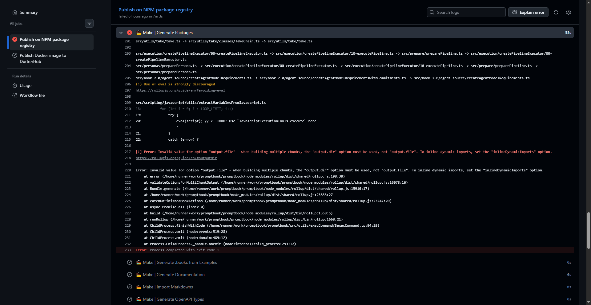

[x]

[✨🧾] Fix publishing on Github Actions



```log
src/utils/take/take.ts -> src/utils/take/classes/TakeChain.ts -> src/utils/take/take.ts

src/execution/createPipelineExecutor/00-createPipelineExecutor.ts -> src/execution/createPipelineExecutor/10-executePipeline.ts -> src/prepare/preparePipeline.ts -> src/execution/createPipelineExecutor/00-createPipelineExecutor.ts
src/personas/preparePersona.ts -> src/execution/createPipelineExecutor/00-createPipelineExecutor.ts -> src/execution/createPipelineExecutor/10-executePipeline.ts -> src/prepare/preparePipeline.ts -> src/personas/preparePersona.ts
src/book-2.0/agent-source/createAgentModelRequirements.ts -> src/book-2.0/agent-source/createAgentModelRequirementsWithCommitments.ts -> src/book-2.0/agent-source/createAgentModelRequirements.ts
(!) Use of eval is strongly discouraged
https://rollupjs.org/guide/en/#avoiding-eval

src/scripting/javascript/utils/extractVariablesFromJavascript.ts
18:         for (let i = 0; i < LOOP_LIMIT; i++)
19:             try {
20:                 eval(script); // <- TODO: Use `JavascriptExecutionTools.execute` here
                    ^
21:             }
22:             catch (error) {

[!] Error: Invalid value for option "output.file" - when building multiple chunks, the "output.dir" option must be used, not "output.file". To inline dynamic imports, set the "inlineDynamicImports" option.
https://rollupjs.org/guide/en/#outputdir

Error: Invalid value for option "output.file" - when building multiple chunks, the "output.dir" option must be used, not "output.file". To inline dynamic imports, set the "inlineDynamicImports" option.
    at error (/home/runner/work/promptbook/promptbook/node_modules/rollup/dist/shared/rollup.js:198:30)
    at validateOptionsForMultiChunkOutput (/home/runner/work/promptbook/promptbook/node_modules/rollup/dist/shared/rollup.js:16078:16)
    at Bundle.generate (/home/runner/work/promptbook/promptbook/node_modules/rollup/dist/shared/rollup.js:15910:17)
    at /home/runner/work/promptbook/promptbook/node_modules/rollup/dist/shared/rollup.js:23833:27
    at catchUnfinishedHookActions (/home/runner/work/promptbook/promptbook/node_modules/rollup/dist/shared/rollup.js:23247:20)
    at async Promise.all (index 0)
    at build (/home/runner/work/promptbook/promptbook/node_modules/rollup/dist/bin/rollup:1558:5)
    at runRollup (/home/runner/work/promptbook/promptbook/node_modules/rollup/dist/bin/rollup:1668:21)
    at ChildProcess.finishWithCode (/home/runner/work/promptbook/promptbook/src/utils/execCommand/$execCommand.ts:94:29)
    at ChildProcess.emit (node:events:519:28)
    at ChildProcess.emit (node:domain:489:12)
    at Process.ChildProcess._handle.onexit (node:internal/child_process:293:12)
Error: Process completed with exit code 1.
```

---

[-]

[✨🧾] qux

-   Keep in mind the DRY _(don't repeat yourself)_ principle.
-   Add the changes into the [changelog](./changelog/_current-preversion.md)

---

[-]

[✨🧾] qux

-   Keep in mind the DRY _(don't repeat yourself)_ principle.
-   Add the changes into the [changelog](./changelog/_current-preversion.md)

---

[-]

[✨🧾] qux

-   Keep in mind the DRY _(don't repeat yourself)_ principle.
-   Add the changes into the [changelog](./changelog/_current-preversion.md)
