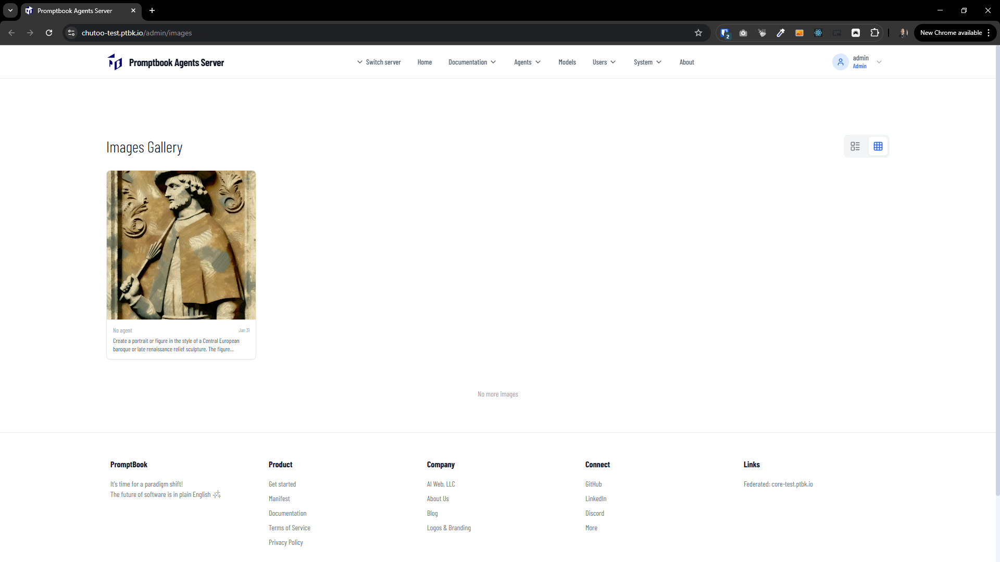

[x]

[✨👒] Add actions to image gallery

-   Allow to copy image prompts by clicking on [copy prompt] button.
-   Allow to See other parameters like what model generated the image, the other technical parameters.
-   Kepp that you are not allow to delete images.
-   Keep in mind the DRY _(don't repeat yourself)_ principle.
-   You are working with the [Agents Server](apps/agents-server) on /admin/images page
-   Add the changes into the [changelog](changelog/_current-preversion.md)

---

[x] ~$0.00

[✨👒] Images are cached BUT other parameters besides `prompt` isn't considered.

-   When I generate the same prompt but with a different image and a different model, the image is taken from the cache, not generated with this another model. This is wrong, it should be generated once again because the model should be considered as one of the parameters to be cached.
-   Consider parameters like image size, style, the actual model used for generation, etc.
-   Keep in mind the DRY _(don't repeat yourself)_ principle.
-   You are working with the [Agents Server](apps/agents-server) on pages /admin/images and /admin/image-generator-test
-   Add the changes into the [changelog](changelog/_current-preversion.md)

---

[-]

[✨👒] bar

-   Keep in mind the DRY _(don't repeat yourself)_ principle.
-   You are working with the [Agents Server](apps/agents-server)
-   Add the changes into the [changelog](changelog/_current-preversion.md)

---

[-]

[✨👒] bar

-   Keep in mind the DRY _(don't repeat yourself)_ principle.
-   You are working with the [Agents Server](apps/agents-server)
-   Add the changes into the [changelog](changelog/_current-preversion.md)
