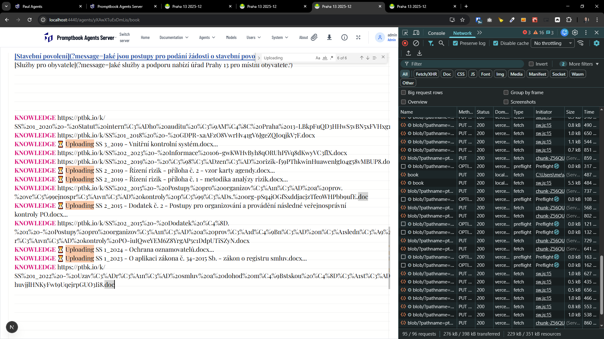
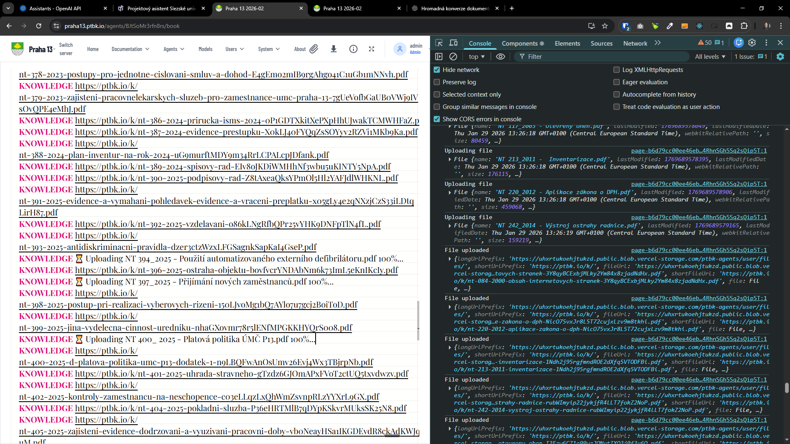
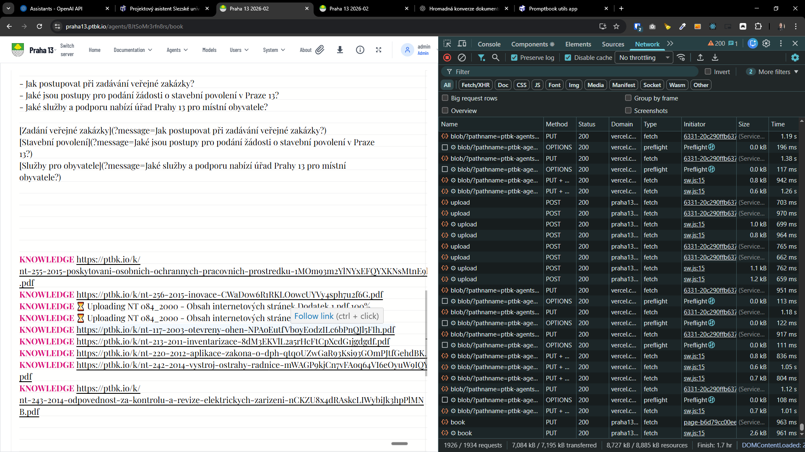

[x] ~$0.00

[✨🗑] Fix the Book editor when user Press to upload a lot of files.

-   When user drags files or presses the upload button and selects a lot of files, not all files are uploaded.
-   Fix the problem so that user can upload a lot of files without any issues.
-   Upload progress should be shown in the UI.
-   Also upload the files in chunks of 5 _(put 5 it into the constants)_ to not overload the server.
-   Keep in mind the DRY _(don't repeat yourself)_ principle.
-   You are working with the [Agents Server](apps/agents-server)



---

[x] ~$1.20

[✨🗑] Fix the Book editor when user Press to upload a lot of files.

-   When uploading a lot of files, some files get stuck in the "⏳ Uploading" state and never finish uploading.
-   The strange thing about this problem is that there are no errors in the console or in the network panel. Everything seems to be working, there is 100% shown that it's uploaded, but the file never changes from "⏳ Uploading" to the final URL.
-   Do not show the percent directly in the book, but open some floating panel with all the ongoing uploads. In the book, there should be only the information that the book is being uploaded and then replaced by the final URL.
-   Do not update the content of the book editor in such a rapid way. Update it in some blocks and debounce the updates.
-   In this panel, allow to pause and resume the uploading, and also show some upload statistics.
-   Keep in mind the DRY _(don't repeat yourself)_ principle.
-   You are working with the [Agents Server](apps/agents-server)
-   Add the changes into the [changelog](changelog/_current-preversion.md)

```book
KNOWLEDGE https://ptbk.io/k/nt-243-2014-odpovednost-za-kontrolu-a-revize-elektrickych-zarizeni-OzxnWNrl60VmCpE2psaostihjDtExx.pdf
KNOWLEDGE https://ptbk.io/k/nt-255-2015-poskytovani-osobnich-ochrannych-pracovnich-prostredku-bOMSMGaSGyRPyGP87eWhY5Zu6plzQR.pdf
KNOWLEDGE https://ptbk.io/k/nt-256-2015-inovace-BIRFcctgavyNq0ry5jkOaVHymnxiaT.pdf
KNOWLEDGE https://ptbk.io/k/nt-257-2015-materialy-do-rmc-a-zmc-AXwsyBxim4ynMhuBqx58qQmYJebsre.pdf
KNOWLEDGE https://ptbk.io/k/nt-289-2018-adaptacni-proces-novych-zamestnancu-bMrKh1ljUCx2SIKtpyPRBUyqxMvqb9.pdf
KNOWLEDGE https://ptbk.io/k/nt-290-2018-odpisovani-dlouhodobeho-majetku-BI6DRmyuWBHpw5oQDEUci5wQYsPfbW.pdf
KNOWLEDGE https://ptbk.io/k/nt-291-2018-transfery-lpxUkvUG2L0T5BjAkcyiNGQv1oHca6.pdf
KNOWLEDGE https://ptbk.io/k/nt-299-2018-pr-pro-archiv-stav-QqRbi1unq598BHVHrSvCkMy7LyyLzA.pdf
KNOWLEDGE https://ptbk.io/k/nt-300-2018-pr-pro-s-208-HwRoXIy2YP5573VqtxFKpoqQRjqySF.pdf
KNOWLEDGE https://ptbk.io/k/nt-301-2018-rad-ohlasovny-pozaru-d80MZfWWRIFVtg7cE9Zro1TTd5Issc.pdf
KNOWLEDGE https://ptbk.io/k/nt-302-2018-pr-pro-mistnost-nahradniho-zdroje-el-ilM01YqvetFulbMehkzWVUhpQ7xQJ3.pdf
KNOWLEDGE https://ptbk.io/k/nt-304-2018-mistni-rad-skladu-DeJtofXcPlL0IzsJqbiQS2S3z9NJ22.pdf
KNOWLEDGE https://ptbk.io/k/nt-305-2018-dokumentace-o-zacleneni-zvysene-pozarni-nebezpeci-q9rE6YYD8akB1XReyLfeBqSzn6X3Af.pdf
KNOWLEDGE https://ptbk.io/k/nt-306-2018-pr-pro-budovu-radnice-mcoR6PjNbLfNtcCsNskD1pMEIcNjv4.pdf
KNOWLEDGE https://ptbk.io/k/nt-308-2018-pozarni-rad-pro-pg-4ngFuyFtojyrhVzIvxPxIbrpS1NZd4.pdf
KNOWLEDGE https://ptbk.io/k/nt-309-2018-pozarni-evakuacni-plan-eTv7Uv17BEFIY1oh4ZQjPCviVEyMnB.pdf
KNOWLEDGE https://ptbk.io/k/nt-310-2018-dokumentace-zdolavani-pozaru-qXtkyCjyZCrUnqaCt2HpouJiHvyKco.pdf
KNOWLEDGE ⏳ Uploading NT 311_ 2018 - Revizní řád..pdf 100%...
KNOWLEDGE https://ptbk.io/k/nt-312-2018-cestovni-nahrady-UMuNvQFP5ZA7GAIcW2Lqu3FWr1tzEY.pdf
KNOWLEDGE https://ptbk.io/k/nt-312-2018-cestovni-nahrady-dodatek-6-5ZiLEoUqdK8D9JzRmXhq0ATvidK25I.pdf
KNOWLEDGE https://ptbk.io/k/nt-314-2018-kategorizace-pro-hpp-KhdBiuxY2cdnxhmlYo5h2W3f4ZA5cM.pdf
KNOWLEDGE https://ptbk.io/k/nt-315-2018-kategorizace-pro-dpp-a-dpc-KLaKBr1e5A6A6layahCSQf26umVMPa.pdf
KNOWLEDGE https://ptbk.io/k/nt-316-2018-zajisteni-vychovy-a-vzdelavani-v-oblasti-bozp-ieIDiJOZO4dMCA7n8UimaOLUDuO2LV.pdf
KNOWLEDGE https://ptbk.io/k/nt-317-2018-prikazove-bloky-21UTFd4Xi14pYbFKJ68UOLDxoyNxvX.pdf
KNOWLEDGE https://ptbk.io/k/nt-319-2018-mistni-provozne-bezpecnostni-predpis-BK9oDhEayE1URxDcQVxsfMWd9rSg2k.pdf
KNOWLEDGE https://ptbk.io/k/nt-320-2018-metodika-k-organizaci-kulturnich-akci-AMCqGX8W03wScTHfTwYv5IFeTB7s1P.pdf
KNOWLEDGE https://ptbk.io/k/nt-321-2018-pracovni-volno-bez-nahrady-dFkumCWjzTNPucGXGwmQXAVFCHxIPi.pdf
KNOWLEDGE https://ptbk.io/k/nt-324-2019-socialne-pravni-ochrana-deti-na-umc-p13-ElCVrh30hyvtn86DS8mlodjYm1A6L1.pdf
KNOWLEDGE https://ptbk.io/k/nt-326-2019-organizace-autoprovozu-vjr4HaBnqGVfRuba27kzYo5x4HAzq3.pdf
KNOWLEDGE https://ptbk.io/k/nt-327-2019-telekomunikacni-zarizeni-PLHFPJJiFJvIb2GnFC1P8EHAGxh1XK.pdf
KNOWLEDGE https://ptbk.io/k/nt-329-2019-provozni-rad-umc-p-13-nu4d8AKQOlqJt09p9N6HfwDmHZA1Aa.pdf
KNOWLEDGE https://ptbk.io/k/nt-333-2020-oznaceni-uradu-pisemnosti-razitek-CocbLJqYIKzNoBqHc14F7ZmuYBiPbr.pdf
KNOWLEDGE https://ptbk.io/k/nt-334-2020-tehotne-kojici-zamestnankyne-RRUHz3BdRSVxsLcybResjCrM55dlcu.pdf
KNOWLEDGE https://ptbk.io/k/nt-335-2020-havarijni-plan-cGfB0Lt899DWUZopX75dTyrBJ0eaqM.pdf
KNOWLEDGE ⏳ Uploading NT 336_2020 - Pracovní úrazy.pdf 100%...
KNOWLEDGE https://ptbk.io/k/nt-337-2020-traumatologicky-plan-GPXG89WOxp9rKA3jP5WHXRnPJmbQWb.pdf
KNOWLEDGE https://ptbk.io/k/nt-338-2020-pokyny-pro-cinnost-preventivni-pozarni-hlidky-ZDYRb7Fmm40Epq2PAm9PdGj31QURDN.pdf
KNOWLEDGE https://ptbk.io/k/nt-342-2020-tvorba-vnitrnich-predpisu-d55S105mhgMagox54SMwdM74lka5s1.pdf
KNOWLEDGE https://ptbk.io/k/nt-344-2020-realizace-dotacnich-projektu-mmDFhKNlm9Bg7ANOpIUHQTUdooQQuU.pdf
KNOWLEDGE https://ptbk.io/k/nt-346-2020-pravidla-pro-komunikaci-kTUYY3fewlzQJzqnHOSHoPCgwei9pA.pdf
KNOWLEDGE https://ptbk.io/k/nt-348-2020-ochrana-ou-zamestnancu-D6L88S3UhtWh6VFwyEWucqNAwO8Bn9.pdf
KNOWLEDGE ⏳ Uploading NT 353_2020 - Daň z přidané hodnoty.pdf 100%...
KNOWLEDGE https://ptbk.io/k/nt-354-2021-ochrana-osobnich-udaju-v-prostredi-umc-praha-13-6pCNLkbKk2AJMYLX6sekep8JmSvlgy.pdf
KNOWLEDGE https://ptbk.io/k/nt-357-2021-uplatnovani-sankci-u-mistnich-poplatku-umc-praha-13-sfxcLbdW32SPO9oyWThQvOkXOXHQLF.pdf
KNOWLEDGE https://ptbk.io/k/nt-359-2021-projednavani-skod-a-likvidace-majetku-MfZg8EYgovif7g6nbfSkYzqP58rivt.pdf
KNOWLEDGE https://ptbk.io/k/nt-360-2021-pracovni-rad-BtUjmfAu2GNMAkVxMLHakJYBUv2mga.pdf
KNOWLEDGE https://ptbk.io/k/nt-363-2021-majetek-LIOw0Yi9pozY1NtoXRGWBK2JLao4BM.pdf
KNOWLEDGE https://ptbk.io/k/nt-366-2022-eticky-kodex-PHAPgJIH6dgv1jJMItbbR4W5pLFOFy.pdf
KNOWLEDGE https://ptbk.io/k/nt-367-2022-komunikace-pri-mimoradne-udalosti-lHB6kcIZIq5Gg2jkG96teSVvixeiAv.pdf
KNOWLEDGE https://ptbk.io/k/nt-368-2022-hodnoceni-zamestnancu-0OGF6aaTn62fbvh1DqiUCwXIAf0Elj.pdf
KNOWLEDGE https://ptbk.io/k/nt-370-2022-bezpecnostni-smernice-j2aM352RRR6roLEIn5BFbNCivnZ8Tq.pdf
KNOWLEDGE https://ptbk.io/k/nt-371-2022-realna-hodnota-u-majetku-urceneho-k-prodeji-iEhGvQRdSWl2PIbekS9BWpTrVn8mgP.pdf
KNOWLEDGE https://ptbk.io/k/nt-374-2022-casove-rozliseni-7okeyGHogUYgfRg6yQ7IoepqTt8mKw.pdf
KNOWLEDGE https://ptbk.io/k/nt-378-2023-postupy-pro-jednotne-cislovani-smluv-a-dohod-E4gEmo2mIB9rgAhgo41C1uGb1mNNvh.pdf
KNOWLEDGE https://ptbk.io/k/nt-379-2023-zajisteni-pracovnelekarskych-sluzeb-pro-zamestnance-umc-praha-13-7gUeVofbGaUB0VWj9IVsOvQPE4eMhJ.pdf
KNOWLEDGE https://ptbk.io/k/nt-386-2024-prirucka-isms-2024-0P1GDTXkitXePXpHhUJwakTCMWHFaZ.pdf
KNOWLEDGE https://ptbk.io/k/nt-387-2024-evidence-prestupku-X0kLJ40FYQqZsSOYyv2RZVi1MKb9Ka.pdf
KNOWLEDGE https://ptbk.io/k/nt-388-2024-plan-inventur-na-rok-2024-uG9murftMDY9m34RrLCPALcpJDfank.pdf
KNOWLEDGE https://ptbk.io/k/nt-389-2024-spisovy-rad-EIv8oJKDiWMHhNf3wbu5uKINTY5NpA.pdf
KNOWLEDGE https://ptbk.io/k/nt-390-2025-podpisovy-rad-Z8tAxeaQksYPmOl5Hl2YAFJdlWHKNL.pdf
KNOWLEDGE https://ptbk.io/k/nt-391-2025-evidence-a-vymahani-pohledavek-evidence-a-vraceni-preplatku-x05gLy4e2qNXzjCzS33iLDtqLirH87.pdf
KNOWLEDGE https://ptbk.io/k/nt-392-2025-vzdelavani-o86kLNgRfbQPr25vYHK9DNFpTlN4fL.pdf
KNOWLEDGE https://ptbk.io/k/nt-393-2025-antidiskriminacni-pravidla-dzer3ctzWzxLFGSagnkSapKaI4GseP.pdf
KNOWLEDGE ⏳ Uploading NT 394_2025 - Použití automatizovaného externího defibrilátoru.pdf 100%...
KNOWLEDGE https://ptbk.io/k/nt-396-2025-ostraha-objektu-bovfvcrYNDAbNm6k73ImL5eKnIKcIy.pdf
KNOWLEDGE ⏳ Uploading NT 397_2025 - Přijímání nových zaměstnanců.pdf 100%...
KNOWLEDGE https://ptbk.io/k/nt-398-2025-postup-pri-realizaci-vyberovych-rizeni-150LJvoMg1bQ7AYlo7u7gcj2BoiToD.pdf
KNOWLEDGE https://ptbk.io/k/nt-399-2025-jina-vydelecna-cinnost-uredniku-nhaGXovmr78r5lENfMPGKKHYQrS008.pdf
KNOWLEDGE ⏳ Uploading NT 400_ 2025 - Platová politika ÚMČ P13.pdf 100%...
KNOWLEDGE https://ptbk.io/k/nt-400-2025-d-platova-politika-umc-p13-dodatek-1-n9LBQFwAnOsUmv26Evj4Wx3TBjrpNb.pdf
KNOWLEDGE https://ptbk.io/k/nt-401-2025-uhrada-stravneho-gTzdz6GJOmAPxFVoT2ctUQ5txvdwzv.pdf
KNOWLEDGE https://ptbk.io/k/nt-402-2025-kontroly-zamestnancu-na-neschopence-c03eLLqzLxQhWmZsvnpRLzYYXrL9GX.pdf
KNOWLEDGE https://ptbk.io/k/nt-404-2025-pokladni-sluzba-P36eHRTMlB7qDYpKSkvrMUksSK25N8.pdf
KNOWLEDGE https://ptbk.io/k/nt-405-2025-zajisteni-evidence-dodrzovani-a-vyuzivani-pracovni-doby-vb0NeayHSa1IKGDEvdR8ckAdKWJquM.pdf
KNOWLEDGE https://ptbk.io/k/nt-406-2025-podrozvaha-a-rezervy-48N3MC2LiAZjC3bu3OtuJLJkeB7tlD.pdf
KNOWLEDGE https://ptbk.io/k/nt-407-2025-pokladni-sluzba-gZ1bAPAjruo3ukgd1Xrq2FbwYZyAEv.pdf
KNOWLEDGE ⏳ Uploading NT 408_2025 - Oběh rozpočtových a účetních dokladů.pdf 100%...
KNOWLEDGE https://ptbk.io/k/nt-409-2025-ekonomicka-smernice-xblYbIwIoYtXyb18WoKly0xDZJwNaF.pdf
KNOWLEDGE https://ptbk.io/k/ss-1-2016-dodatek-c-1-k-pravidla-pro-prijimani-petic-stiznosti-VS4QRIkfjNr3d9xvgc688MTbuClRfs.pdf
KNOWLEDGE https://ptbk.io/k/ss-1-2016-pravidla-pro-prijimani-petic-stiznosti-oznameni-podnetu-a-vyrizovani-podani-na-mozna-korupcni-jednani-podanych-organum-mc-p13-cnNwhlc0OLDUqTLNvyXRE4bBBE0j0o.pdf
KNOWLEDGE https://ptbk.io/k/ss-1-2017-dodatek-c-1-zadavani-vz-Ha6jxVOcFwQKy9RePbBOOj77VsiZKJ.pdf
KNOWLEDGE https://ptbk.io/k/ss-1-2017-dodatek-c-2-zadavani-vz-4Ifyah0N5Mm3piLhzOm7gQds3LFtcR.pdf
KNOWLEDGE https://ptbk.io/k/ss-1-2017-dodatek-c-3-zadavani-vz-SXg3virK7BjxD4qUKldVtc9W6vR64g.pdf
KNOWLEDGE ⏳ Uploading SS 1_2017 - Dodatek č. 4 -  zadávání VZ.pdf...
KNOWLEDGE https://ptbk.io/k/ss-1-2017-priloha-c-1-5-zadavani-vz-dO9PkvhKhorYQfnSUngdO4V3b1iRTY.pdf
KNOWLEDGE https://ptbk.io/k/ss-1-2017-zadavani-vz-mc-praha-13-dle-zakona-c-134-2016-sb-o-zadavani-vz-aJbAiFH64ignGR4hoqykR7MXJqQhty.pdf
KNOWLEDGE https://ptbk.io/k/ss-1-2018-gdpr-0c4AnXZwV4Y4Cy24mONCrKeuebDQd1.pdf
KNOWLEDGE https://ptbk.io/k/ss-1-2020-statut-interniho-auditu-umc-praha-13-6v3EKDaABIrS4JOV5ktmDPLPcBQz8Q.pdf
KNOWLEDGE https://ptbk.io/k/ss-1-2022-uzavirani-smluv-a-dohod-mestskou-casti-praha-13-jIEKXvolQvnk9D0spMv7PSuoajK0gx.pdf
KNOWLEDGE https://ptbk.io/k/ss-1-2023-o-aplikaci-zakona-c-34-2015-sb-zakon-o-registru-smluv-hUFsedNU0O4g0h843x5D6YiyLxyjqf.pdf
KNOWLEDGE ⏳ Uploading SS 1_2024 - Ochrana oznamovatelů.pdf 100%...
KNOWLEDGE https://ptbk.io/k/ss-2-2015-dodatek-c-1-postupy-pro-organizovani-a-provadeni-nasledne-verejnospravni-kontroly-po-NP4c0gsHumYvysyJasY7th2JfhjNsH.pdf
KNOWLEDGE https://ptbk.io/k/ss-2-2015-dodatek-c-2-postupy-pro-organizovani-a-provadeni-nasledne-verejnospravni-kontroly-po-RJDxlaQIPe17u9fVIU1RP5qWhJurmV.pdf
KNOWLEDGE https://ptbk.io/k/ss-2-2015-postupy-pro-organizovani-a-prov-verejnospravni-kontroly-pris-org-ehYT7m1iXc177OedGbB1SqX5eFMcPD.pdf
KNOWLEDGE https://ptbk.io/k/ss-2-2019-rizeni-rizik-priloha-c-1-metodika-analyzy-rizik-aB9Yh74jQPEsGNVmkTBIqhCrftnzfQ.pdf
KNOWLEDGE https://ptbk.io/k/ss-2-2019-rizeni-rizik-priloha-c-2-vzor-karty-agendy-a1GAXxV6gUegPyDBjWDqKByLfOEg7y.pdf
KNOWLEDGE ⏳ Uploading SS 2_2019 - Řízení rizik.pdf 100%...
KNOWLEDGE https://ptbk.io/k/ss-2-2023-informace-106-3OCE3vWvHZP4957x03x4YL5yAzLuVy.pdf
KNOWLEDGE https://ptbk.io/k/ss-3-2019-vnitrni-kontrolni-system-sQUT7RAiQ1XjTxlCJDnNCpJazo0UMV.pdf
KNOWLEDGE https://ptbk.io/k/nt-084-2000-obsah-internetovych-stranek-dodatek-1-taEvFmPafPXZtZXJ2PK3ulfbkhsIgw.pdf
KNOWLEDGE https://ptbk.io/k/nt-084-2000-obsah-internetovych-stranek-3Y8qyBCExbjMLky2Ym84x8zjadNdHx.pdf
KNOWLEDGE https://ptbk.io/k/nt-117-2003-otevreny-ohen-I3Ezw6CZ1e99wzJONytIXQ3j0f3y6O.pdf
KNOWLEDGE https://ptbk.io/k/nt-213-2011-inventarizace-1Ndh2j95rgfmndROE2dXfq5VTODFBi.pdf
KNOWLEDGE https://ptbk.io/k/nt-220-2012-aplikace-zakona-o-dph-NicO75vxJr8L5T72cujxLzv9m8tkhi.pdf
KNOWLEDGE ⏳ Uploading NT 242_2014 - Výstroj ostrahy radnice.pdf 100%...
```




---

[-]

[✨🗑] baz

-   Keep in mind the DRY _(don't repeat yourself)_ principle.
-   You are working with the [Agents Server](apps/agents-server)
-   Add the changes into the [changelog](changelog/_current-preversion.md)

---

[-]

[✨🗑] baz

-   Keep in mind the DRY _(don't repeat yourself)_ principle.
-   You are working with the [Agents Server](apps/agents-server)
-   Add the changes into the [changelog](changelog/_current-preversion.md)

