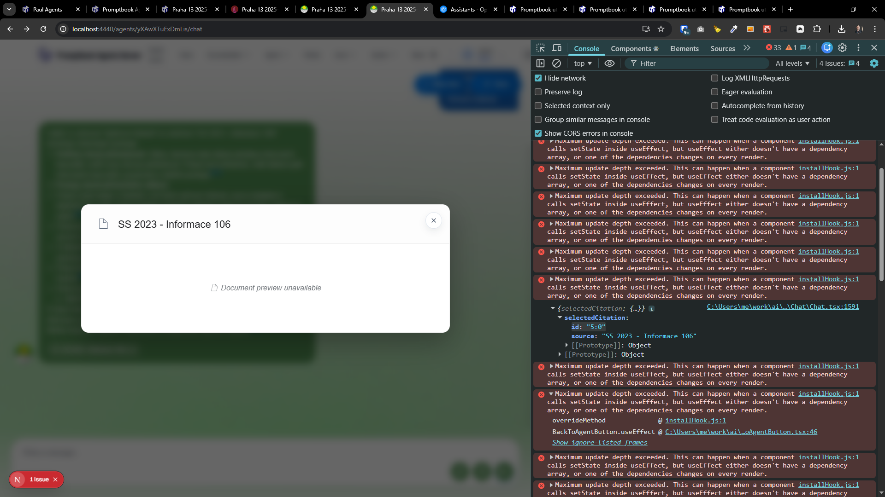
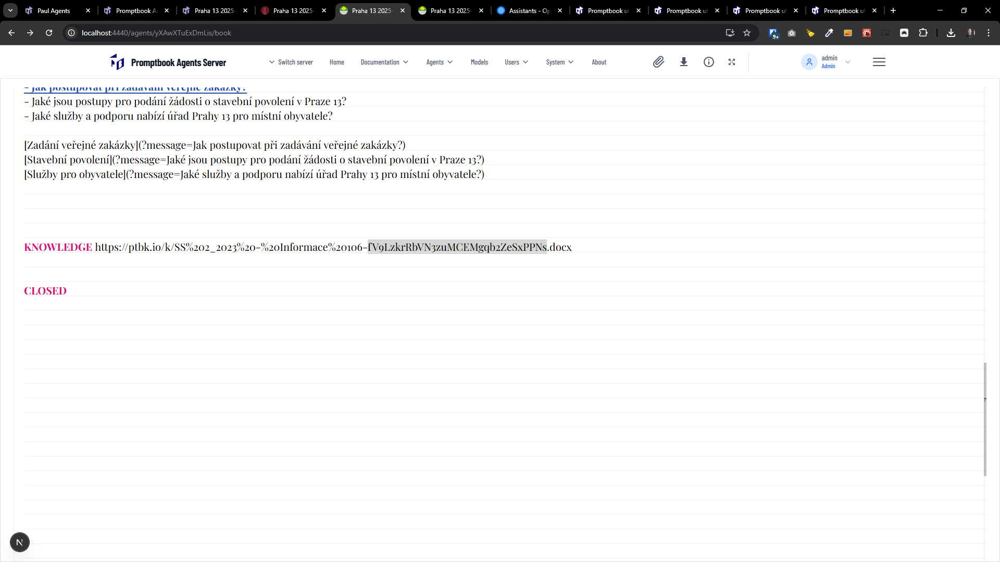

[x] $2.38

[✨👗] Fix showing the document from which the agent sourced their information

-   The agents are telling correct information based on given documents, but they are not showing the source correctly
-   When the agent cites something, the user should be able to click on the source chip and show the document from the agent sourced its response.
-   You are working with the entire vertical from the object representing the LLMs and agents to the [Agents Server application](apps/agents-server)
-   This is probably a hard problem because you have tried to do it multiple times but failed - Analyze the problem deeply and come up with a robust solution.
-   Keep in mind the DRY _(don't repeat yourself)_ principle and other best practices.


---

[x] ~$0.00

[✨👗] Fix showing the document from which the agent sourced their information

-   The agents are telling correct information based on given documents, but they are not showing the source correctly
-   When the agent cites something, the user should be able to click on the source chip and show the document from the agent sourced its response.
-   You are working with the entire vertical from the object representing the LLMs and agents to the [Agents Server application](apps/agents-server)
-   This is probably a hard problem because you have tried to do it multiple times but failed
    -   Analyze the problem deeply and come up with a robust solution.
    -   If there is something that I need to do, write me a detailed plan of what needs to be done and save it into the file in the root of the repository.
-   Keep in mind the DRY _(don't repeat yourself)_ principle and other best practices.


---

[x] ~$0.00

[✨👗] Fix showing the document from which the agent sourced their information

-   Try harder to locate the document, for example this should be found

```book
AI Agent

KNOWLEDGE https://ptbk.io/k/SS%202_2023%20-%20Informace%20106-fV9LzkrRbVN3zuMCEMgqb2ZeSxPPNs.docx
```

```
{
    "id": "5:0",
    "source": "SS 2023 - Informace 106"
}
```

-   Now it shows "Document preview unavailable" but it should show the document
-   Despite the document being present in the knowledge base, the agent is not able to show it when cited
-   Document in the `KNOWLEDGE` can be URL encoded - ensure that the document is correctly located
-   Make some heuristic to locate the document - for example normalize the URLs, decode them, etc.
-   You are working with the [Agents Server](apps/agents-server)
-   Keep in mind the DRY _(don't repeat yourself)_ principle and other best practices.




