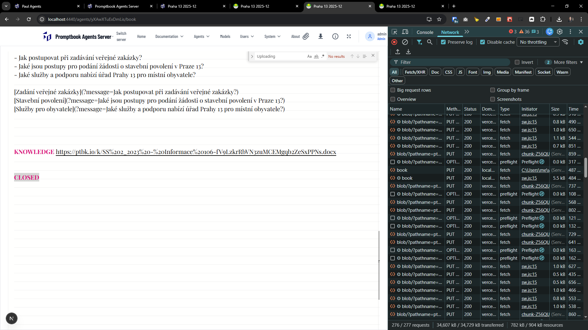
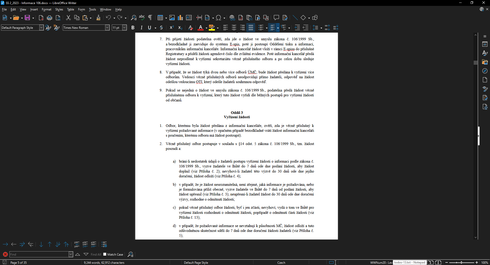
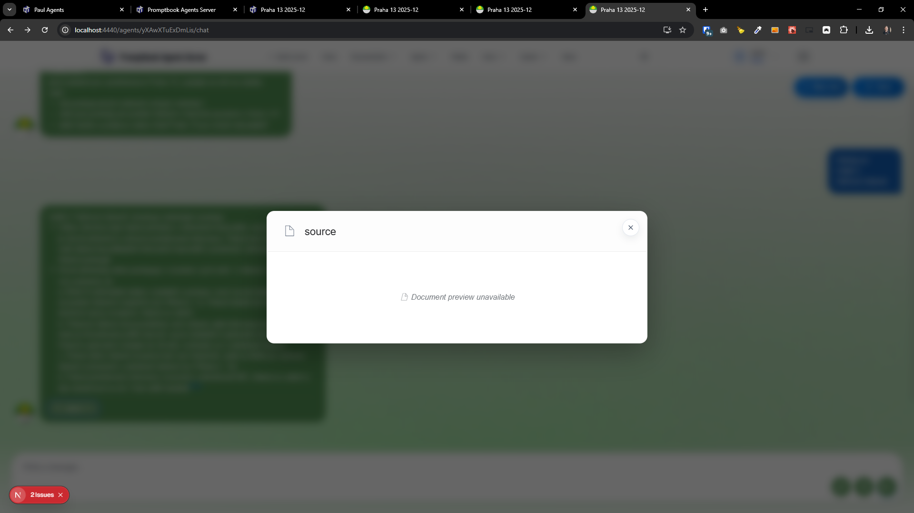
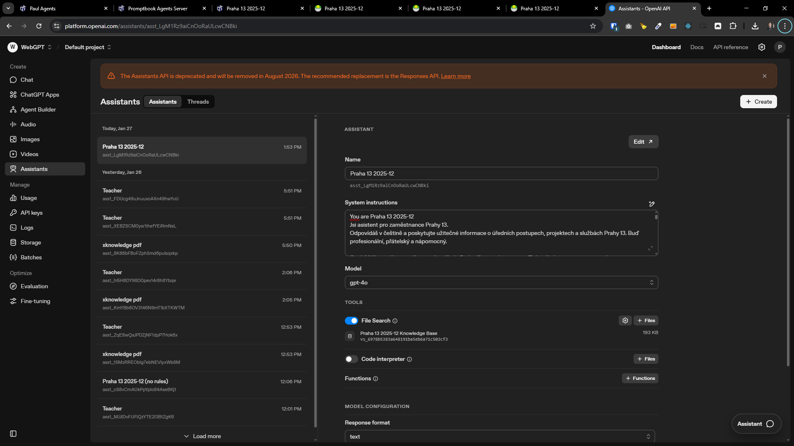

[ ] !!!!!!!

[✨👗] Fix showing the document from which the agent sourced their information

-   The agents are telling correct information based on given documents, but they are not showing the source correctly
-   When the agent cites something, the user should be able to click on the source chip and show the document from the agent sourced its response.
-   You are working with the entire vertical from the object representing the LLMs and agents to the [Agents Server application](apps/agents-server)
-   This is probably a hard problem because you have tried to do it multiple times but failed - Analyze the problem deeply and come up with a robust solution.
-   Keep in mind the DRY _(don't repeat yourself)_ principle and other best practices.

---

[-]

[✨👗] qux

-   Keep in mind the DRY _(don't repeat yourself)_ principle.
-   You are working with the [Agents Server](apps/agents-server)
-   Add the changes into the [changelog](changelog/_current-preversion.md)

---

[-]

[✨👗] qux

-   Keep in mind the DRY _(don't repeat yourself)_ principle.
-   You are working with the [Agents Server](apps/agents-server)
-   Add the changes into the [changelog](changelog/_current-preversion.md)

---

[-]

[✨👗] qux

-   Keep in mind the DRY _(don't repeat yourself)_ principle.
-   You are working with the [Agents Server](apps/agents-server)
-   Add the changes into the [changelog](changelog/_current-preversion.md)
