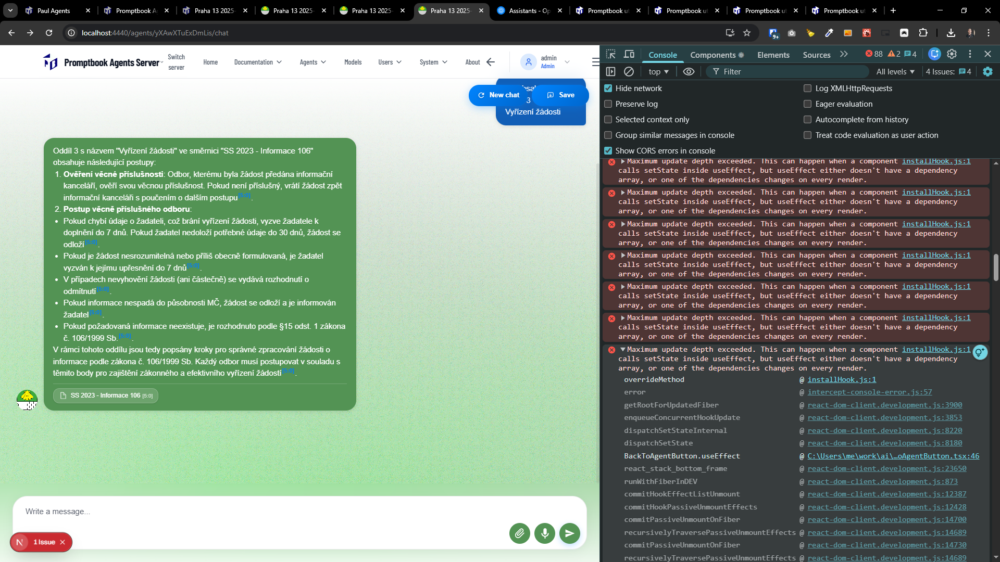

[ ]

[✨🚖] Fix Maximum update depth exceeded. This can happen when a component calls setState inside useEffect, but useEffect either doesn't have a dependency array, or one of the dependencies changes on every render.

-   You are working with the [Agents Server](apps/agents-server)

---

[-]

[✨🚖] foo

-   Keep in mind the DRY _(don't repeat yourself)_ principle.
-   You are working with the [Agents Server](apps/agents-server)
-   Add the changes into the [changelog](changelog/_current-preversion.md)

---

[-]

[✨🚖] foo

-   Keep in mind the DRY _(don't repeat yourself)_ principle.
-   You are working with the [Agents Server](apps/agents-server)
-   Add the changes into the [changelog](changelog/_current-preversion.md)

---

[-]

[✨🚖] foo

-   Keep in mind the DRY _(don't repeat yourself)_ principle.
-   You are working with the [Agents Server](apps/agents-server)
-   Add the changes into the [changelog](changelog/_current-preversion.md)
