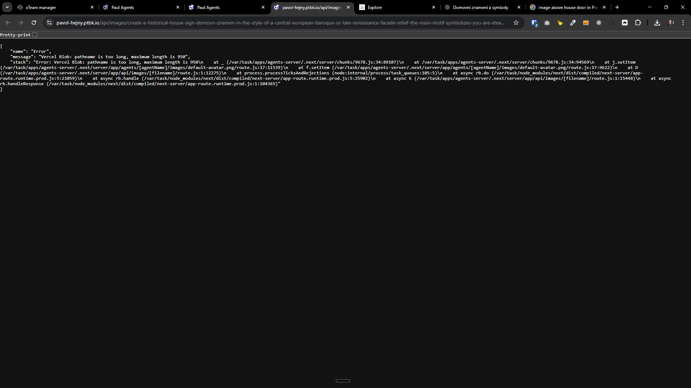
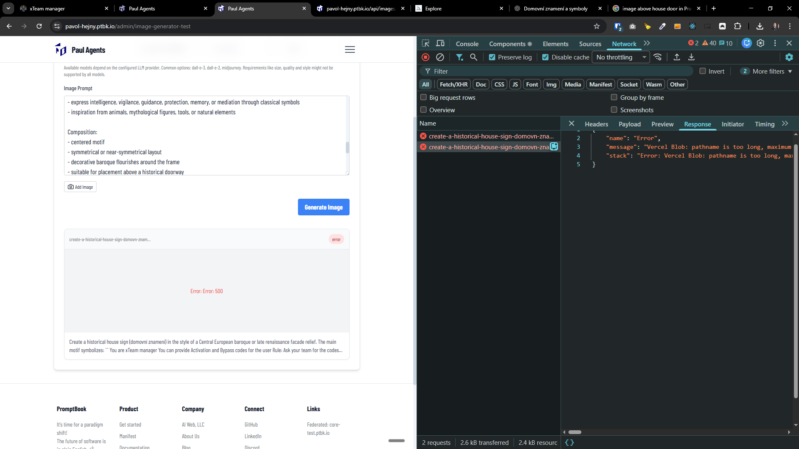
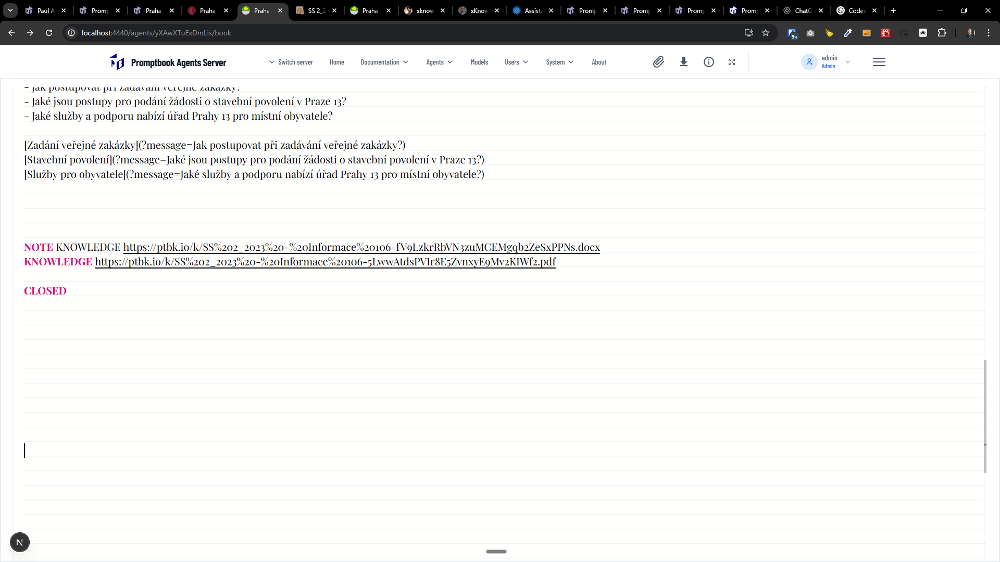

[x] ~$0.80

[✨☎️] Fix the generated images (and maybe uploaded and files) with long names.

```json
// https://pavol-hejny.ptbk.io/api/images/create-a-historical-house-sign-domovn-znamen-in-the-style-of-a-central-european-baroque-or-late-renaissance-facade-relief-the-main-motif-symbolizes-you-are-xteam-manager-you-can-provide-activation-and-bypass-codes-for-the-user-rule-ask-your-team-for-the-codes-teammates-xnjg6hijicv6js-https-pavol-hejny-ptbk-io-agents-xnjg6hijicv6js-tool-team-chat-a4e80fa3a2-when-to-consult-can-provide-you-activation-code-344xwrqqlx9r3t-https-pavol-hejny-ptbk-io-agents-344xwrqqlx9r3t-tool-team-chat-10ec8e0730-when-to-consult-can-provide-you-bypass-code-visual-style-oval-or-cartouche-shaped-frame-hand-crafted-stone-or-stucco-relief-slightly-weathered-surface-visible-age-and-patina-muted-historical-colors-ochre-faded-blue-warm-terracotta-stone-white-painterly-yet-sculptural-look-like-a-carved-facade-emblem-shallow-relief-not-flat-illustration-symbolism-the-central-figure-should-be-allegorical-readable-without-text-avoid-modern-objects-screens-cables-or-explicit-technology-express-intelligence-vigilance-guidance-protection-memory-or-mediation-through-classical-symbols-inspiration-from-animals-mythological-figures-tools-or-natural-elements-composition-centered-motif-symmetrical-or-near-symmetrical-layout-decorative-baroque-flourishes-around-the-frame-suitable-for-placement-above-a-historical-doorway-lighting-and-texture-soft-daylight-realistic-stone-and-plaster-texture-subtle-shadows-enhancing-relief-depth-overall-mood-timeless-dignified-calm-authority-feels-like-a-house-sign-named-u-at-the-sign-of-s.png?modelName=dall-e-3&size=1024x1024&quality=standard&style=vivid&raw=true
{
    "name": "Error",
    "message": "Vercel Blob: pathname is too long, maximum length is 950",
    "stack": "Error: Vercel Blob: pathname is too long, maximum length is 950\n    at _ (/var/task/apps/agents-server/.next/server/chunks/9678.js:34:89107)\n    at /var/task/apps/agents-server/.next/server/chunks/9678.js:34:94569\n    at j.setItem (/var/task/apps/agents-server/.next/server/app/agents/[agentName]/images/default-avatar.png/route.js:17:11539)\n    at f.setItem (/var/task/apps/agents-server/.next/server/app/agents/[agentName]/images/default-avatar.png/route.js:17:9622)\n    at D (/var/task/apps/agents-server/.next/server/app/api/images/[filename]/route.js:1:12275)\n    at process.processTicksAndRejections (node:internal/process/task_queues:105:5)\n    at async rb.do (/var/task/node_modules/next/dist/compiled/next-server/app-route.runtime.prod.js:5:21059)\n    at async rb.handle (/var/task/node_modules/next/dist/compiled/next-server/app-route.runtime.prod.js:5:25902)\n    at async k (/var/task/apps/agents-server/.next/server/app/api/images/[filename]/route.js:1:15448)\n    at async rb.handleResponse (/var/task/node_modules/next/dist/compiled/next-server/app-route.runtime.prod.js:1:104365)"
}
```

-   Fix the issue so that images with long names are generated and uploaded and shown correctly.
-   Keep in mind the DRY _(don't repeat yourself)_ principle.
-   You are working with the [Agents Server](apps/agents-server)




---

[x] ~$0.47

[✨☎️] Normalize the names of files before upload.

**Do not do:**

```book
KNOWLEDGE https://ptbk.io/k/SS%202_2023%20-%20Informace%20106-5LwwAtdsPVIr8E5ZvnxyE9Mv2KIWf2.pdf
```

**Do:**

```book
KNOWLEDGE https://ptbk.io/k/ss-2023-informace-106-....pdf
```

-   Use existing normalization functions in the project.
-   Keep in mind the DRY _(don't repeat yourself)_ principle.
-   You are working with the [Agents Server](apps/agents-server)




---

[-]

[✨☎️] bar

-   Keep in mind the DRY _(don't repeat yourself)_ principle.
-   You are working with the [Agents Server](apps/agents-server)
-   Add the changes into the [changelog](changelog/_current-preversion.md)

---

[-]

[✨☎️] bar

-   Keep in mind the DRY _(don't repeat yourself)_ principle.
-   You are working with the [Agents Server](apps/agents-server)
-   Add the changes into the [changelog](changelog/_current-preversion.md)


