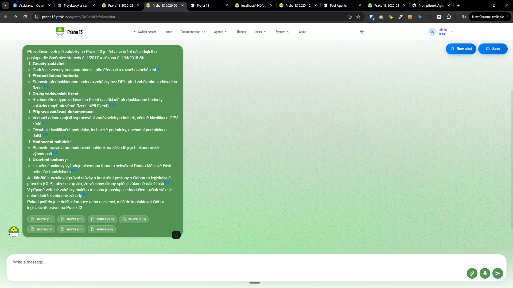

[ ] !!

[✨♊️] When rendering markdown sublists in chat messages it is broken. Please fix it.

```markdown
Při zadávání veřejné zakázky na Praze 13 je třeba se držet následujícího postupu dle Směrnice starosty č. 1/2017 a zákona č. 134/2016 Sb.:

1. **Zásady zadávání:**

    - Dodržujte zásady transparentnosti, přiměřenosti a rovného zacházení【5:1†source】.

2. **Předpokládaná hodnota:**

    - Stanovte předpokládanou hodnotu zakázky bez DPH před zahájením zadávacího řízení【5:2†source】.

3. **Druhy zadávacích řízení:**

    - Rozhodněte o typu zadávacího řízení na základě předpokládané hodnoty zakázky (např. otevřené řízení, užší řízení)【5:11†source】.

4. **Příprava zadávací dokumentace:**

    - Vedoucí odboru zajistí vypracování zadávacích podmínek, včetně klasifikace CPV kódů【5:13†source】.
    - Obsahuje kvalifikační podmínky, technické podmínky, obchodní podmínky a další【5:5†source】.

5. **Hodnocení nabídek:**

    - Stanovte pravidla pro hodnocení nabídek na základě jejich ekonomické výhodnosti【5:5†source】.

6. **Uzavření smlouvy:**
    - Uzavření smlouvy vyžaduje písemnou formu a schválení Radou Městské části nebo Zastupitelstvem【5:7†source】.

Je důležité konzultovat právní otázky a konkrétní postupy s Odborem legislativně-právním (OLP), aby se zajistilo, že všechny úkony splňují zákonné náležitosti【5:6†source】.

V případě veřejné zakázky malého rozsahu je postup zjednodušen, avšak stále je nutné dodržet zákonné zásady【5:7†source】.

Pokud potřebujete další informace nebo asistenci, můžete kontaktovat Odbor legislativně-právní na Praze 13.
```

<- This example is showing broken numbering. Look at the .

-   Keep in mind the DRY _(don't repeat yourself)_ principle.
-   You are working with the [Agents Server](apps/agents-server)
-   Add the changes into the [changelog](changelog/_current-preversion.md)


---

[-]

[✨♊️] qux

-   Keep in mind the DRY _(don't repeat yourself)_ principle.
-   You are working with the [Agents Server](apps/agents-server)
-   Add the changes into the [changelog](changelog/_current-preversion.md)

---

[-]

[✨♊️] qux

-   Keep in mind the DRY _(don't repeat yourself)_ principle.
-   You are working with the [Agents Server](apps/agents-server)
-   Add the changes into the [changelog](changelog/_current-preversion.md)

---

[-]

[✨♊️] qux

-   Keep in mind the DRY _(don't repeat yourself)_ principle.
-   You are working with the [Agents Server](apps/agents-server)
-   Add the changes into the [changelog](changelog/_current-preversion.md)
