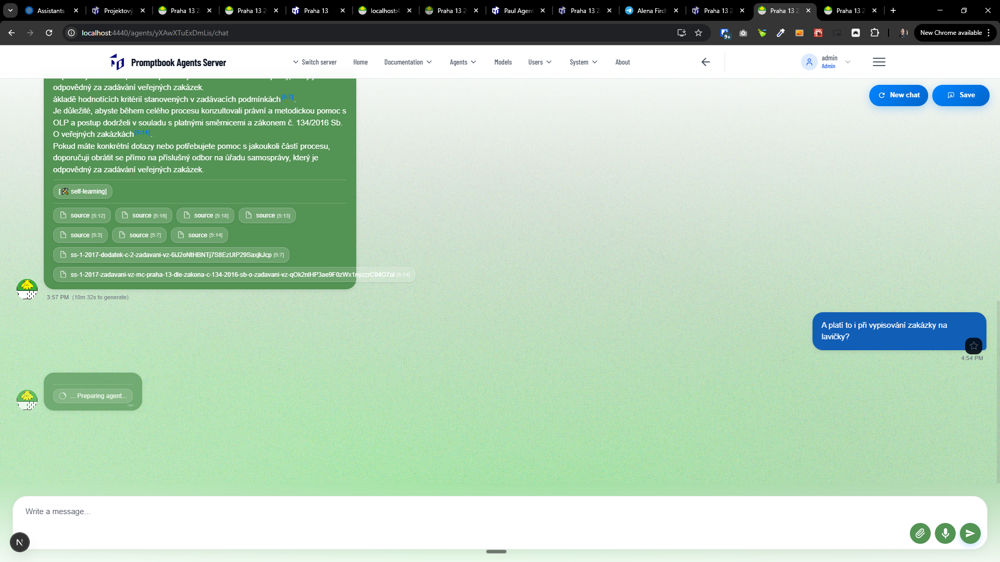
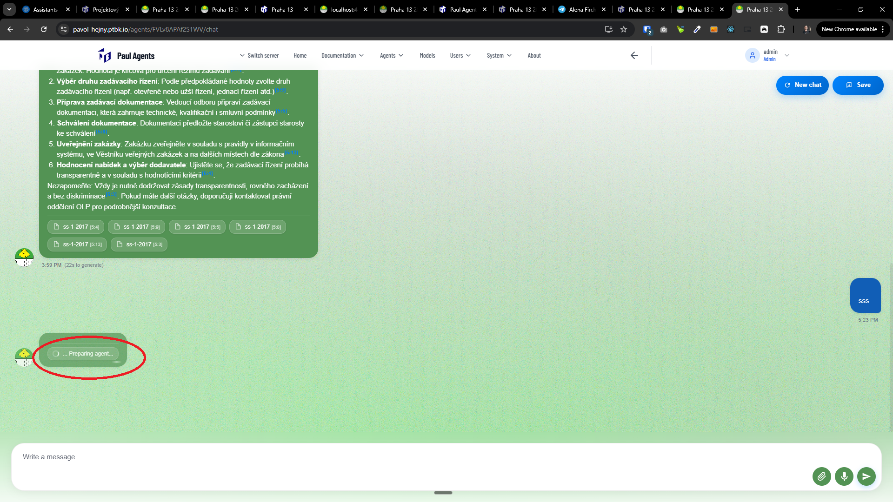
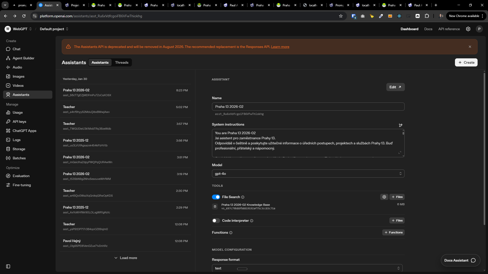
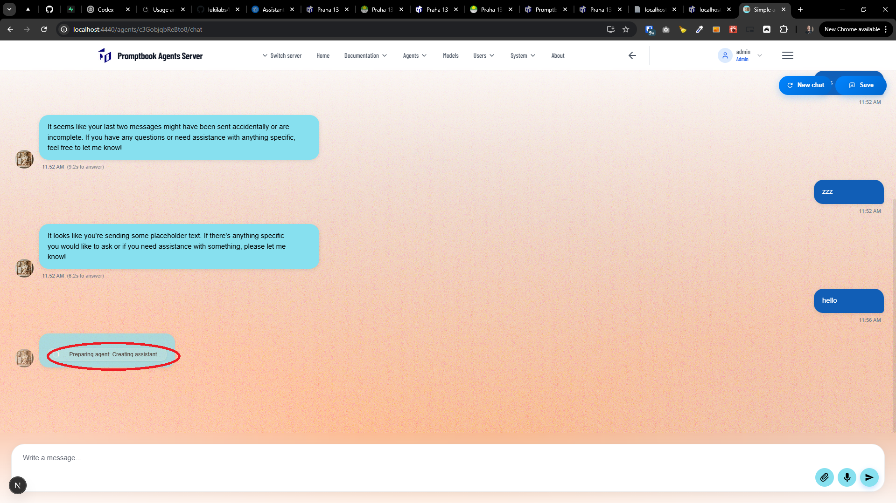
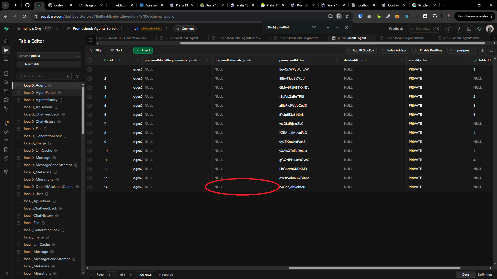

[x] ~$1.58

[✨📰] Show that the GPT assistant is pending in UI

When the agent has a very huge book, the duration of the creation of the underlying GPT assistant is pretty long. It can take, for example, multiple minutes of waiting. This has terrible user experience because the user is waiting and waiting and waiting for the first response.

Make some look how the chips or tool chips are implemented. For example, how it looks when the agent is using a source engine, or when the agent is self-learning, or when the agent is doing some job and create similar mechanism, but not during the call and after call like a self-learning, but before the call. This chip should show something like "Preparing" or "Creating agents", and the user should clearly see that something is happening. They should see that "Oh, now I'm in the phase when the agent is preparing this". This will happen once, and then the GPT assistant is created. At the second call, the preparation won't show because the agent is already cached, but the UI will be much better.

-   Keep in mind the DRY _(don't repeat yourself)_ principle.
-   You are working with the [Agents Server](apps/agents-server)
-   Add the changes into the [changelog](changelog/_current-preversion.md)

---

[x] ~$1.57

[✨📰] When the agent is being prepared, log more info.

-   The operation of the underlying OpenAI assistant can take multiple minutes.
-   During this time, it would be great to log more info about what is happening under the hood.
-   Mark logs with some special tag like `console.info('[🤰]',...)`
-   We need to get your info for making this process much quicker because the current speed is unacceptable.
-   You are not optimizing this process. You are now just logging what is happening in this process.
-   You can also report it into the chip "... Preparing agent..." on the UI If it doesn't require making some substantial changes.
-   You are working with the [Agents Server](apps/agents-server)

---

[x] ~$0.36

[✨📰] When creating the underlying GPT assistant of the agent, put the hashing key in the agent name.

-   Now the GPT assistants are 1:1 called like the agent.
-   Agent is names "My Agent", the underlying GPT assistant is also named "My Agent".
-   Change is such as the underlying GPT assistant is named like "My Agent - abcd1234" where "abcd1234" is some hashing key which is derived from the agents model requirements.
-   Use first 8 characters of the hashing key.
-   Keep in mind the DRY _(don't repeat yourself)_ principle.
-   You are working with the [Agents Server](apps/agents-server) with the agent chat _(for example, [here](https://my-agent-server.com/agents/FVLv8APAf2S1WV/chat))_
-   Add the changes into the [changelog](changelog/_current-preversion.md)

---

[x] ~$0.00
[x] $1.89 - `claude-sonnet-4.5`
[x]

[✨📰] When creating the underlying GPT assistant of the agent, the caching is not working very well

-   The Assistant is sometimes cached, but very often it is unnecessarily re-created again and again.
-   The thing that the agent isnt cached properly but re-re-created again and again is indicated by "Preparing agent" chip under a chat message _(see the screenshot)_
-   You should use `preparedExternals` in `Agent` table - Store there the cached underlying GPT assistant id from the OpenAI
-   Store this assistant ID from the OpenAI first time agent is called and then reuse it for the next calls.
-   When the agent is called, check if there is already some cached underlying GPT assistant in `preparedExternals`
    -   If yes, check if the underlying GPT assistant with this id exists and is up-to-date with the agent requirements (hashing key)
        -   If yes, use it
        -   If not, create a new underlying GPT assistant, and store its id into `preparedExternals`
-   Purpose of `Agent.preparedExternals` is to store things like IDs created outside of the Agents Server, so we have connection between the agent and the underlying GPT assistant created in the OpenAI or some other system.
-   Keep in mind the DRY _(don't repeat yourself)_ principle.
-   You are working with the [Agents Server](apps/agents-server) with the agent chat _(for example, [here](https://my-agent-server.com/agents/FVLv8APAf2S1WV/chat))_

---

[-]

[✨📰] bar

-   Keep in mind the DRY _(don't repeat yourself)_ principle.
-   You are working with the [Agents Server](apps/agents-server) with the agent chat _(for example, [here](https://my-agent-server.com/agents/FVLv8APAf2S1WV/chat))_
-   Add the changes into the [changelog](changelog/_current-preversion.md)

---

[-]

[✨📰] bar

-   Keep in mind the DRY _(don't repeat yourself)_ principle.
-   You are working with the [Agents Server](apps/agents-server) with the agent chat _(for example, [here](https://my-agent-server.com/agents/FVLv8APAf2S1WV/chat))_
-   Add the changes into the [changelog](changelog/_current-preversion.md)

---

[-]

[✨📰] bar

-   Keep in mind the DRY _(don't repeat yourself)_ principle.
-   You are working with the [Agents Server](apps/agents-server) with the agent chat _(for example, [here](https://my-agent-server.com/agents/FVLv8APAf2S1WV/chat))_
-   Add the changes into the [changelog](changelog/_current-preversion.md)
