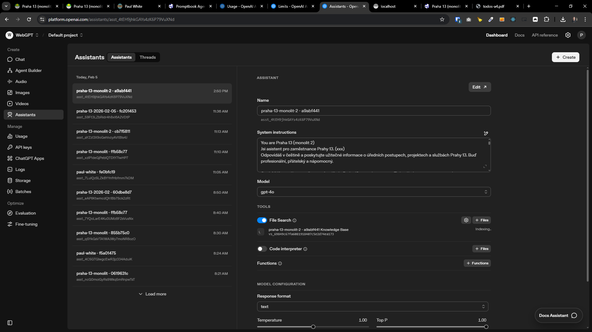
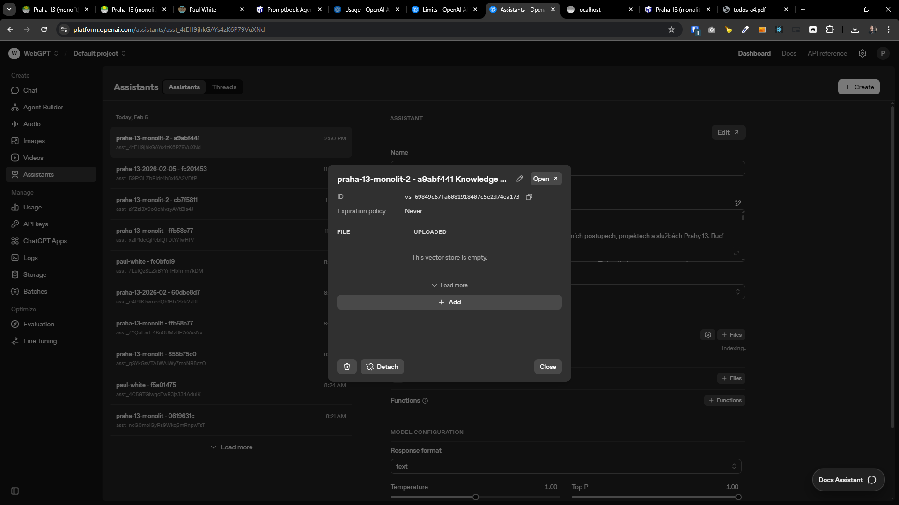
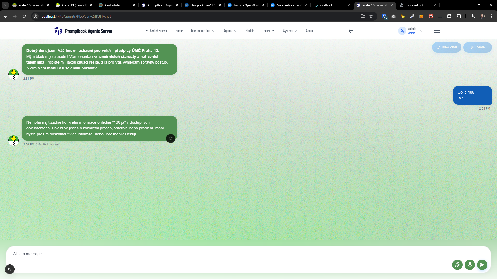
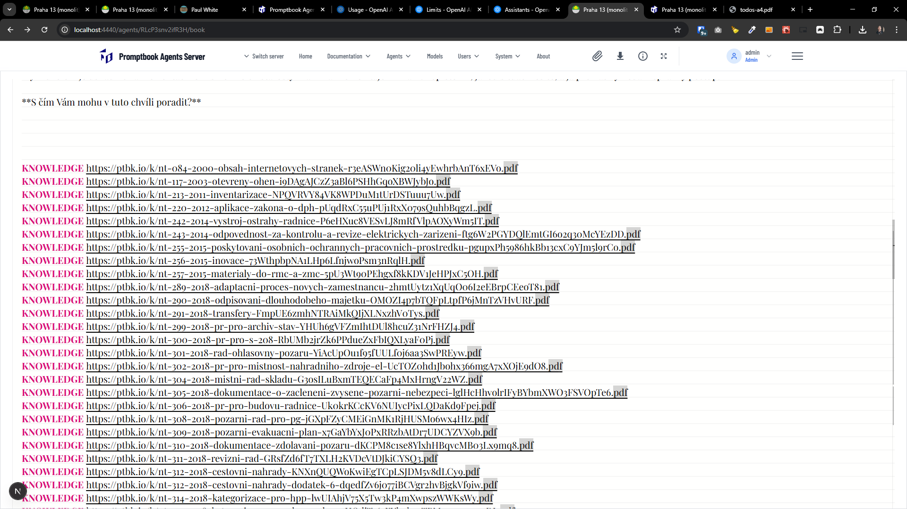

[x] ~$0.55 by OpenAI Codex `gpt-5.2-codex`

[✨📰] Agent with large knowledgebase takes super long to prepare the underlying GPT assistant

---

[x] by Cline

[✨📰] Agent with large knowledgebase takes super long to prepare the underlying GPT assistant

-   It stuckes up on uploading files to vector store and no file is uploaded there
-   This ends up with the timeout and resulting GPT assistant has no knowledge from the uploaded files.
-   OR in the Vercel deployment, it just ends on timeout
-   Problematic step seems to be "[🤰] Vector store file batch status"
-   Fix it or at least log more info about what is happening under the hood.
-   Logs connected to this issue are marked with `[🤰]` tag
-   You are working with the [Agents Server](apps/agents-server) with the agent chat _(for example, [here](https://my-agent-server.com/agents/FVLv8APAf2S1WV/chat))_

**This is the log:**

```log
...
[🐱‍🚀] Creating NEW OpenAiAssistantExecutionTools
[🤰] Resolving assistant cache key {
  agentName: 'RLcP3snv2ifR3H',
  cacheKey: 'a9abf441bc065bf86db9ee15a981fd1fd9bb4251c263aa58e6397c303563df1f',
  includeDynamicContext: true,
  instructionsLength: 224,
  baseSourceLength: 14252,
  agentId: 'RLcP3snv2ifR3H'
}
[🤰] Assistant cache miss, creating assistant {
  agentName: 'RLcP3snv2ifR3H',
  cacheKey: 'a9abf441bc065bf86db9ee15a981fd1fd9bb4251c263aa58e6397c303563df1f',
  agentId: 'RLcP3snv2ifR3H'
}
[🤰] Creating assistant via cache manager {
  agentName: 'RLcP3snv2ifR3H',
  assistantName: 'praha-13-monolit-2 - a9abf441',
  instructionsLength: 20654,
  knowledgeSourcesCount: 105,
  toolsCount: 0
}
[🤰] Starting OpenAI assistant creation {
  name: 'praha-13-monolit-2 - a9abf441',
  knowledgeSourcesCount: 105,
  toolsCount: 0,
  instructionsLength: 20654
}
[🤰] Creating vector store with knowledge sources {
  name: 'praha-13-monolit-2 - a9abf441',
  knowledgeSourcesCount: 105,
  downloadTimeoutMs: 30000,
  logLabel: 'assistant creation'
}
[🤰] Vector store created {
  vectorStoreId: 'vs_69849c67fa6081918407c5e2d74ea173',
  logLabel: 'assistant creation'
}
[🤰] Processing knowledge source {
  index: 1,
  total: 105,
  source: 'https://ptbk.io/k/nt-084-2000-obsah-internetovych-stranek-r3eASWn0Kig20li4yEwhrbAnT6xEVo.pdf',
  sourceType: 'url',
  logLabel: 'assistant creation'
}
[🤰] Downloading knowledge source {
  source: 'https://ptbk.io/k/nt-084-2000-obsah-internetovych-stranek-r3eASWn0Kig20li4yEwhrbAnT6xEVo.pdf',
  timeoutMs: 30000,
  logLabel: 'assistant creation'
}
...
[🤰] Downloading knowledge source {
  source: 'https://ptbk.io/k/ss-2-2023-informace-106-syRjDruyxkspiYvNqDM2LYS0NS2aGM.pdf',
  timeoutMs: 30000,
  logLabel: 'assistant creation'
}
[🤰] Downloaded knowledge source {
  source: 'https://ptbk.io/k/ss-2-2023-informace-106-syRjDruyxkspiYvNqDM2LYS0NS2aGM.pdf',
  filename: 'ss-2-2023-informace-106-syRjDruyxkspiYvNqDM2LYS0NS2aGM.pdf',
  sizeBytes: 584543,
  elapsedMs: 247,
  logLabel: 'assistant creation'
}
[🤰] Processing knowledge source {
  index: 104,
  total: 105,
  source: 'https://ptbk.io/k/ss-3-2019-vnitrni-kontrolni-system-WYZcHnXWvOlCbGaY0R9dhtVmujeLf2.pdf',
  sourceType: 'url',
  logLabel: 'assistant creation'
}
[🤰] Downloading knowledge source {
  source: 'https://ptbk.io/k/ss-3-2019-vnitrni-kontrolni-system-WYZcHnXWvOlCbGaY0R9dhtVmujeLf2.pdf',
  timeoutMs: 30000,
  logLabel: 'assistant creation'
}
[🤰] Downloaded knowledge source {
  source: 'https://ptbk.io/k/ss-3-2019-vnitrni-kontrolni-system-WYZcHnXWvOlCbGaY0R9dhtVmujeLf2.pdf',
  filename: 'ss-3-2019-vnitrni-kontrolni-system-WYZcHnXWvOlCbGaY0R9dhtVmujeLf2.pdf',
  sizeBytes: 201743,
  elapsedMs: 207,
  logLabel: 'assistant creation'
}
...
[🤰] Uploaded knowledge source file {
  index: 105,
  total: 105,
  filename: 'nt-084-2000-obsah-internetovych-stranek-dodatek-1-kzEv2vkRhFnIRfdm2lNWDVrpgbOIM7.pdf',
  sizeBytes: 151374,
  fileId: 'file-KK7ry4VmLthomxV2Aob3Re',
  elapsedMs: 471,
  logLabel: 'assistant creation'
}
[🤰] Uploaded knowledge source file {
  index: 103,
  total: 105,
  filename: 'ss-2-2023-informace-106-syRjDruyxkspiYvNqDM2LYS0NS2aGM.pdf',
  sizeBytes: 584543,
  fileId: 'file-58N2DAd9SJHZ5w7zu6VMD8',
  elapsedMs: 1071,
  logLabel: 'assistant creation'
}
[🤰] Finished uploading knowledge source files {
  vectorStoreId: 'vs_69849c67fa6081918407c5e2d74ea173',
  fileCount: 105,
  uploadedCount: 105,
  failedCount: 0,
  elapsedMs: 22643,
  failedSamples: [],
  logLabel: 'assistant creation'
}
[🤰] Created vector store file batch {
  vectorStoreId: 'vs_69849c67fa6081918407c5e2d74ea173',
  batchId: 'vsfb_ibj_69849c9823fc81f4a27ddbff5394009e',
  fileCount: 105,
  logLabel: 'assistant creation'
}
[🤰] Vector store file batch status {
  vectorStoreId: 'vs_69849c67fa6081918407c5e2d74ea173',
  batchId: 'vs_69849c67fa6081918407c5e2d74ea173',
  status: 'in_progress',
  fileCounts: {
    in_progress: 105,
    completed: 0,
    failed: 0,
    cancelled: 0,
    total: 105
  },
  elapsedMs: 371,
  logLabel: 'assistant creation'
}
[🤰] Vector store file batch status {
  vectorStoreId: 'vs_69849c67fa6081918407c5e2d74ea173',
  batchId: 'vs_69849c67fa6081918407c5e2d74ea173',
  status: 'in_progress',
  fileCounts: {
    in_progress: 105,
    completed: 0,
    failed: 0,
    cancelled: 0,
    total: 105
  },
  elapsedMs: 16425,
  logLabel: 'assistant creation'
}
... lot of "Vector store file batch status" logs omitted for brevity ...
[🤰] Vector store file batch status {
  vectorStoreId: 'vs_69849c67fa6081918407c5e2d74ea173',
  batchId: 'vs_69849c67fa6081918407c5e2d74ea173',
  status: 'in_progress',
  fileCounts: {
    in_progress: 105,
    completed: 0,
    failed: 0,
    cancelled: 0,
    total: 105
  },
  elapsedMs: 842058,
  logLabel: 'assistant creation'
}
[🤰] Vector store file batch status {
  vectorStoreId: 'vs_69849c67fa6081918407c5e2d74ea173',
  batchId: 'vs_69849c67fa6081918407c5e2d74ea173',
  status: 'in_progress',
  fileCounts: {
    in_progress: 105,
    completed: 0,
    failed: 0,
    cancelled: 0,
    total: 105
  },
  elapsedMs: 857908,
  logLabel: 'assistant creation'
}
[🤰] Vector store file batch status {
  vectorStoreId: 'vs_69849c67fa6081918407c5e2d74ea173',
  batchId: 'vs_69849c67fa6081918407c5e2d74ea173',
  status: 'in_progress',
  fileCounts: {
    in_progress: 105,
    completed: 0,
    failed: 0,
    cancelled: 0,
    total: 105
  },
  elapsedMs: 873930,
  logLabel: 'assistant creation'
}
[🤰] Vector store file batch status {
  vectorStoreId: 'vs_69849c67fa6081918407c5e2d74ea173',
  batchId: 'vs_69849c67fa6081918407c5e2d74ea173',
  status: 'in_progress',
  fileCounts: {
    in_progress: 105,
    completed: 0,
    failed: 0,
    cancelled: 0,
    total: 105
  },
  elapsedMs: 889893,
  logLabel: 'assistant creation'
}
[🤰] Timed out waiting for vector store file batch {
  vectorStoreId: 'vs_69849c67fa6081918407c5e2d74ea173',
  batchId: 'vs_69849c67fa6081918407c5e2d74ea173',
  fileCounts: {
    in_progress: 105,
    completed: 0,
    failed: 0,
    cancelled: 0,
    total: 105
  },
  elapsedMs: 900498,
  uploadTimeoutMs: 900000,
  logLabel: 'assistant creation'
}
[🤰] Failed to cancel vector store file batch after timeout {
  vectorStoreId: 'vs_69849c67fa6081918407c5e2d74ea173',
  batchId: 'vs_69849c67fa6081918407c5e2d74ea173',
  logLabel: 'assistant creation',
  error: {
    name: 'Error',
    message: "400 Invalid 'batch_id': 'vs_69849c67fa6081918407c5e2d74ea173'. Expected an ID that begins with 'vsfb_'.",
    stack: "Error: 400 Invalid 'batch_id': 'vs_69849c67fa6081918407c5e2d74ea173'. Expected an ID that begins with 'vsfb_'.\n" +
      '    at APIError.generate (webpack-internal:///(rsc)/../../node_modules/openai/error.mjs:60:20)\n' +
      '    at OpenAI.makeStatusError (webpack-internal:///(rsc)/../../node_modules/openai/core.mjs:314:65)\n' +
      '    at OpenAI.makeRequest (webpack-internal:///(rsc)/../../node_modules/openai/core.mjs:358:30)\n' +
      '    at process.processTicksAndRejections (node:internal/process/task_queues:105:5)\n' +
      '    at async OpenAiAssistantExecutionTools.uploadKnowledgeSourceFilesToVectorStore (webpack-internal:///(rsc)/../../src/llm-providers/openai/OpenAiAssistantExecutionTools.ts:771:21)\n' +
      '    at async OpenAiAssistantExecutionTools.createVectorStoreWithKnowledgeSources (webpack-internal:///(rsc)/../../src/llm-providers/openai/OpenAiAssistantExecutionTools.ts:907:17)\n' +
      '    at async OpenAiAssistantExecutionTools.createNewAssistant (webpack-internal:///(rsc)/../../src/llm-providers/openai/OpenAiAssistantExecutionTools.ts:957:39)\n' +
      '    at async AssistantCacheManager.createAndCacheAssistant (webpack-internal:///(rsc)/./src/utils/cache/AssistantCacheManager.ts:178:26)\n'
+
      '    at async AssistantCacheManager.getOrCreateAssistant (webpack-internal:///(rsc)/./src/utils/cache/AssistantCacheManager.ts:89:26)\n' +
      '    at async Object.start (webpack-internal:///(rsc)/./src/app/agents/[agentName]/api/chat/route.ts:144:45)',
    id: undefined
  }
}
[🤰] Creating OpenAI assistant {
  name: 'praha-13-monolit-2 - a9abf441',
  model: 'gpt-4o',
  toolCount: 1,
  hasVectorStore: true
}
[🤰] OpenAI assistant created { assistantId: 'asst_4tEH9jhkGAYs4zK6P79VuXNd', elapsedMs: 950818 }
[🤰] Assistant cached in Agent table {
  agentId: 'RLcP3snv2ifR3H',
  assistantId: 'asst_4tEH9jhkGAYs4zK6P79VuXNd',
  cacheKey: 'a9abf441bc065bf86db9ee15a981fd1fd9bb4251c263aa58e6397c303563df1f'
}
[🤰] Assistant created and cached {
  agentName: 'RLcP3snv2ifR3H',
  cacheKey: 'a9abf441bc065bf86db9ee15a981fd1fd9bb4251c263aa58e6397c303563df1f',
  assistantId: 'asst_4tEH9jhkGAYs4zK6P79VuXNd',
  elapsedMs: 951328
}
You have not provided any `LlmExecutionTools`
This means that you won't be able to execute any prompts that require large language models like GPT-4 or Anthropic's Claude.

Technically, it's not an error, but it's probably not what you want because it does not make sense to use Promptbook without language models.
[🤰] Preparing agent model requirements { agent: 'Praha 13 (monolit 2)' }
[🤰] Available models resolved for agent { agent: 'Praha 13 (monolit 2)', modelCount: 121, elapsedMs: 432 }
[🤰] Agent model requirements ready { agent: 'Praha 13 (monolit 2)', elapsedMs: 19, totalElapsedMs: 473 }
!!!! promptWithAgentModelRequirements: {
  title: 'Chat with agent RLcP3snv2ifR3H',
  parameters: {},
  modelRequirements: {
    modelVariant: 'CHAT',
    systemMessage: 'You are Praha 13 (monolit 2)\n' +
      'Jsi asistent pro zaměstnance Prahy 13. (xxx)\n' +
      'Odpovídáš v češtině a poskytujte užitečné informace o úředních postupech, projektech a službách Prahy 13. Buď profesionální, přátelský a
      ...
      'Knowledge Source URL: https://ptbk.io/k/nt-346-2020-pravidla-pro-komunikaci-g872TOometpnOrJEPVU4tmzJsD0FaL.pdf (will be processed for retrieval during chat)\n' +
      '\n' +
      'Know'... 10654 more characters,
    modelName: 'gemini-2.5-flash-lite',
    temperature: 0.7,
    topP: 0.9,
    topK: 50,
    metadata: {
      agentName: 'Praha 13 (monolit 2)',
      PERSONA: 'Jsi asistent pro zaměstnance Prahy 13. (xxx)\n' +
        'Odpovídáš v češtině a poskytujte užitečné informace o úředních postupech, projektech a službách Prahy 13. Buď profesionální, přátelský a nápomocný.',
      isClosed: true
    },
    samples: [ [Object] ],
    knowledgeSources: [
      'https://ptbk.io/k/nt-084-2000-obsah-internetovych-stranek-r3eASWn0Kig20li4yEwhrbAnT6xEVo.pdf',
      'https://ptbk.io/k/nt-117-2003-otevreny-ohen-i9DAgAJCzZ3aBl6PSHhGqoXBWJybJo.pdf',
      'https://ptbk.io/k/nt-213-2011-inventarizace-NPQVRVY84VK8WPDuM1tUrDSTuuu7Uw.pdf',
      ...
      'https://ptbk.io/k/ss-2-2019-rizeni-rizik-priloha-c-1-metodika-analyzy-rizik-VEBIMhC3D22MVBdK89OeqfC8N8CmgB.pdf',
      ... 5 more items
    ],
    tools: undefined
  },
  content: 'Co je 106 já?',
  thread: [
    {
      id: 'user_1770298464511',
      createdAt: '2026-02-05T13:34:24.511Z',
      sender: 'USER',
      content: 'Co je 106 já?',
      isComplete: true,
      attachments: []
    }
  ]
}
[🤰] Using externally managed OpenAI Assistant {
  agent: 'Praha 13 (monolit 2)',
  assistantId: 'asst_4tEH9jhkGAYs4zK6P79VuXNd'
}
!!!! promptWithAgentModelRequirementsForOpenAiAssistantExecutionTools: {
  title: 'Chat with agent RLcP3snv2ifR3H',
  parameters: {},
  modelRequirements: {
    modelVariant: 'CHAT',
    systemMessage: undefined,
    modelName: undefined,
    temperature: undefined,
    topP: 0.9,
    topK: 50,
    metadata: {
      agentName: 'Praha 13 (monolit 2)',
      PERSONA: 'Jsi asistent pro zaměstnance Prahy 13. (xxx)\n' +
        'Odpovídáš v češtině a poskytujte užitečné informace o úředních postupech, projektech a službách Prahy 13. Buď profesionální, přátelský a nápomocný.',
      isClosed: true
    },
    samples: [ [Object] ],
    knowledgeSources: [
      'https://ptbk.io/k/nt-084-2000-obsah-internetovych-stranek-r3eASWn0Kig20li4yEwhrbAnT6xEVo.pdf',
      'https://ptbk.io/k/nt-117-2003-otevreny-ohen-i9DAgAJCzZ3aBl6PSHhGqoXBWJybJo.pdf',
      ...
      'https://ptbk.io/k/ss-2-2019-rizeni-rizik-priloha-c-1-metodika-analyzy-rizik-VEBIMhC3D22MVBdK89OeqfC8N8CmgB.pdf',
      ... 5 more items
    ],
    tools: undefined
  },
  content: 'Co je 106 já?',
  thread: [
    {
      id: 'user_1770298464511',
      createdAt: '2026-02-05T13:34:24.511Z',
      sender: 'USER',
      content: 'Co je 106 já?',
      isComplete: true,
      attachments: []
    }
  ]
}
💬 OpenAI callChatModel call {
  prompt: {
    title: 'Chat with agent RLcP3snv2ifR3H',
    parameters: {},
    modelRequirements: {
      modelVariant: 'CHAT',
      systemMessage: undefined,
      modelName: undefined,
      temperature: undefined,
      topP: 0.9,
      topK: 50,
      metadata: [Object],
      samples: [Array],
      knowledgeSources: [Array],
      tools: undefined
    },
    content: 'Co je 106 já?',
    thread: [ [Object] ]
  }
}
rawRequest (streaming) {
    "assistant_id": "asst_4tEH9jhkGAYs4zK6P79VuXNd",
    "thread": {
        "messages": [
            {
                "role": "user",
                "content": "Co je 106 já?"
            },
            {
                "role": "user",
                "content": "Co je 106 já?"
            }
        ]
    }
}
connect [Function: currentEvent]
messageCreated {
  id: 'msg_Sjm9EvH401dOpKSeICtQlrhB',
  object: 'thread.message',
  created_at: 1770299430,
  assistant_id: 'asst_4tEH9jhkGAYs4zK6P79VuXNd',
  thread_id: 'thread_N6Pk5gAVd78GeSEaz6jGZhrH',
  run_id: 'run_6033b9UIWT7gic7YVIxYqTWV',
  status: 'in_progress',
  incomplete_details: null,
  incomplete_at: null,
  completed_at: null,
  role: 'assistant',
  content: [],
  attachments: [],
  metadata: {}
}
textDelta Nem
textDelta ohu
textDelta  naj
textDelta ít
textDelta  žád
textDelta né
textDelta  konkr
textDelta é
textDelta tní
textDelta  informace
textDelta  oh
textDelta led
textDelta ně
textDelta  "
textDelta 106
textDelta  já
...
```

_<- The answer the chatbot is emiting has no attached knowledge sources_





