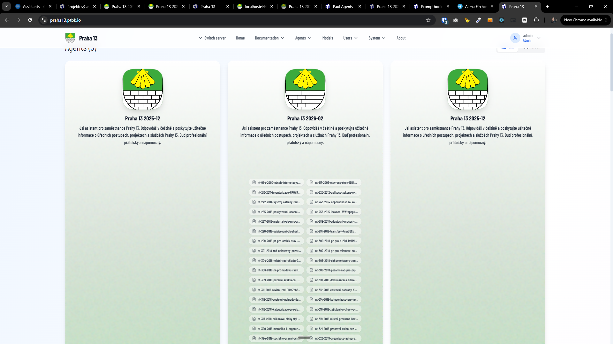
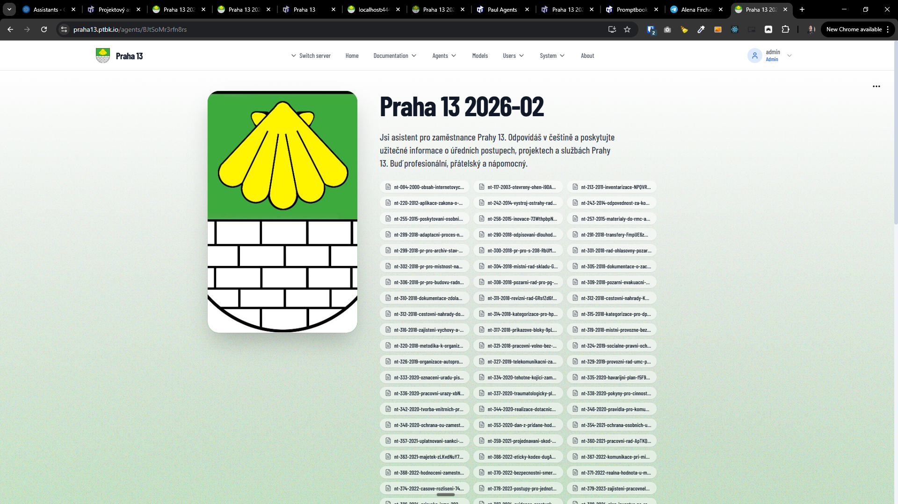

[x] ~$0.46

[✨🚧] Limit number of the capability chips. There can be an agent which has tens of the capability chips, and this looks awful and provides terrible UX and UI for the user. Please do some techniques to reduce these capability chips if there are many of them. You are working with the agent server; these chips are both on the homepage and on the agent's page, but due to separate limits, there should be one limit for the home page (there should be maximally 3 capability chips), and on the agent profile page, there can be maximally 7 capability chips.

Every capability chip should have some priority; this priority should be computed, and the most important priority is to our chips which refer to which agent can communicate with this agent using team commitment. The second most important is the parent and inheritance chips. The third are the capabilities like using browser or time and so on. And in last place should be knowledge and other chips do it universally.

Take care of good architecture and software design, and try to figure out some grouping strategy, for example, when there are a lot of PDF documents, do not show there a lot of chips with the PDF documents, but try to group them together somehow.

-   Keep in mind the DRY _(don't repeat yourself)_ principle.
-   You are working with the [Agents Server](apps/agents-server)
-   Add the changes into the [changelog](changelog/_current-preversion.md)

---

[-]

[✨🚧] baz

-   Keep in mind the DRY _(don't repeat yourself)_ principle.
-   You are working with the [Agents Server](apps/agents-server)
-   Add the changes into the [changelog](changelog/_current-preversion.md)

---

[-]

[✨🚧] baz

-   Keep in mind the DRY _(don't repeat yourself)_ principle.
-   You are working with the [Agents Server](apps/agents-server)
-   Add the changes into the [changelog](changelog/_current-preversion.md)

---

[-]

[✨🚧] baz

-   Keep in mind the DRY _(don't repeat yourself)_ principle.
-   You are working with the [Agents Server](apps/agents-server)
-   Add the changes into the [changelog](changelog/_current-preversion.md)

