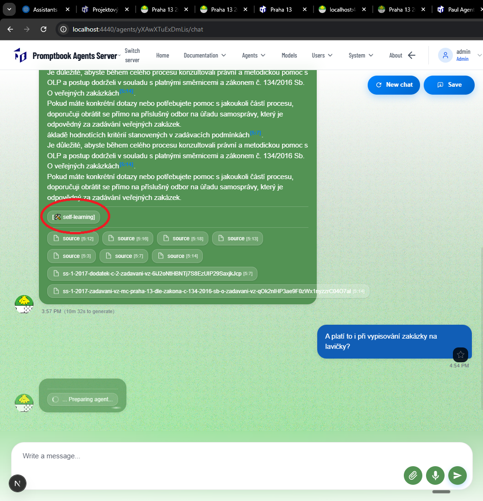
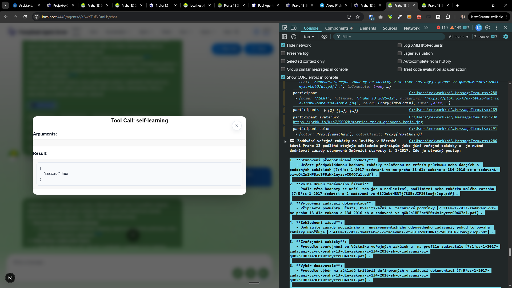

[x] ~$0.35

[✨📇] Enhance the self-learning chip.

-   The agent used self-learning. There is shown a simple chip bellow the message.
-   Change the emoji to "🧠" and remove the brackets.
-   Text "[🛠️ self-learning]" should became "🧠 self-learning"
-   Keep in mind the DRY _(don't repeat yourself)_ principle.
-   You are working with the [Agents Server](apps/agents-server)

---

[x] ~$0.69

[✨📇] Enhance the self-learning chip popup modal

-   The agent used self-learning. There is shown a simple chip bellow the message.
-   When the user clicks on the self-learning chip, there is shown a popup modal with some info.
-   Enhance the UI and UX of this popup modal.
-   This model shouldn't look technical. It should look very user-friendly. It should explain to the user what is self-learning in simple words.
-   Transfer from server the information about the self-learning and explain it in some simple way in this pop-up model.
-   This model isn't for the programmers or experts. This model should be for regular users.
-   Keep in mind the DRY _(don't repeat yourself)_ principle.
-   You are working with the [Agents Server](apps/agents-server)

---

[-]

[✨📇] brr

-   Keep in mind the DRY _(don't repeat yourself)_ principle.
-   You are working with the [Agents Server](apps/agents-server)
-   Add the changes into the [changelog](changelog/_current-preversion.md)

---

[-]

[✨📇] brr

-   Keep in mind the DRY _(don't repeat yourself)_ principle.
-   You are working with the [Agents Server](apps/agents-server)
-   Add the changes into the [changelog](changelog/_current-preversion.md)

