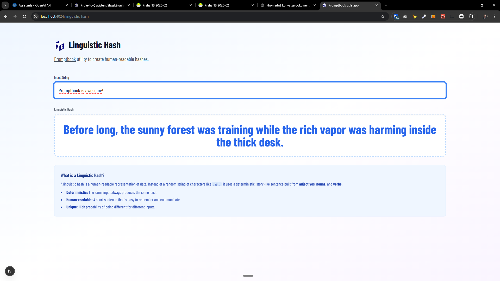

[x] ~$0.45

[✨📸] There is a function to do the linguistic hash, enhance it

-   Now it spits just three words like "Slick sigh beating" or "Slick sigh beating", Change it in a such way that the linguistic hash will be entire sentence "story" and much more memorable.
-   There is both the function which can be used from the package and the showcase page and also unit test. Look at entire vertical of it.
-   Keep in mind the DRY _(don't repeat yourself)_ principle.
-   You are working with the [Utils app](apps/utils) on page http://localhost:4024/linguistic-hash

---

[ ]

[✨📸] Allow to set number of words in linguistic hash.

-   It can go from 2 to 20 words. Default is 7 words.
-   The input causes avalanche hash effect, so even small changes in input will cause completely different output.
-   The number of words does not cause a avalanche hash effect, so changing number of words from 7 to 8 will just add more details to the story, but the story will be similar, e.g. "Slick sigh beating" to "Slick sigh beating dancing".
-   Single word linguistic hash is just the noun itself, e.g. "Slick" or "Mountain".
-   Two words linguistic hash is adjective + noun, e.g. "Slick Mountain" or "Ancient River".
-   Update the manual and reasoning behing the change on the /linguistic-hash page
-   For 1 and 2 words warn about possible collisions and low uniqueness.
-   There is both the function which can be used from the package and the showcase page and also unit test. Look at entire vertical of it.
-   Keep in mind the DRY _(don't repeat yourself)_ principle.
-   You are working with the [Utils app](apps/utils) on page http://localhost:4024/linguistic-hash

---

[ ]

[✨📸] Make linguistic hash in other languages

-   Start with the Czech language.
-   The linguistic hash should produce similar results as in English, e.g. similar number of words, similar structure (adjective + noun + verb + ...), similar memorability.
-   BUT be aware that direct translation of words may not work well, so choose words that fit well in the target language and culture.
-   There is both the function which can be used from the package and the showcase page and also unit test. Look at entire vertical of it.
-   Keep in mind the DRY _(don't repeat yourself)_ principle, also keep in mind the SOLID principles and create abstractions if needed, separate language-specific data from the logic and into separate files if needed.
-   You are working with the [Utils app](apps/utils) on page http://localhost:4024/linguistic-hash

