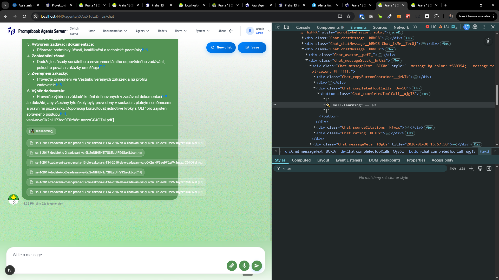
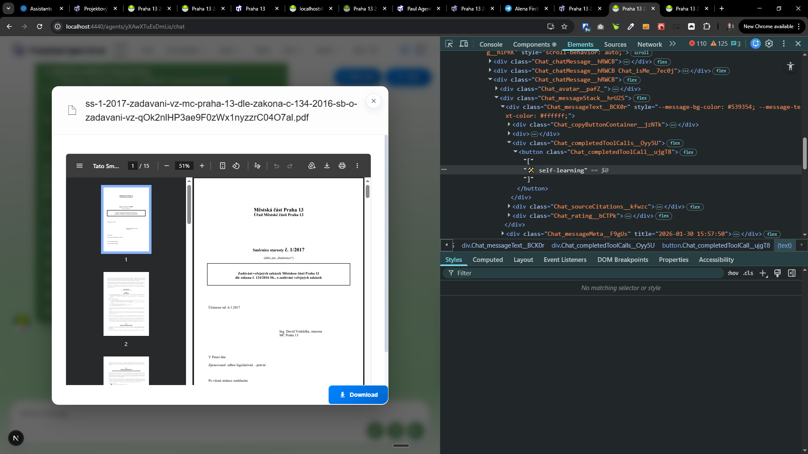

[.] _<- TODO: [🥀] Study how the sourcing is working_

[✨🥀] Remove the ID from the source chip.

-   @@@
-   For example "
    ss-1-2017-zadavani-vz-mc-praha-13-dle-zakona-c-134-2016-sb-o-zadavani-vz-qOk2nlHP3ae9F0zWx1nyzzrC04O7al.pdf" -> "
    ss-1-2017-zadavani-vz-mc-praha-13-dle-zakona-c-134-2016-sb-o-zadavani-vz-qOk2nlHP3ae9F0zWx1nyzzrC04O7al.pdf"
-   This is relevant for both the source chip and the pop-up model which is opened when clicking on the source chip.
-   Keep in mind the DRY _(don't repeat yourself)_ principle.
-   Do a proper analysis of the current functionality before you start implementing.
-   You are working with the [Agents Server](apps/agents-server)
-   Add the changes into the [changelog](changelog/_current-preversion.md)

---

[-]

[✨🥀] foo

-   Keep in mind the DRY _(don't repeat yourself)_ principle.
-   Do a proper analysis of the current functionality before you start implementing.
-   You are working with the [Agents Server](apps/agents-server)
-   Add the changes into the [changelog](changelog/_current-preversion.md)

---

[-]

[✨🥀] foo

-   Keep in mind the DRY _(don't repeat yourself)_ principle.
-   Do a proper analysis of the current functionality before you start implementing.
-   You are working with the [Agents Server](apps/agents-server)
-   Add the changes into the [changelog](changelog/_current-preversion.md)

---

[-]

[✨🥀] foo

-   Keep in mind the DRY _(don't repeat yourself)_ principle.
-   Do a proper analysis of the current functionality before you start implementing.
-   You are working with the [Agents Server](apps/agents-server)
-   Add the changes into the [changelog](changelog/_current-preversion.md)
