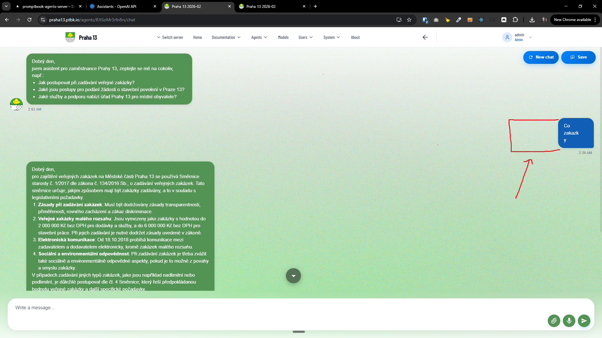
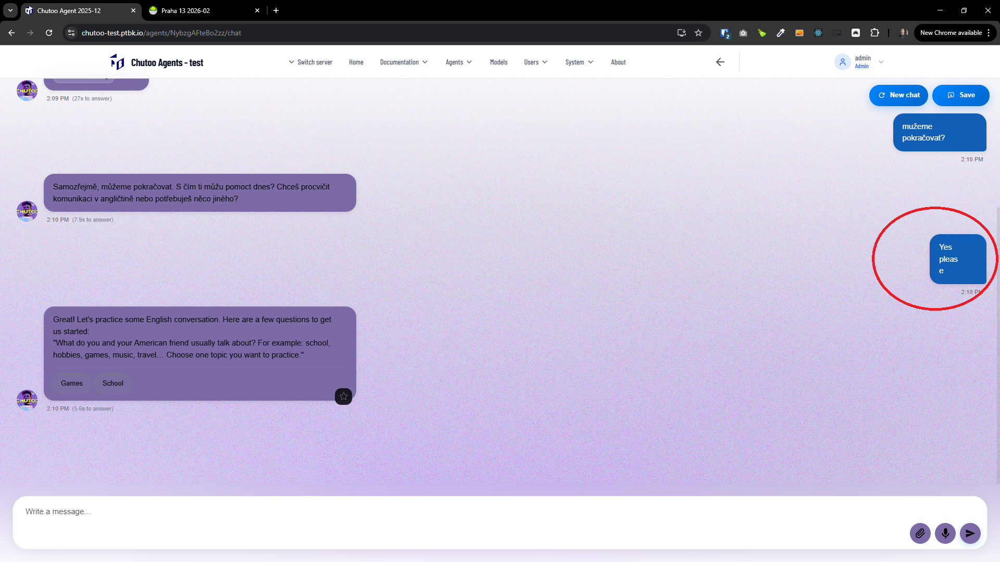
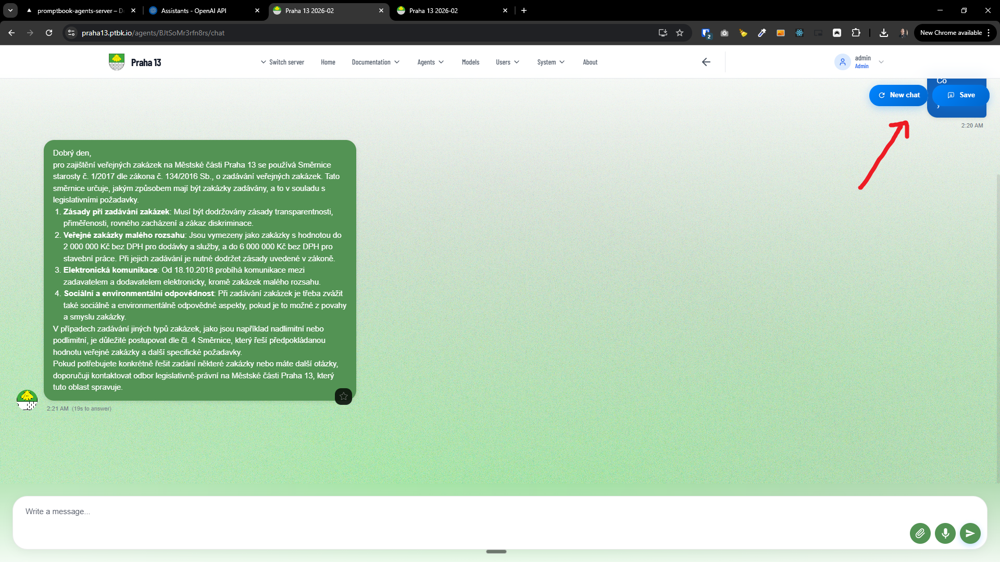
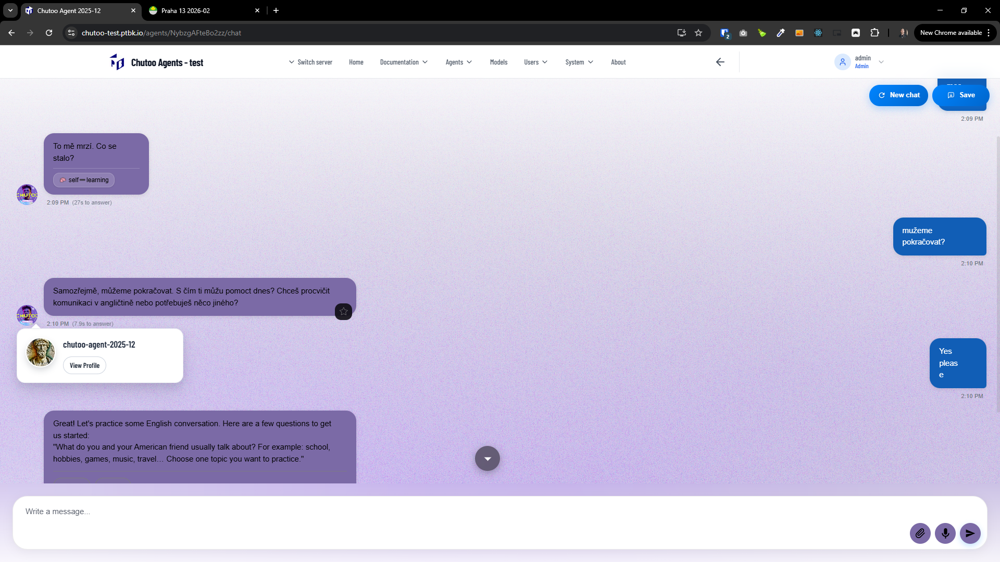

[x]

[✨📮] Fix the width of the message in the chat.

-   When the message contains little text or short words, the message has very low width and looks very bad
-   There should be some minimum width of the message box.
-   It must look great on all screen sizes.
-   You are working with the [Agents Server](apps/agents-server) with the agent chat

---

[ ]

[✨📮] Fix overlapping action buttons in the chat.

-   The action buttons (like "New Chat" or "Save") are shown on the correct size left or right of the chat window.
-   But when you are scrolling the chat, these buttons can obstruct the view to the messages.
-   There is already some logic to to fade out these buttons when scrolling, but it is not working correctly because it always shows the buttons when you stop scrolling for a moment.
-   You are working with the [Agents Server](apps/agents-server) with the agent chat _(for example, [here](https://my-agent-server.com/agents/FVLv8APAf2S1WV/chat))_

---

[ ]

[✨📮] Fix the agent image of the pop-up when hovering over the agent profile image.

-   The pop-up should show actual imige of the agent
-   Now its showing the default image instead of image defined by `META IMAGE`
-   There should be a generic pattern for the agents. Every time when you are showing an image of the agent, show first try to show `META IMAGE`, if its not defined, show the default generated image.
    -   This pattern should be relevant both in the local agents, federated agents, and across the entire agent server application.
-   Fix the image here and also try to go through the Enter Agent Server application and find if this error isn't occurring also somewhere else.
-   You are working with the [Agents Server](apps/agents-server) with the agent chat _(for example, [here](https://my-agent-server.com/agents/FVLv8APAf2S1WV/chat))_

