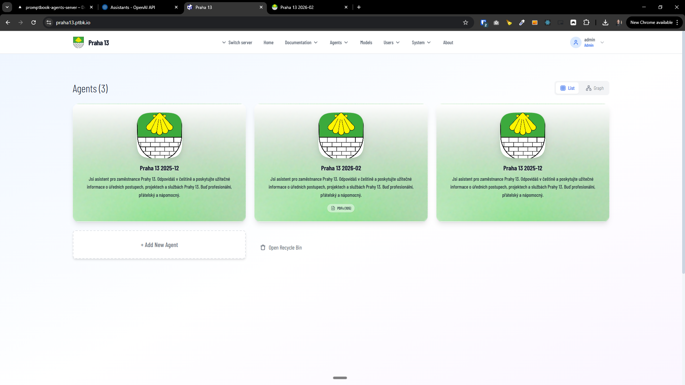

[x] ~$1.88

[✨🦢] Allow to organize agents into folders.

-   Allow to create folders. Folders can contain agents and other folders (subfolders).
-   Allow to drag and drop the agents to reorder them or to put them into the folders.
-   When you are in the subfolder, allow to drag and drop the agents out of the subfolder.
-   Allow to reorder agents by drag and drop. Persist also the order of the agent, not only where it is in the sub-folder structure.
-   Folders are always first, and agents are second, but you are allowed to reorder both folders and agents.
-   You are allowed to drag folders into the folder.
-   The current folder should be in the get search parameters of the URL. E.g. when you are in folder "Sales/Europe", the URL is `/agents?folder=Sales/Europe`.
-   Visual of the the agent, should be the same as it is now.
-   Visual of the folder should be multiple icons of containing agents (Similar to Windows folder when previewing files inside).
-   Allow to create, rename and delete folders.
-   When deleting a folder, user must confirm the deletion of N agents and M subfolders inside, and all agents and subfolders will be moved to the Recycle Bin.
-   Recycle Bin can contain both agents and folders.
-   Recycle Bin behaves kind of like a folder, you can see the content of the Recycle Bin, and you can restore agents and folders from there.
-   In the Agents Server UI, show the folder structure in the agents list view.
-   Only logged in users should be able to do the organization.
-   Anonymous visitors are seeing only the publicly visible agents and folders (and sub, subsub,... folders) which are containing some publicly visible agents.
-   This structure isn't affecting the agent URL. E.g. an agent in folder "Sales/Europe" is still and only accessible under `/agents/{agentId}/...` - no folder path in the URL.
-   This shouldn't affect the graph view.
-   Persist the folder structure in the database
-   Create database migration for the change
    -   Migrations are located in `/apps/agents-server/src/database/migrations`
    -   Be aware that table names in migrations have prefix `prefix_` _(look at existing migrations for reference)_
-   Keep in mind the DRY _(don't repeat yourself)_ principle.
-   You are working with the [Agents Server](apps/agents-server)
-   Add the changes into the [changelog](changelog/_current-preversion.md)

---

[ ]

[✨🦢] When creating folders in agent server, it ends up with an error: 'invalid input syntax for type bigint: "null"'

-   Fix it
-   If you need to create database migration for the change
    -   Migrations are located in `/apps/agents-server/src/database/migrations`
    -   Be aware that table names in migrations have prefix `prefix_` _(look at existing migrations for reference)_
-   You are working with the [Agents Server](apps/agents-server)

---

[-]

[✨🦢] baz

-   Keep in mind the DRY _(don't repeat yourself)_ principle.
-   You are working with the [Agents Server](apps/agents-server)
-   Add the changes into the [changelog](changelog/_current-preversion.md)

---

[-]

[✨🦢] baz

-   Keep in mind the DRY _(don't repeat yourself)_ principle.
-   You are working with the [Agents Server](apps/agents-server)
-   Add the changes into the [changelog](changelog/_current-preversion.md)
