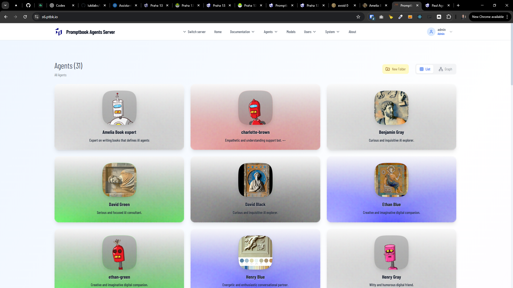
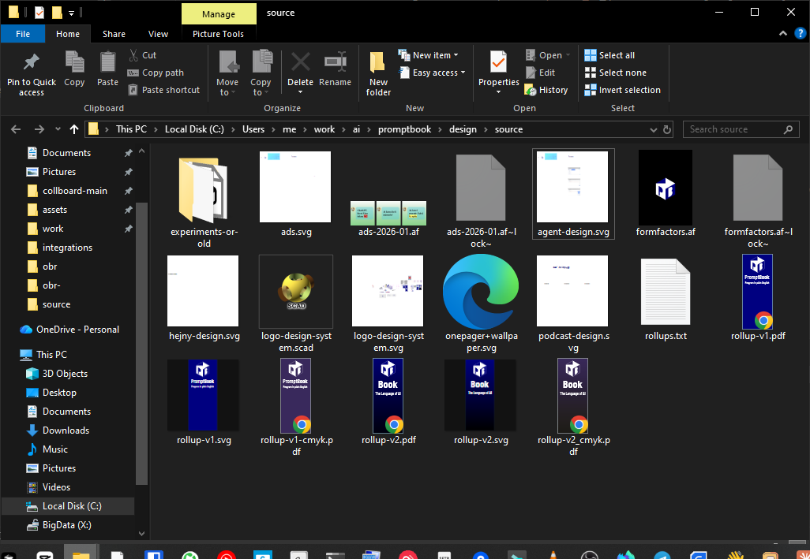
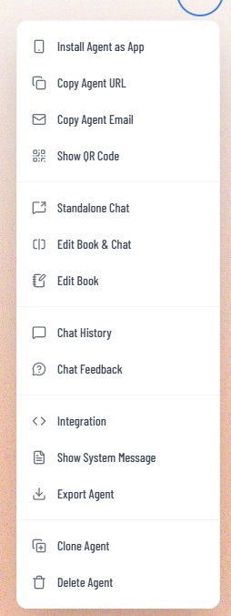
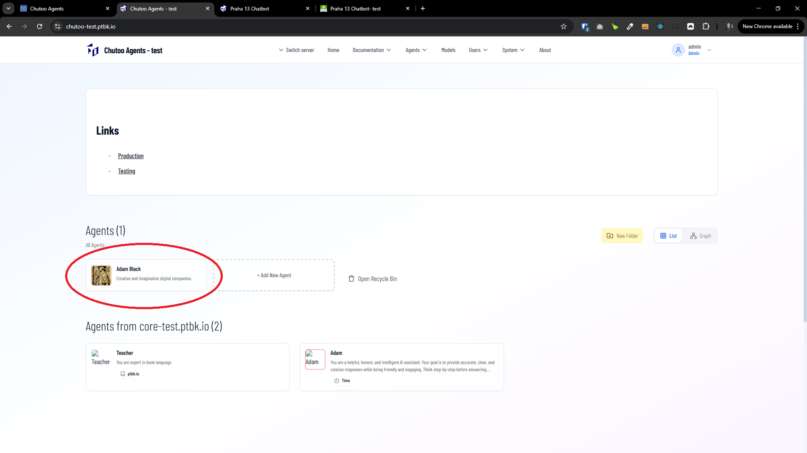
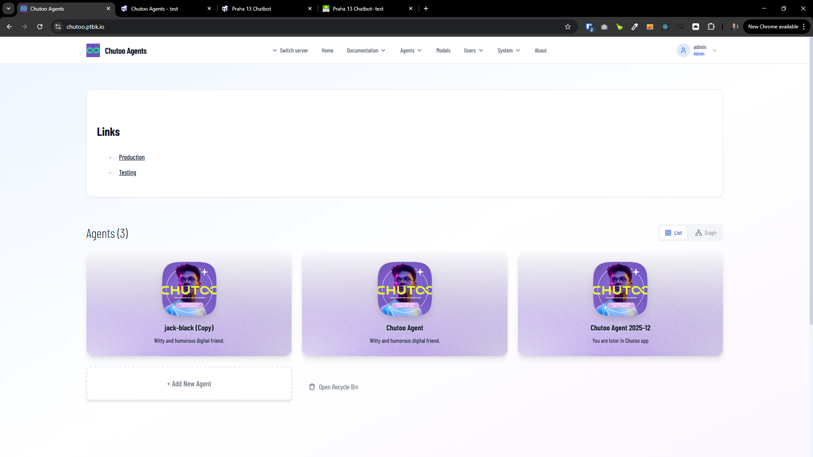
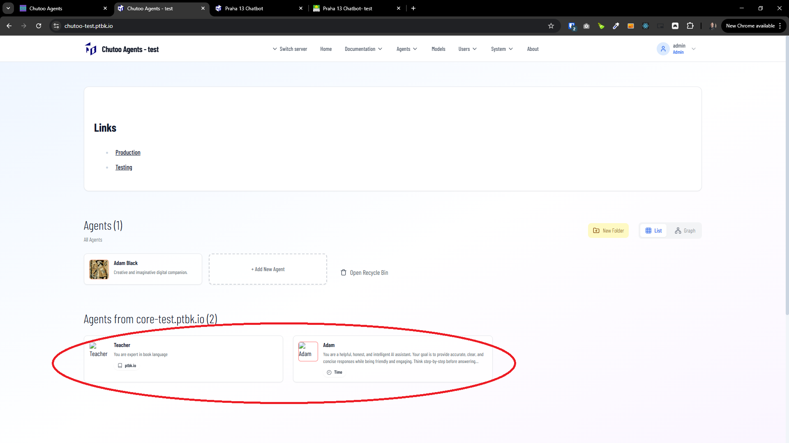

[x] ~$1.88

[✨🦢] Allow to organize agents into folders.

-   Allow to create folders. Folders can contain agents and other folders (subfolders).
-   Allow to drag and drop the agents to reorder them or to put them into the folders.
-   When you are in the subfolder, allow to drag and drop the agents out of the subfolder.
-   Allow to reorder agents by drag and drop. Persist also the order of the agent, not only where it is in the sub-folder structure.
-   Folders are always first, and agents are second, but you are allowed to reorder both folders and agents.
-   You are allowed to drag folders into the folder.
-   The current folder should be in the get search parameters of the URL. E.g. when you are in folder "Sales/Europe", the URL is `/agents?folder=Sales/Europe`.
-   Visual of the the agent, should be the same as it is now.
-   Visual of the folder should be multiple icons of containing agents (Similar to Windows folder when previewing files inside).
-   Allow to create, rename and delete folders.
-   When deleting a folder, user must confirm the deletion of N agents and M subfolders inside, and all agents and subfolders will be moved to the Recycle Bin.
-   Recycle Bin can contain both agents and folders.
-   Recycle Bin behaves kind of like a folder, you can see the content of the Recycle Bin, and you can restore agents and folders from there.
-   In the Agents Server UI, show the folder structure in the agents list view.
-   Only logged in users should be able to do the organization.
-   Anonymous visitors are seeing only the publicly visible agents and folders (and sub, subsub,... folders) which are containing some publicly visible agents.
-   This structure isn't affecting the agent URL. E.g. an agent in folder "Sales/Europe" is still and only accessible under `/agents/{agentId}/...` - no folder path in the URL.
-   This shouldn't affect the graph view.
-   Persist the folder structure in the database
-   Create database migration for the change
    -   Migrations are located in `/apps/agents-server/src/database/migrations`
    -   Be aware that table names in migrations have prefix `prefix_` _(look at existing migrations for reference)_
-   Keep in mind the DRY _(don't repeat yourself)_ principle.
-   You are working with the [Agents Server](apps/agents-server)
-   Add the changes into the [changelog](changelog/_current-preversion.md)

---

[x] ~$0.22

[✨🦢] When creating folders in agent server, it ends up with an error: 'invalid input syntax for type bigint: "null"'

-   Fix it
-   If you need to create database migration for the change
    -   Migrations are located in `/apps/agents-server/src/database/migrations`
    -   Be aware that table names in migrations have prefix `prefix_` _(look at existing migrations for reference)_
-   You are working with the [Agents Server](apps/agents-server)

---

[x] ~$0.91

[✨🦢] Make agent chips smaller.

-   The agent boxes on the home page are too large. Make them smaller. Take inspiration, for example, from the Windows File Explorer view.
-   The agents should look more like files.
-   Keep in mind the DRY _(don't repeat yourself)_ principle.
-   You are working with the [Agents Server](apps/agents-server) with the Agents on the home page `/` on List view

---

[x] ~$0.76

[✨🦢] Enhance the UI and UX of the agents reordering.

-   Reordering has a terrible user experience. It is working, but you need to drag the agent onto another agent, and you have no visual feedback that it is working until the reorder is finished.
-   Once the user starts to drag, it should snap out the agent from the list and work highly interactively.
-   While dragging, there should be visual indicators where the agent will be dropped.
-   Feel free to use some library to do this properly.
-   Keep in mind the DRY _(don't repeat yourself)_ principle.
-   You are working with the [Agents Server](apps/agents-server) with the Agents on the home page `/` on List view

---

[x] ~$0.33

[✨🦢] Add parent folder when in some subfolder _(for example `http://localhost:4440/?folder=aaa`)_, and allow agent to be dragged out to the parent folder.

-   When you are looking into some folder or subfolder, you should be able to very easily and quickly drag the agent to the parent folder.
-   Keep in mind the DRY _(don't repeat yourself)_ principle.
-   You are working with the [Agents Server](apps/agents-server) with the Agents on the home page `/` on List view

---

[x] ~$0.77

[✨🦢] When showing the subfolder _(for example `http://localhost:4440/?folder=aaa`)_, do not show `HOMEPAGE_MESSAGE` or federated servers.

-   The homepage _(for example `http://localhost:4440/`)_ should look like now, folder _(for example `http://localhost:4440/?folder=aaa`)_ should show the folder name with number of agents inside, for example not "Agents (31)" but "Aaa (15)".
-   Also `HOMEPAGE_MESSAGE` is relevant only for the homepage, not for the subfolder view.
-   Also federated servers and their agents are relevant only for the homepage, not for the subfolder view.
-   Keep in mind the DRY _(don't repeat yourself)_ principle.
-   You are working with the [Agents Server](apps/agents-server) with the Agents on the home page `/` on List view

---

[x] ~$0.93

[✨🦢] When the new agent is created, and you are in the subfolder _(for example `http://localhost:4440/?folder=aaa`)_, create this agent in this subfolder.

-   Keep in mind the DRY _(don't repeat yourself)_ principle.
-   You are working with the [Agents Server](apps/agents-server) with the Agents on the home page `/` on List view

---

[x] ~$1.28

[✨🦢] Create context menu when clicking the right button on the agent.

-   This context menu should be the same as the menu in the agent. _(for example `http://localhost:4440/agents/7ZEA1J4MuyeFLG`)_
-   Allow to rename the agent from this context menu.
-   Keep in mind the DRY _(don't repeat yourself)_ principle, There should be only one place where this context menu lives: reuse it in the agent list view _(for example `http://localhost:4440/`)_ and also in the agent profile page _(for example `http://localhost:4440/agents/7ZEA1J4MuyeFLG`)_.
-   You are working with the [Agents Server](apps/agents-server) with the Agents on the home page `/` on List view

---

[ ]

[✨🦢] Enhance the graphics of the Agent item on the home page in the list folder view.

-   Now the items look very basic. Enhance the graphics to look more professional and beautiful.
-   Take inspiration from the old version of the Agents Server, just keep the items smaller as it is now.
-   Use the colors of the agent in the item background
-   Agent shouldn't be solid color, but similar to the agent profile page _(for example `http://localhost:4440/agents/7ZEA1J4MuyeFLG`)_
-   Keep in mind the DRY _(don't repeat yourself)_ principle.
-   You are working with the [Agents Server](apps/agents-server) with the Agents on the home page `/` on List view

---

[ ]

[✨🦢] Fix the design of the federated agent item on the home page in the list folder view.

-   Federated agents should look and feel the same as the local agents.
-   Fix the agent image - Image of federated agent should work either if its set by `META IMAGE` or if its default generated image.
-   The agent item should look the same in local and in federated agents.
-   You just cannot them organize in the folders and/or reorder them.
-   Keep in mind the DRY _(don't repeat yourself)_ principle.
-   You are working with the [Agents Server](apps/agents-server) with the Agents on the home page `/` on List view

---

[-]

[✨🦢] baz

-   Keep in mind the DRY _(don't repeat yourself)_ principle.
-   You are working with the [Agents Server](apps/agents-server) with the Agents on the home page `/` on List view

---

[-]

[✨🦢] baz

-   Keep in mind the DRY _(don't repeat yourself)_ principle.
-   You are working with the [Agents Server](apps/agents-server) with the Agents on the home page `/` on List view
