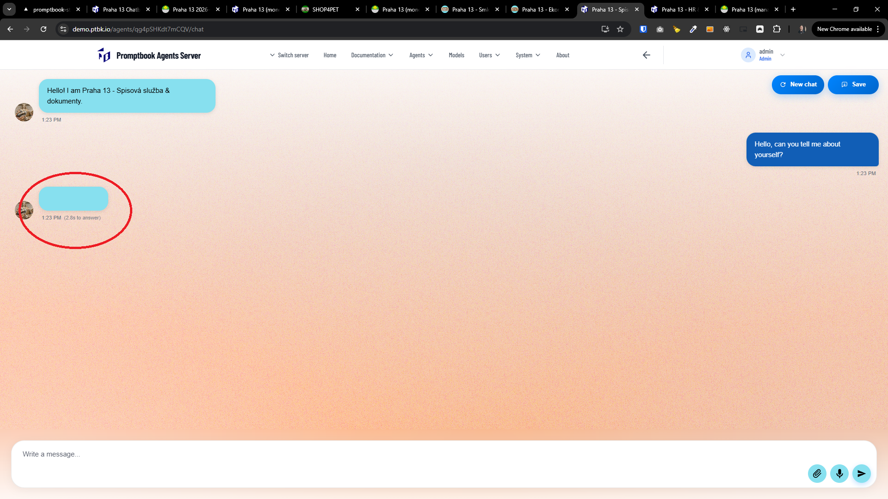
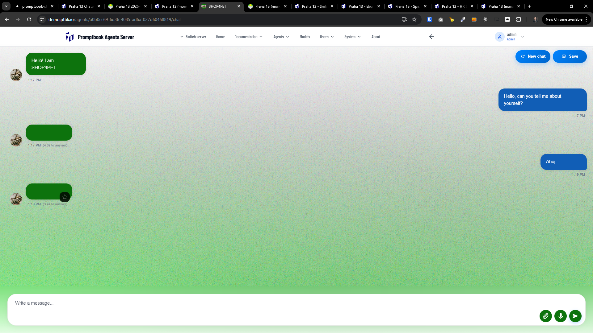
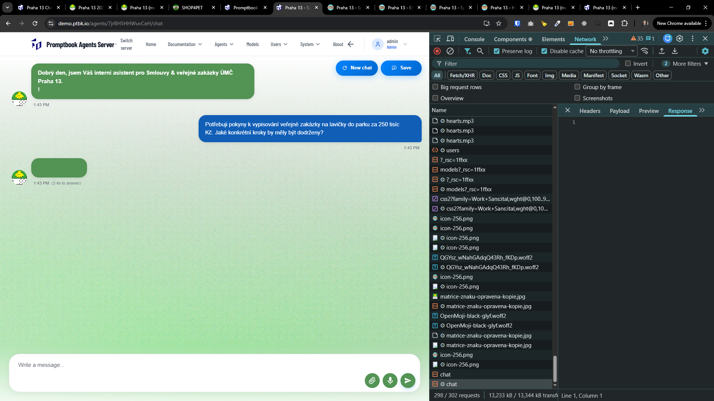
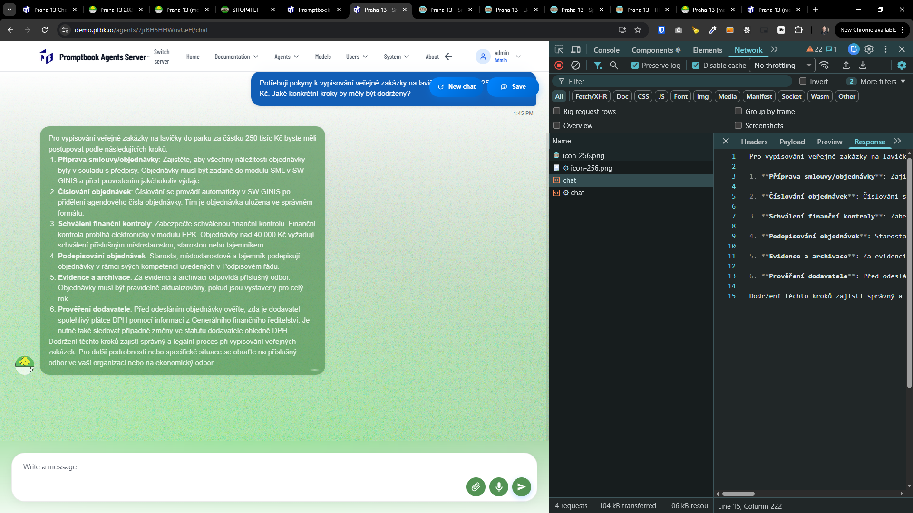

[x] ~$0.49 by OpenAI Codex `gpt-5.2-codex`

[✨🏝] Fixed empty responses.

-   It sometimes happens that the agent responds with an empty message. No error, no loading, just empty message.
-   Fix this issue so that the agent always responds with some meaningful message or an error message if something goes wrong.
-   This is happening especially when the agent has large source and the underlying GPT agent is taking long to create.
-   Keep in mind the DRY _(don't repeat yourself)_ principle.
-   You are working with the [Agents Server](apps/agents-server)
-   Add the changes into the [changelog](changelog/_current-preversion.md)

---

[-]

[✨🏝] qux

-   Keep in mind the DRY _(don't repeat yourself)_ principle.
-   You are working with the [Agents Server](apps/agents-server)
-   Add the changes into the [changelog](changelog/_current-preversion.md)

---

[-]

[✨🏝] qux

-   Keep in mind the DRY _(don't repeat yourself)_ principle.
-   You are working with the [Agents Server](apps/agents-server)
-   Add the changes into the [changelog](changelog/_current-preversion.md)

---

[-]

[✨🏝] qux

-   Keep in mind the DRY _(don't repeat yourself)_ principle.
-   You are working with the [Agents Server](apps/agents-server)
-   Add the changes into the [changelog](changelog/_current-preversion.md)

