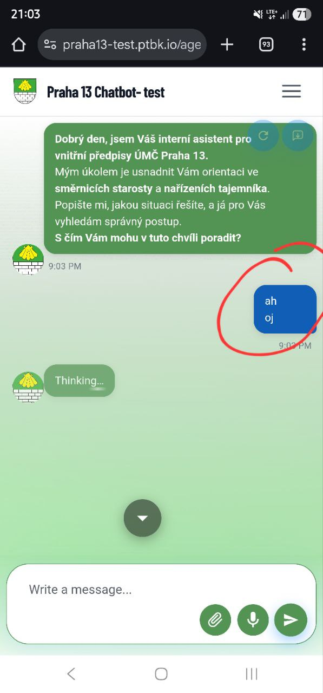
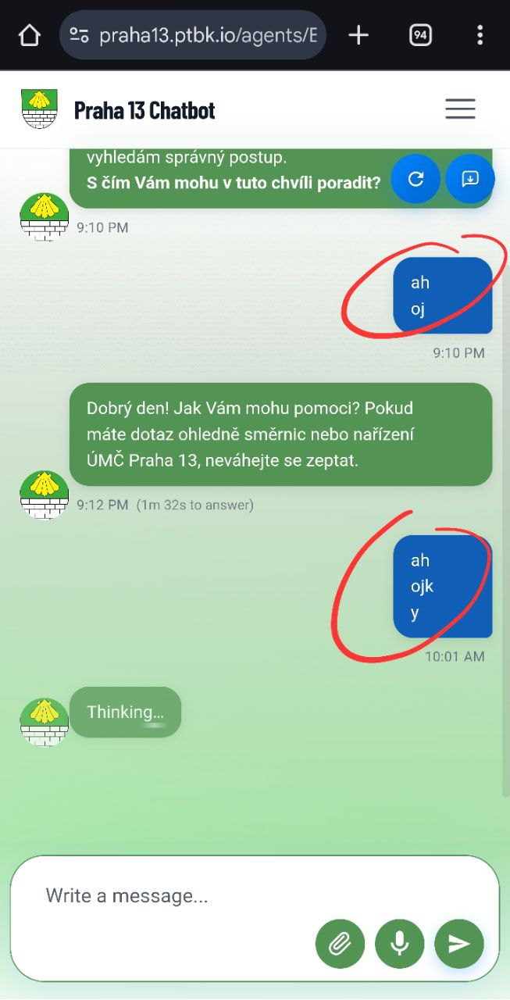
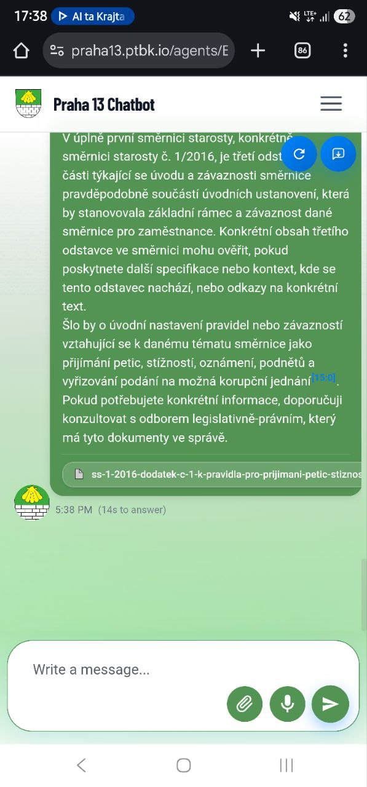
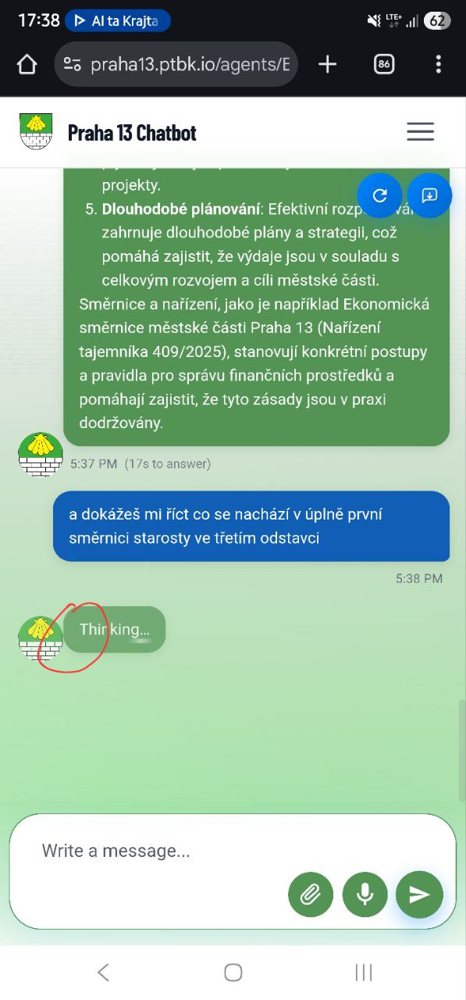
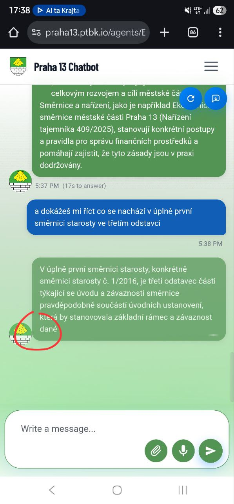

[x] ~$1.24 by OpenAI Codex `gpt-5.2-codex`

[✨🖼] Fix the chat messages width

-   You are working with the [Agents Server](apps/agents-server)

---

[x] ~$0.71 by OpenAI Codex `gpt-5.2-codex`

---

[x] ~$0.60 7 minutes by OpenAI Codex `gpt-5.3-codex`

[✨🖼] In the chat component, when the agent is thinking or emitting a response (i.e., the message is not complete), there is no gap between the agent avatar image and the message bubble. But when the agent finished its response, the design is fixed again. Please look at this design flaw and try to enhance the situation or it should look exactly as this state where the message is complete. The state when the message isn't complete is defaulty one in the chat component.

-   You are working with the [Agents Server](apps/agents-server)

---

[-]

[✨🖼] foo

-   Keep in mind the DRY _(don't repeat yourself)_ principle.
-   Do a proper analysis of the current functionality before you start implementing.
-   You are working with the [Agents Server](apps/agents-server)
-   Add the changes into the [changelog](changelog/_current-preversion.md)

---

[-]

[✨🖼] foo

-   Keep in mind the DRY _(don't repeat yourself)_ principle.
-   Do a proper analysis of the current functionality before you start implementing.
-   You are working with the [Agents Server](apps/agents-server)
-   Add the changes into the [changelog](changelog/_current-preversion.md)
