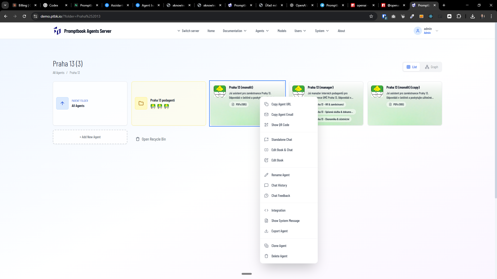
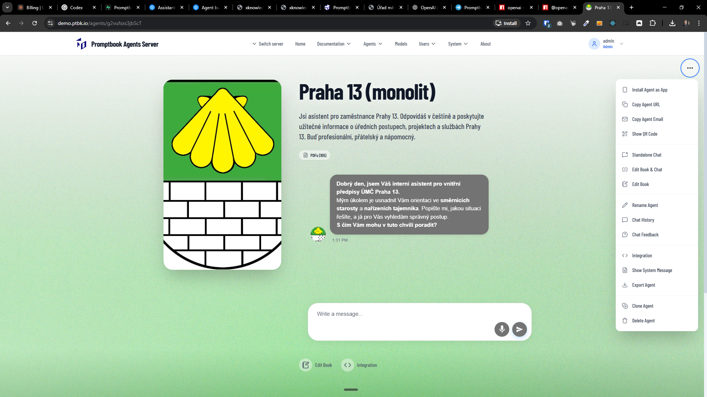
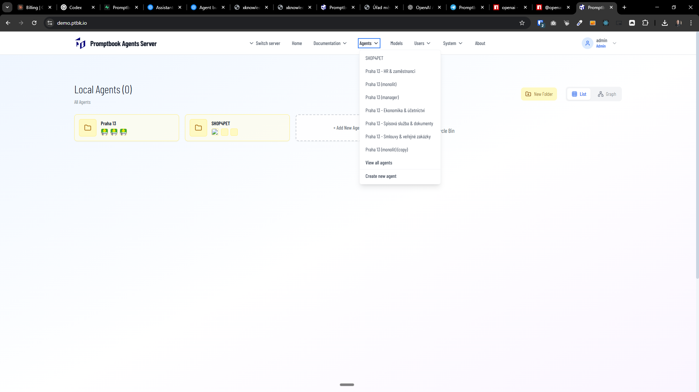
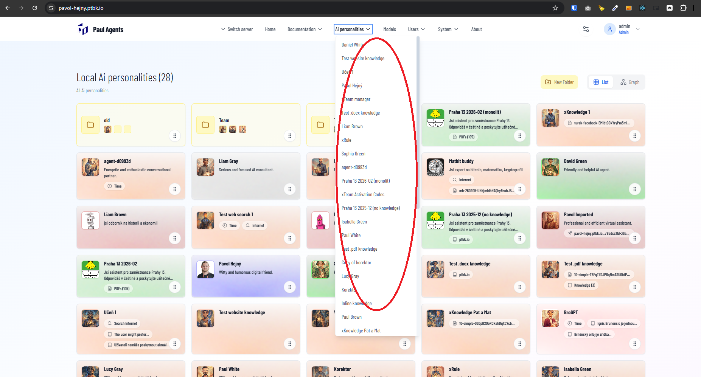
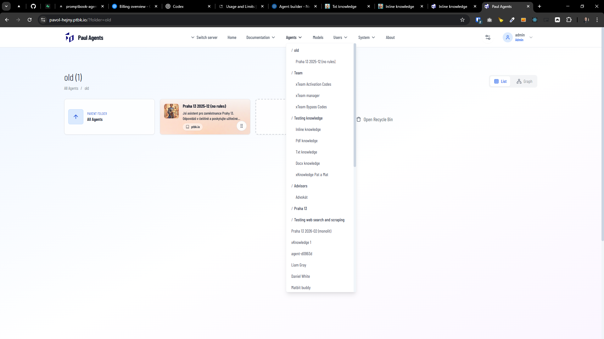

[x] ~$0.87 by OpenAI Codex `gpt-5.2-codex`

[✨🖍] Allow to see and manage folder in which the agent is located from the context menu on the profile page / right click of the agent.

-   You are working with the [Agents Server](apps/agents-server)

---

[x] ~$0.00 by Gemini CLI

[✨🖍] Allow to Open agent in new tab from its context menu click of the agent.

-   We have intercepted the native context menu of the browser.
-   We want to add the option "Open in new tab" to the context menu when right-clicking on an agent in the Agents Server application.
-   This is probably only option which isn't relevant for the agent profile page but only for the right-click on the agent in the directory listing.
-   You are working with the [Agents Server](apps/agents-server)
-   Keep in mind the DRY _(don't repeat yourself)_ principle, especially the items in the context menu shouldn't be replicated in two separate places.

---

[x] ~$0.00 by Gemini CLI

[✨🖍] Allow to rename agent from its context menu on the Agent profile page / right click of the agent.

-   You are working with the [Agents Server](apps/agents-server)

---

[x] ~$0.00 by Gemini CLI

---

[x] ~$0.40 10 minutes by OpenAI Codex `gpt-5.3-codex`

[✨🖍] See Agent organized by folders in the application menu.

-   You are working with the [Agents Server](apps/agents-server)

---

[x] ~$0.22 7 minutes by OpenAI Codex `gpt-5.1-codex-mini`

[✨🖍] You can see Agent organized by folders in the application menu.

-   Now, are all items shown at once, only with minor indentation
-   This is not very scalable, as if you have many agents and many folders, it will be a mess
-   Create proper item menus that are collapsible on hover
-   You are working with the [Agents Server](apps/agents-server)

---

[x] ~$0.00 by Gemini CLI

[✨🖍] Allow to make agent public / private agent from its context menu on the Agent profile page / right click of the agent.

-   Keep in mind the DRY _(don't repeat yourself)_ principle.
-   Do a proper analysis of the current functionality before you start implementing.
-   You are working with the [Agents Server](apps/agents-server)
-   Add the changes into the [changelog](changelog/_current-preversion.md)

---

[-]

[✨🖍] brr

-   Keep in mind the DRY _(don't repeat yourself)_ principle.
-   Do a proper analysis of the current functionality before you start implementing.
-   You are working with the [Agents Server](apps/agents-server)
-   Add the changes into the [changelog](changelog/_current-preversion.md)
