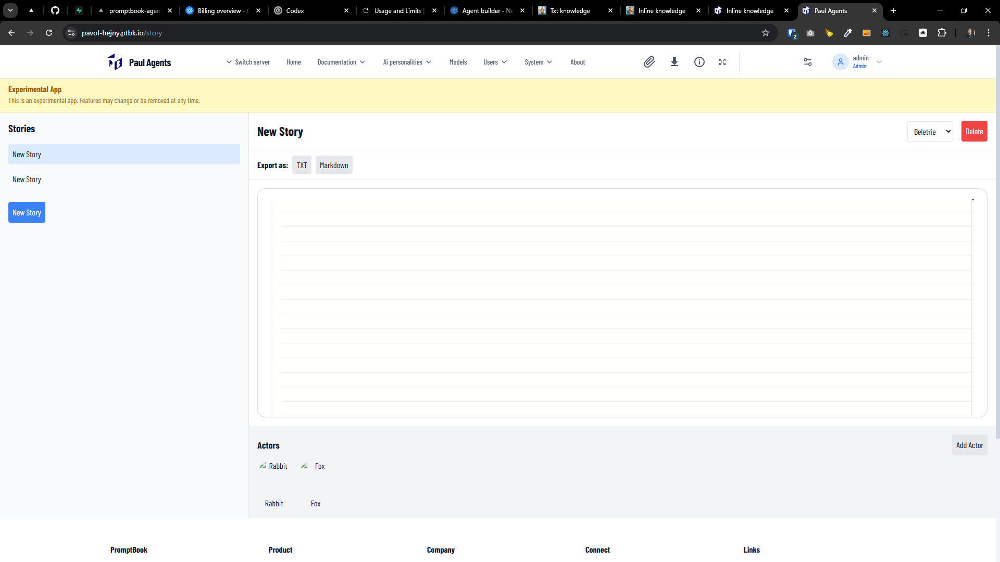

[x] ~$0.00 by Gemini CLI

[✨📉] Create the experimental book app called Story

Implement a new experimental application called **Story** in the agent server. Story is an interactive storytelling app where users orchestrate AI agents to collaboratively write a story.

This app is explicitly experimental and must be clearly labeled as such in both the UI and exported outputs.

## Availability & Navigation

-   Add a new top-level menu group: **Experiments**
-   Add a menu item under this group: **Story**
-   The Experiments group is visible **only when** the metadata flag `IS_EXPERIMENTAL_APP` is enabled, by default it is disabled
-   The Story app must include the standard top bar and footer used by the main application.

## Core Concept

Story is a text editor where:

-   The user does **not** write the story directly.
-   Instead, the user composes the story by triggering AI agents.
-   Each agent adds a paragraph or dialogue segment as a continuation of the story.

## Editor UI

### Main Editor

-   A single large text area occupies the main workspace.
-   The editor should reuse the existing **Book Editor** component.
-   Apply the **DRY principle**: avoid duplicating logic between the Book Editor and Story.
-   Styling:

    -   Similar to the Book Editor
    -   No syntax or keyword highlighting
    -   Only the editor title is highlighted

> Note: Distinguish between the internal “Book” language (agent source format) and this Story application. They are separate concepts.

## Story Modes

Story supports two modes:

### 1. Beletrie Mode (Free Narrative)

-   Unstructured prose
-   Agents append free-form paragraphs

### 2. Dramatic Mode (Dialogue)

-   Structured as dialogue
-   Each agent adds dialogue attributed to itself
-   Agent identity is visible in the text

Users can select the mode per story.

## Agents Panel

### Bottom Panel

-   A bottom panel displays active agents (called **Actors** in the context of a story).
-   Each actor is shown as:

    -   A profile image, or
    -   A reusable agent chip component

### Interaction

-   Clicking an actor triggers that agent to generate and append a continuation.
-   Each click produces one paragraph or dialogue segment.

### Example Agents

-   Rabbit: writes sad continuations
-   Fox: writes happy continuations

(These are examples; the system must support arbitrary agents.)

## Agent Palette

Users can add actors to a story via an agent palette.

### Palette Features

-   Opened via a popup or dropdown UI
-   Agents grouped as follows:

    1. Local server agents
    2. Federated servers (grouped per server)
    3. Ad hoc agents added by URL

### Remote Agents

-   Federated and ad hoc agents use the same internal implementation
-   Both are represented as remote agent objects
-   Federated agents are pre-listed; ad hoc agents are user-specified

## Stories Management (CRUD)

Users can manage multiple stories.

### Story Navigation

-   Provide a bookmarks/chapters-style UI to switch between stories
-   Support:

    -   Create story
    -   Rename story
    -   Delete story
    -   Switch active story

### Story Scope

-   Each story has:

    -   Its own text content
    -   Its own mode (Beletrie or Dramatic)
    -   Its own set of actors

Users may have multiple independent stories.

## Persistence & User Data

### User Data Table

Create a new extensible table: **UserData**

Requirements:

-   Stores arbitrary structured data
-   Designed to support experimental apps and future extensions
-   Flexible schema (e.g., JSON-based)

### Stored Data

For each story:

-   Story content
-   Story mode
-   Associated actors
-   Agent configuration

### Cross-Device Sync

-   Stories and actors must persist per user
-   Users see the same stories and configuration on all devices after login

## Export & Printing

Users can export stories in multiple formats:

-   Print-friendly view
-   PDF
-   Plain text
-   Markdown

### Export Requirements

-   Reuse existing chat export mechanisms where possible
-   Include branding in exported versions
-   Clearly mark exports as **Experimental**

## Experimental Labeling

The app must visibly communicate its experimental status:

-   In-app banner or label
-   Exported documents
-   Print views

The labeling should be clear but not intrusive.

## UI/UX Guidelines

-   Default state should be clean and minimal
-   Focus on readability and simplicity
-   Use consistent design with existing app components
-   Agent palette interactions should feel lightweight and intuitive

## Non-Goals

-   This is not a replacement for the Book language editor
-   No advanced syntax highlighting
-   No full collaborative editing features

## Summary

Story is an experimental orchestration-based storytelling environment where users compose narratives by triggering AI agents. It reuses existing editor infrastructure, supports modular agent selection, persists user stories across devices, and provides export capabilities while clearly remaining labeled as an prototype experiment.

-   Keep in mind the DRY _(don't repeat yourself)_ principle.
-   You are working with the [Agents Server](apps/agents-server)
-   Add the changes into the [changelog](changelog/_current-preversion.md)

---

[x] ~$0.23 15 minutes by OpenAI Codex `gpt-5.1-codex-mini`

[✨📉] You have implemented [experimental book app](prompts/2026-01-0800-experimental-book-app.md), but it needs some changes and improvements

-   The name of the story shouldn't be a separate input; it should be just the first line of the editor.
-   "Actors" should be just agents, not a separate concept. The app is about orchestrating agents already existing on a Agents server to write a story, not adding a new concept of "actor" on top of it
-   "Export as:" should look more like saving the chat conversation, reuse the same design pattern.
-   Create item in menu `System` -> `Experiments` -> `Story`
    -   Use the system of sub-menus that are collapsible on hover
-   Move it from `/story` -> `/experiments/story`
-   Keep in mind the DRY _(don't repeat yourself)_ principle.
-   You are working with the [Agents Server](apps/agents-server)

---

[-]

[✨📉] foo

-   Keep in mind the DRY _(don't repeat yourself)_ principle.
-   You are working with the [Agents Server](apps/agents-server)
-   Add the changes into the [changelog](changelog/_current-preversion.md)

---

[-]

[✨📉] foo

-   Keep in mind the DRY _(don't repeat yourself)_ principle.
-   You are working with the [Agents Server](apps/agents-server)
-   Add the changes into the [changelog](changelog/_current-preversion.md)

