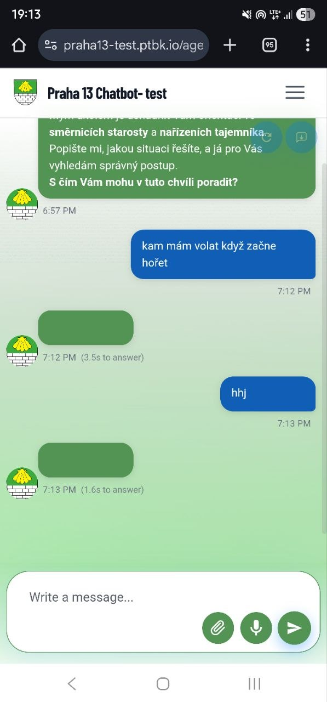
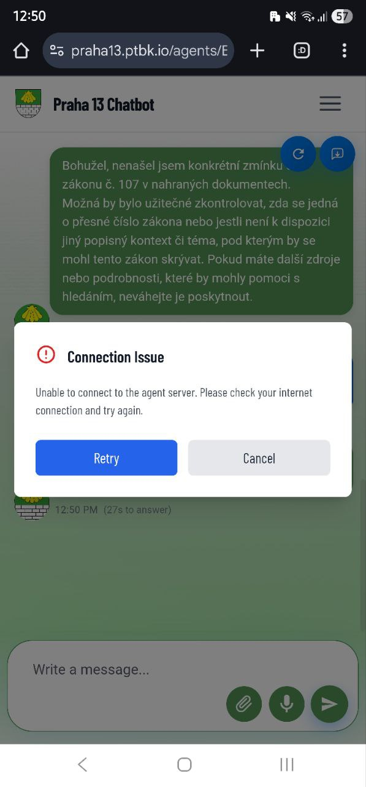
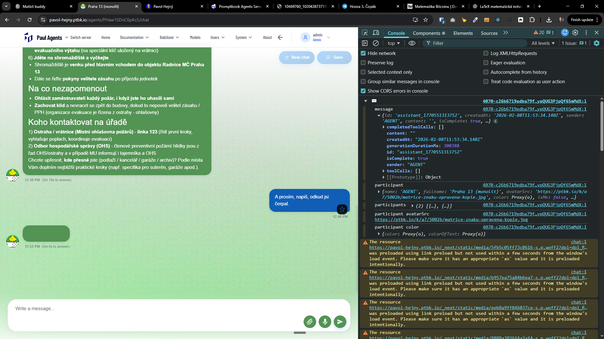
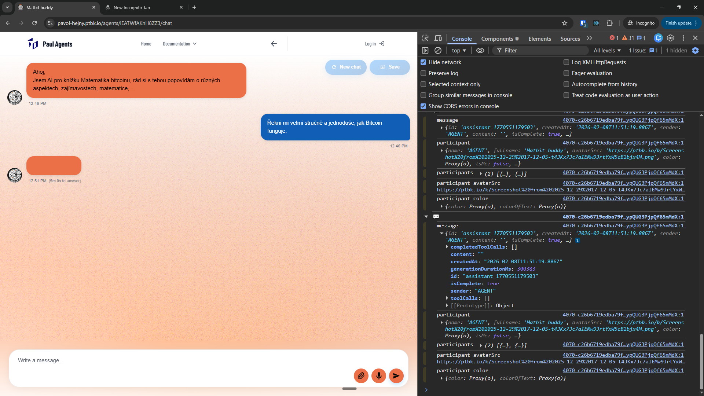

[x] $0.00 by Gemini CLI

[✨☣️] When the returned message is empty, show the error dialog simmilar as if the server responded with some error code ("Connection Issue").

-   Keep in mind the DRY _(don't repeat yourself)_ principle.
-   You are working with the [Agents Server](apps/agents-server)
-   Add the changes into the [changelog](changelog/_current-preversion.md)

**This is for example the empty message:**

```json
{
    "id": "assistant_1770551313752",
    "createdAt": "2026-02-08T11:53:34.140Z",
    "sender": "AGENT",
    "content": "",
    "isComplete": true,
    "toolCalls": [],
    "completedToolCalls": [],
    "generationDurationMs": 300388
}
```






---

[x]

[✨☣️] The error dialog when the chat fails ("Connection Issue") should have an option to reset the chat with the same message sent to a fresh chat.

-   Keep in mind the DRY _(don't repeat yourself)_ principle.
-   You are working with the [Agents Server](apps/agents-server)
-   Add the changes into the [changelog](changelog/_current-preversion.md)


---

[ ]

[✨☣️] Error logging

-   @@@
-   Keep in mind the DRY _(don't repeat yourself)_ principle.
-   You are working with the [Agents Server](apps/agents-server)
-   Add the changes into the [changelog](changelog/_current-preversion.md)

---

[-]

[✨☣️] qux

-   Keep in mind the DRY _(don't repeat yourself)_ principle.
-   You are working with the [Agents Server](apps/agents-server)
-   Add the changes into the [changelog](changelog/_current-preversion.md)
