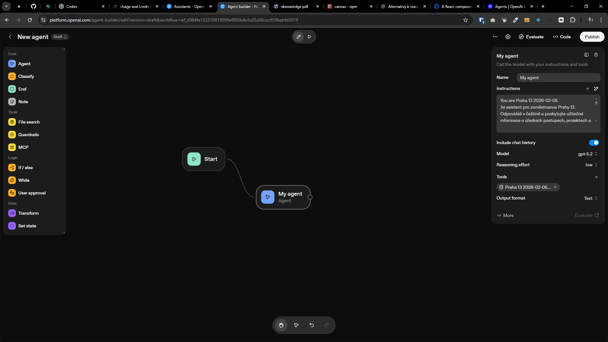

[x] ~$0.00 by OpenAI Codex `gpt-5.2-codex`

[✨🎩] Migrate [Agents](src/llm-providers/agent/Agent.ts) from Assistants API to OpenAI AgentKit

---

[ ]

[✨🎩] Migrate Promptbook Agents from Assistants API to OpenAI AgentKit

-   You are migrating [`Agent` class](src/llm-providers/agent/Agent.ts)
-   Migrate `Agent` class and all related classes from using OpenAI Assistants API to [OpenAI AgentKit](https://platform.openai.com/docs/guides/agents#agentkit), the migration guide is placed below.
-   You are doing refactoring migration. Do not change features; just migrate them, keep in mind:
    -   `KNOWLEDGE` should work as before
    -   Tool calling should work as before
    -   Caching of the agents and underlying assistants should work as before
    -   It should work in the `Agents Server` application `/apps/agents-server`
    -   All existing features should work as before
-   Use `gpt-5.2` model as the base model for the agents.
-   Use `OpenAiAgentKitExecutionTools` as the new class name used internally in `Agent` instead of `OpenAiAssistantExecutionTools`.
-   Migrate [Agents server `$provideOpenAiAgentKitExecutionToolsForServer`](apps/agents-server/src/tools/$provideOpenAiAgentKitExecutionToolsForServer.ts) to the new `OpenAiAgentKitExecutionTools`.
-   Migrate the [`Agent` playground](src/llm-providers/agent/playground/playground.ts)
-   Add sample to [Open AI playground](src/llm-providers/openai/playground/playground.ts)
-   Keep the manipulation of vector stores as before, just use AgentKit instead of Assistants API.
-   Keep `OpenAiAssistantExecutionTools`, just mark it as deprecated and do not use in `Agent`.
-   Do not confuse the Promptbook native `Agent`, `RemoteAgent` and the "agent" from OpenAI AgentKit - Everything from OpenAI AgentKit should be named `OpenAiAgentKitAgent...` to avoid confusion.
    -   Theese are two different concepts - the Promptbook "Agent" is a class and concept that represents an agent in Promptbook, while the OpenAI AgentKit "agent" is a specific implementation of an AI agent provided by OpenAI which will be used internally by the Promptbook `Agent` class.
-   Mark the preparation steps of the agent kit with `[🤰]` tag in the logs, look how it is done in `src/llm-providers/openai/OpenAiAssistantExecutionTools.ts`
-   One promptbook `Agent` should use one OpenAI AgentKit agent with attached vector store under the hood, similar to how it was with Assistants API.
-   Keep the naming strategy of the agents the same, for example "my-chatbot - fc201453"
-   Keep the caching of the agents and underlying assistants the same as before, use table `Agent` column `preparedExternals`
    -   Just instead of `openaiAssistantId` -> use `openaiAgentKitAgentId` and instead of `openaiAssistantHash` -> use `openaiAgentKitAgentHash`
-   Keep in mind the DRY _(don't repeat yourself)_ principle, just dont intermingle the code of the new and deprecated stuff.
    -   Maybe create some base classes to share the code between `OpenAiAssistantExecutionTools` and `OpenAiAgentKitExecutionTools`, especially for vector store handling.
-   Add the changes into the `/changelog/_current-preversion.md`
-   If there is something that I need to do, write me a detailed plan of what needs to be done and save it into the file in the root of the repository.



---

[-]

[✨🎩] foo

-   Keep in mind the DRY _(don't repeat yourself)_ principle.
-   Add the changes into the [changelog](./changelog/_current-preversion.md)

---

[-]

[✨🎩] foo

-   Keep in mind the DRY _(don't repeat yourself)_ principle.
-   Add the changes into the [changelog](./changelog/_current-preversion.md)

---

[-]

[✨🎩] foo

-   Keep in mind the DRY _(don't repeat yourself)_ principle.
-   Add the changes into the [changelog](./changelog/_current-preversion.md)

```

```
