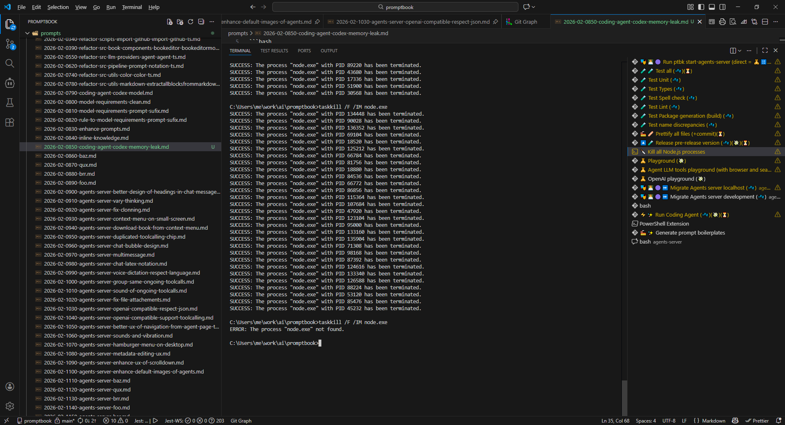

[ ]

[✨⛴] bar

```bash
C:\Users\me\work\ai\promptbook>taskkill /F /IM node.exe
SUCCESS: The process "node.exe" with PID 134448 has been terminated.
SUCCESS: The process "node.exe" with PID 90028 has been terminated. 
SUCCESS: The process "node.exe" with PID 136352 has been terminated.
SUCCESS: The process "node.exe" with PID 69104 has been terminated. 
SUCCESS: The process "node.exe" with PID 18520 has been terminated. 
SUCCESS: The process "node.exe" with PID 125212 has been terminated.
SUCCESS: The process "node.exe" with PID 66784 has been terminated.
SUCCESS: The process "node.exe" with PID 81756 has been terminated.
SUCCESS: The process "node.exe" with PID 18880 has been terminated.
SUCCESS: The process "node.exe" with PID 84536 has been terminated.
SUCCESS: The process "node.exe" with PID 66772 has been terminated.
SUCCESS: The process "node.exe" with PID 86856 has been terminated. 
SUCCESS: The process "node.exe" with PID 115364 has been terminated.
SUCCESS: The process "node.exe" with PID 107684 has been terminated.
SUCCESS: The process "node.exe" with PID 47920 has been terminated.
SUCCESS: The process "node.exe" with PID 123104 has been terminated.
SUCCESS: The process "node.exe" with PID 95000 has been terminated. 
SUCCESS: The process "node.exe" with PID 133160 has been terminated.
SUCCESS: The process "node.exe" with PID 135904 has been terminated.
SUCCESS: The process "node.exe" with PID 71308 has been terminated. 
SUCCESS: The process "node.exe" with PID 98168 has been terminated. 
SUCCESS: The process "node.exe" with PID 87392 has been terminated. 
SUCCESS: The process "node.exe" with PID 124616 has been terminated.
SUCCESS: The process "node.exe" with PID 133340 has been terminated.
SUCCESS: The process "node.exe" with PID 126588 has been terminated.
SUCCESS: The process "node.exe" with PID 88224 has been terminated.
SUCCESS: The process "node.exe" with PID 53120 has been terminated.
SUCCESS: The process "node.exe" with PID 85476 has been terminated.
SUCCESS: The process "node.exe" with PID 45232 has been terminated.
```


- @@@
-   Keep in mind the DRY _(don't repeat yourself)_ principle.
-   Add the changes into the [changelog](./changelog/_current-preversion.md)



---

[-]

[✨⛴] bar

-   Keep in mind the DRY _(don't repeat yourself)_ principle.
-   Add the changes into the [changelog](./changelog/_current-preversion.md)

---

[-]

[✨⛴] bar

-   Keep in mind the DRY _(don't repeat yourself)_ principle.
-   Add the changes into the [changelog](./changelog/_current-preversion.md)

---

[-]

[✨⛴] bar

-   Keep in mind the DRY _(don't repeat yourself)_ principle.
-   Add the changes into the [changelog](./changelog/_current-preversion.md)