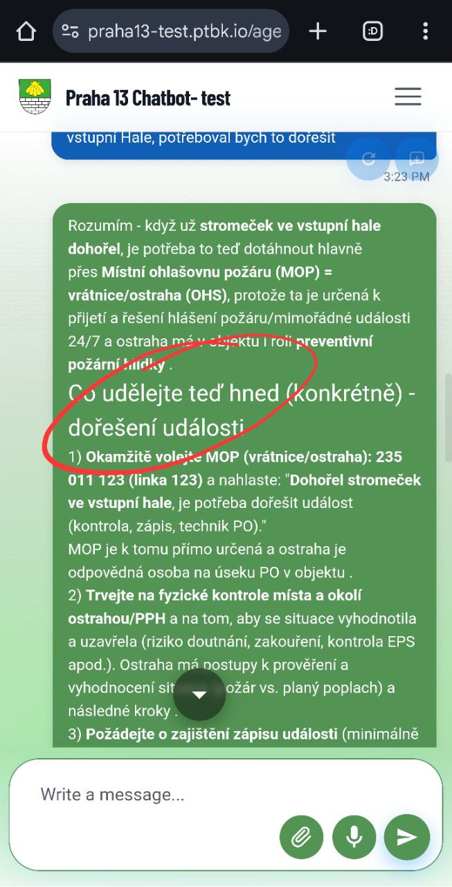
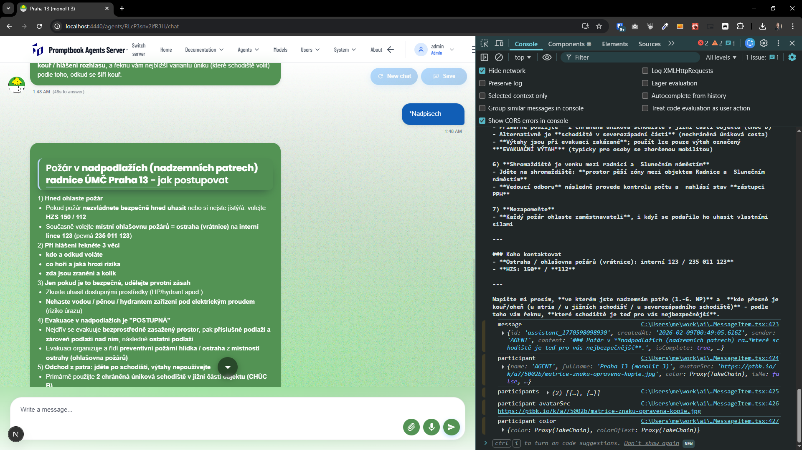
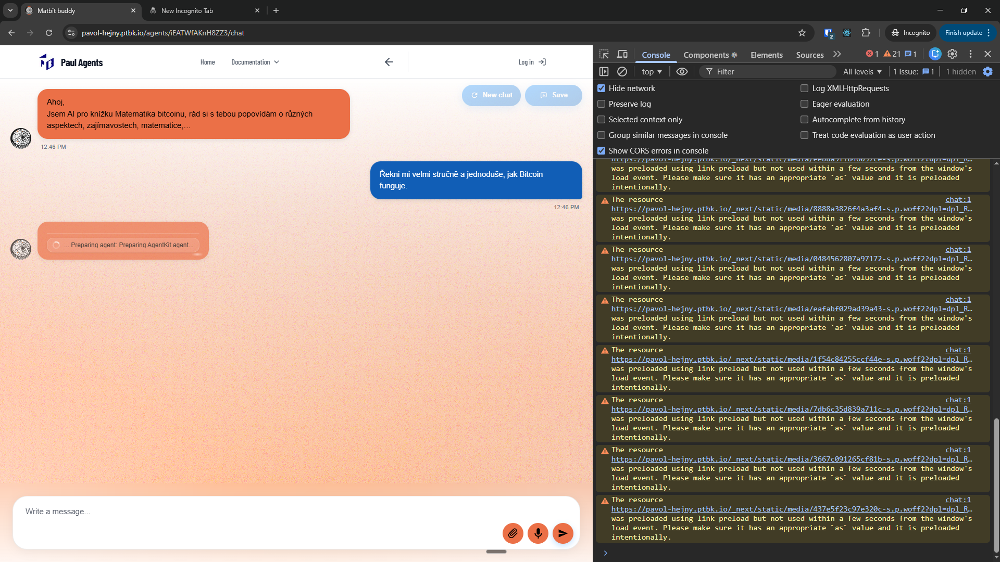
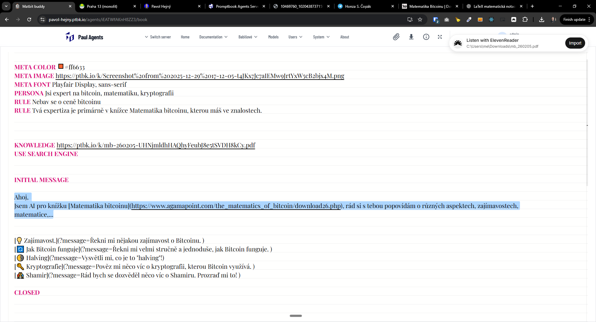

[x] ~$5.62 10 minutes by OpenAI Codex `gpt-5.1-codex-mini`

[✨🤧] Enhance the design of headings in the chat messages.

-   Chat messages can contain headings because they can be formatted in Markdown.
-   Some of the Markdown features look great, but headings look pretty bad.
-   The headings should be more visually better
-   Keep in mind the DRY _(don't repeat yourself)_ principle, there should be one design language shared across the project.
-   You are working with the [Agents Server](apps/agents-server)
-   Add the changes into the [changelog](changelog/_current-preversion.md)

---

[ ]

[✨🤧] Enhance the design of headings in the chat messages.

-   Chat messages can contain headings because they can be formatted in Markdown.
-   Some of the Markdown features look great, but headings look pretty bad.
-   The headings should be more visually better
-   Keep in mind the DRY _(don't repeat yourself)_ principle, there should be one design language shared across the project.
-   You are working with the [Agents Server](apps/agents-server)
-   Add the changes into the [changelog](changelog/_current-preversion.md)

---

[x] ~$3.28 6 minutes by OpenAI Codex `gpt-5.1-codex-mini`

[✨🤧] When there is a link in the chat message, the link should be underlined.

-   Keep in mind the DRY _(don't repeat yourself)_ principle.
-   You are working with the [Agents Server](apps/agents-server)
-   Add the changes into the [changelog](changelog/_current-preversion.md)

---

[-]

[✨🤧] bar

-   Keep in mind the DRY _(don't repeat yourself)_ principle.
-   You are working with the [Agents Server](apps/agents-server)
-   Add the changes into the [changelog](changelog/_current-preversion.md)

---

[-]

[✨🤧] bar

-   Keep in mind the DRY _(don't repeat yourself)_ principle.
-   You are working with the [Agents Server](apps/agents-server)
-   Add the changes into the [changelog](changelog/_current-preversion.md)

