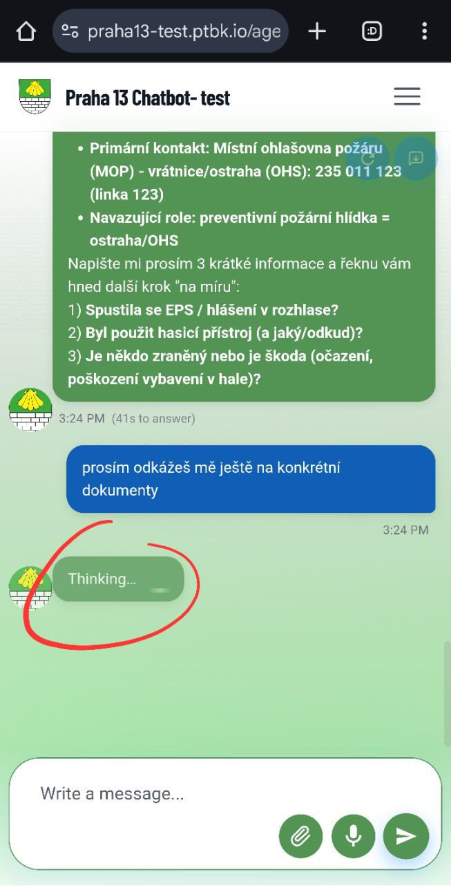

[x] ~$7.57 12 minutes by OpenAI Codex `gpt-5.1-codex-mini`

[✨🏪] Vary the "Thinking" message

-   The "Thinking" message occures when the agent receives the message but still don't emit any tokens.
-   Allow to configure all the variants Through the metadata `THINKING_MESSAGES`. Similarly to `AGENT_NAMING`
-   By default, we can have 3 variants: `Thinking / Searching for information / Sorting information`
-   Keep in mind the DRY _(don't repeat yourself)_ principle.
    -   For example, share the parsing logic with the `AGENT_NAMING`
-   You are working with the [Agents Server](apps/agents-server)

---

[-]

[✨🏪] baz

-   Keep in mind the DRY _(don't repeat yourself)_ principle.
-   You are working with the [Agents Server](apps/agents-server)
-   Add the changes into the [changelog](changelog/_current-preversion.md)

---

[-]

[✨🏪] baz

-   Keep in mind the DRY _(don't repeat yourself)_ principle.
-   You are working with the [Agents Server](apps/agents-server)
-   Add the changes into the [changelog](changelog/_current-preversion.md)

---

[-]

[✨🏪] baz

-   Keep in mind the DRY _(don't repeat yourself)_ principle.
-   You are working with the [Agents Server](apps/agents-server)
-   Add the changes into the [changelog](changelog/_current-preversion.md)

