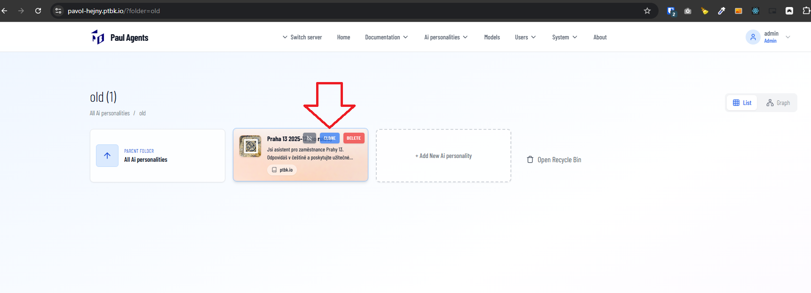

[ ]

[✨🌅] Remove clone button from the agent the directory listing.

-   Keep it in the context menu of the agent
-   You are working with the [Agents Server](apps/agents-server)

---

[ ]

[✨🌅] Fix the cloning.

-   Currently, when you clone an agent, it redirects you into the non-existing agent.
-   Before the cloning happens, show the pop-up with the new name with prefilled "Copy of {agent name}" and the "Clone" button. After the user clicks the "Clone" button, the agent is cloned and you are redirected to the newly cloned agent.
-   Keep in mind the DRY _(don't repeat yourself)_ principle.
-   You are working with the [Agents Server](apps/agents-server)

---

[-]

[✨🌅] qux

-   Keep in mind the DRY _(don't repeat yourself)_ principle.
-   You are working with the [Agents Server](apps/agents-server)
-   Add the changes into the [changelog](changelog/_current-preversion.md)

---

[-]

[✨🌅] qux

-   Keep in mind the DRY _(don't repeat yourself)_ principle.
-   You are working with the [Agents Server](apps/agents-server)
-   Add the changes into the [changelog](changelog/_current-preversion.md)
