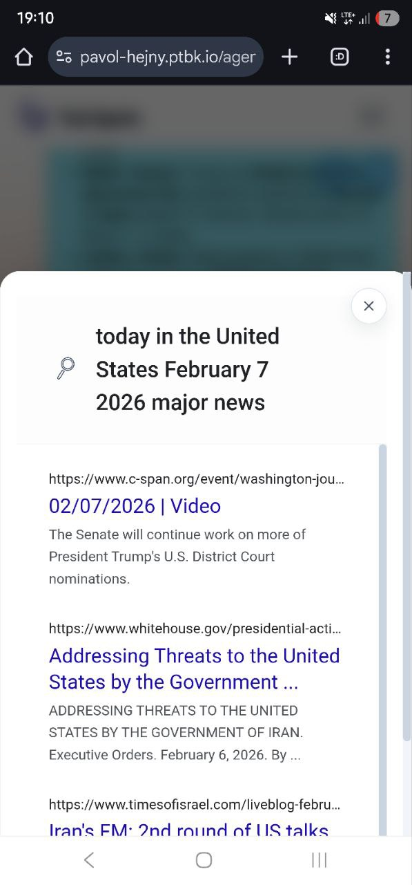
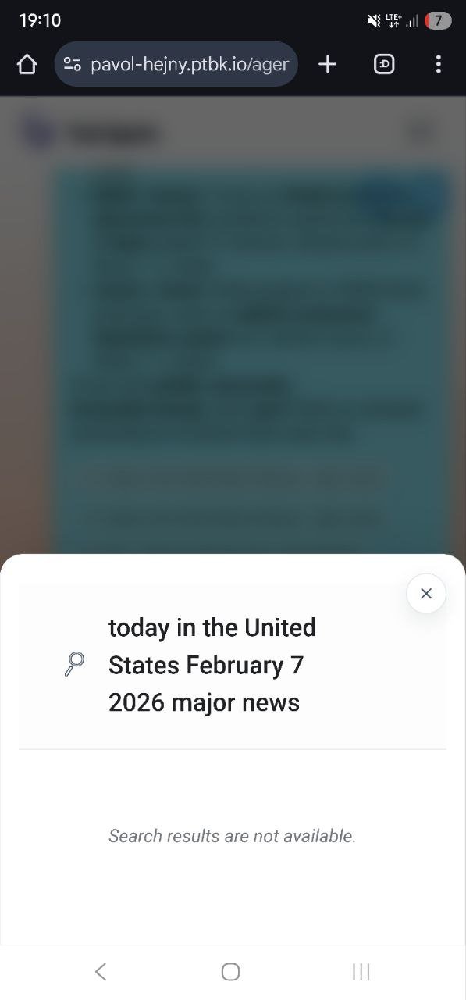
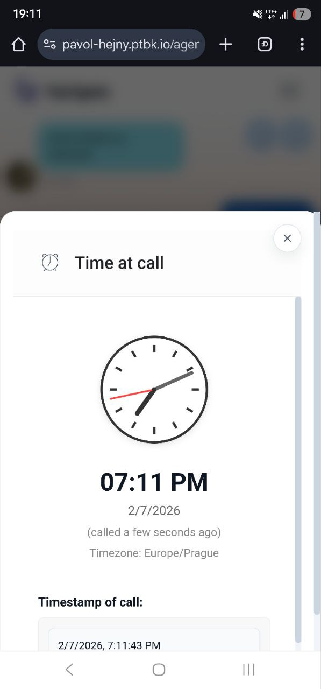

[ ] !

[✨💻] When the agent makes a tool call, for example web search, every web search is shown twice.

-   Same problem is occurring with any other tool calls, for example `USE TIME`
-   There is a secondary bug that the first chip has no content, but the second one is working perfectly.
-   Show only one chip per tool call - the second one, which is working correctly. The first one should be removed.
-   Keep The feature that when there are multiple distinct tool calls (e.g., multiple web searches), for each of these web searches, it's shown its distinct chip under the message.
-   Keep in mind the DRY _(don't repeat yourself)_ principle.
-   You are working with the [Agents Server](apps/agents-server)

---

[-]

[✨💻] bar

-   Keep in mind the DRY _(don't repeat yourself)_ principle.
-   You are working with the [Agents Server](apps/agents-server)
-   Add the changes into the [changelog](changelog/_current-preversion.md)

---

[-]

[✨💻] bar

-   Keep in mind the DRY _(don't repeat yourself)_ principle.
-   You are working with the [Agents Server](apps/agents-server)
-   Add the changes into the [changelog](changelog/_current-preversion.md)

---

[-]

[✨💻] bar

-   Keep in mind the DRY _(don't repeat yourself)_ principle.
-   You are working with the [Agents Server](apps/agents-server)
-   Add the changes into the [changelog](changelog/_current-preversion.md)
