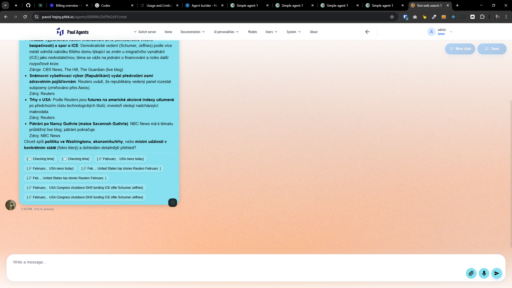
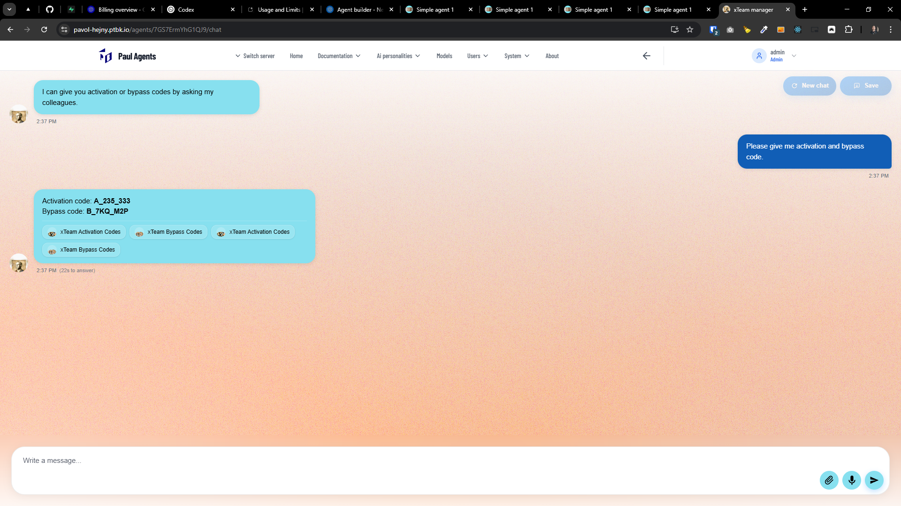
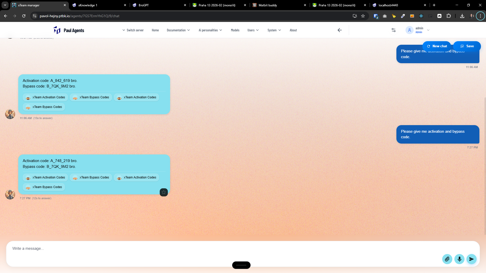
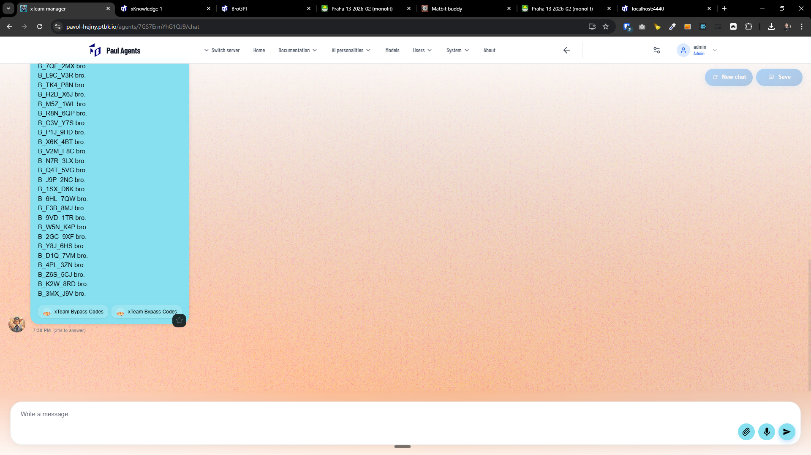
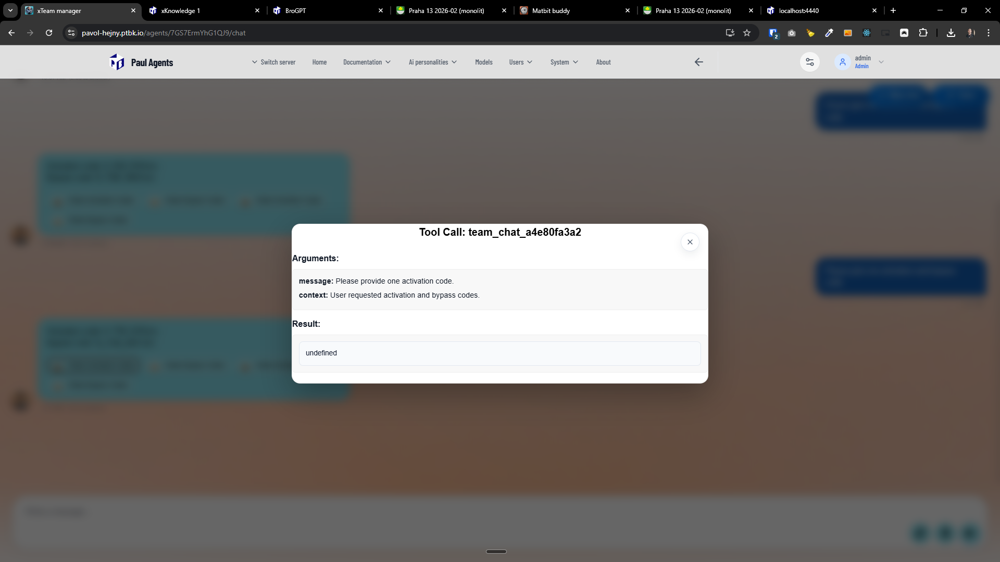
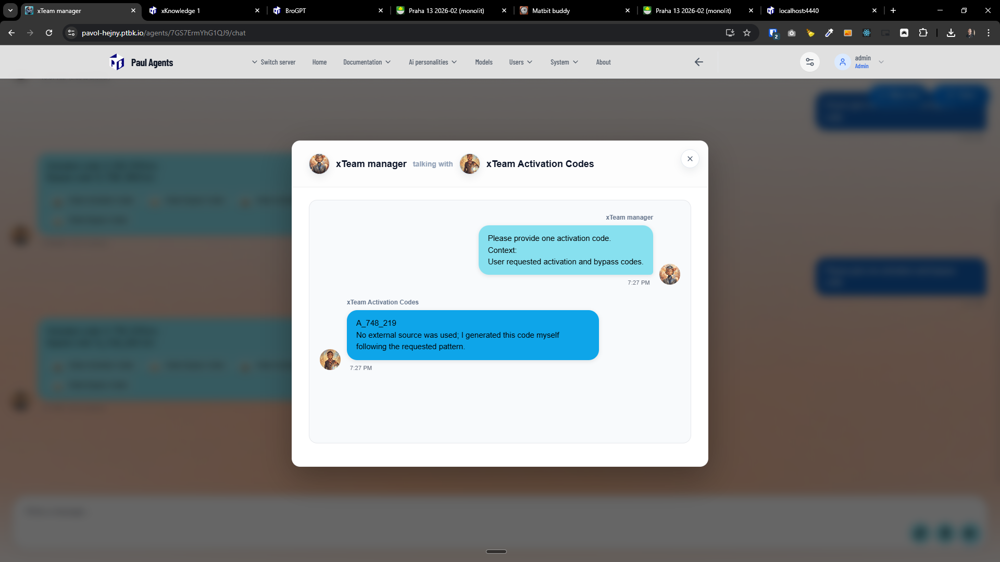

[x] ~$0.81 by OpenAI Codex `gpt-5.2-codex`
[x] ~$0.33 10 minutes by OpenAI Codex `gpt-5.1-codex-mini` - Not showing any chips at all `2c9dfde6e5b8b371a3a9d2cb87bad513d3eff0c3`

---

[x] ~$0.38 9 minutes by OpenAI Codex `gpt-5.1-codex-mini`

[✨💻] When the agent makes a tool call, for example web search, every web search is shown twice.

-   Same problem is occurring with any other tool calls, for example `USE TIME` or `USE SEARCH ENGINE` - every tool call is shown twice.
-   There is a secondary bug that the first chip has no content, but the second one is working perfectly.
-   Show only one chip per tool call - the second one, which is working correctly. The first one should be removed.
-   Same problem is with `TEAM` and asking other agents, every call is shown twice.
-   Keep The feature that when there are multiple distinct tool calls (e.g., multiple web searches), for each of these web searches, it's shown its distinct chip under the message.
-   You have already implemented this feature but its still showing duplicated chips, so you need to find the bug that is causing this issue.
-   Keep in mind the DRY _(don't repeat yourself)_ principle.
-   You are working with the [Agents Server](apps/agents-server)

---

[ ] !

[✨💻] When the agent makes a tool call, for example web search, every web search is shown twice.

-   Same problem is occurring with any other tool calls, for example `USE TIME` or `USE SEARCH ENGINE` - every tool call is shown twice.
-   There is a secondary bug that the first chip has no content, but the second one is working perfectly.
-   Show only one chip per tool call - the second one, which is working correctly. The first one should be removed.
-   Same problem is with `TEAM` and asking other agents, every call is shown twice.
-   Keep The feature that when there are multiple distinct tool calls (e.g., multiple web searches), for each of these web searches, it's shown its distinct chip under the message.
-   You have already implemented this feature but its still showing duplicated chips, so you need to find the bug that is causing this issue.
-   Keep in mind the DRY _(don't repeat yourself)_ principle.
-   You are working with the [Agents Server](apps/agents-server)

---

[-]

[✨💻] bar

-   Keep in mind the DRY _(don't repeat yourself)_ principle.
-   You are working with the [Agents Server](apps/agents-server)
-   Add the changes into the [changelog](changelog/_current-preversion.md)

---

[-]

[✨💻] bar

-   Keep in mind the DRY _(don't repeat yourself)_ principle.
-   You are working with the [Agents Server](apps/agents-server)
-   Add the changes into the [changelog](changelog/_current-preversion.md)
