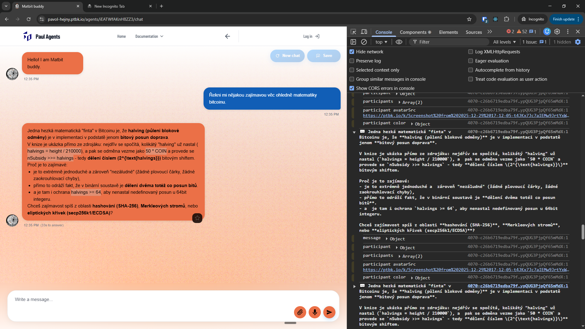
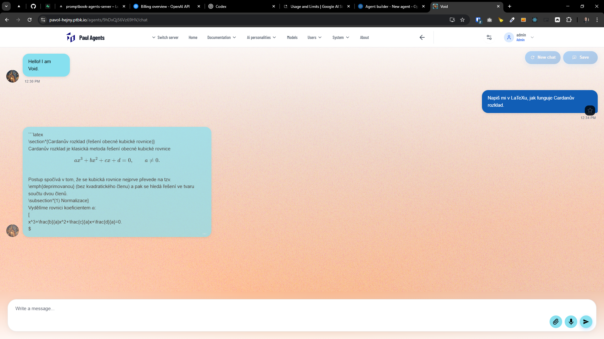
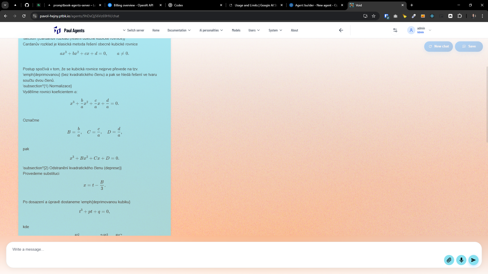
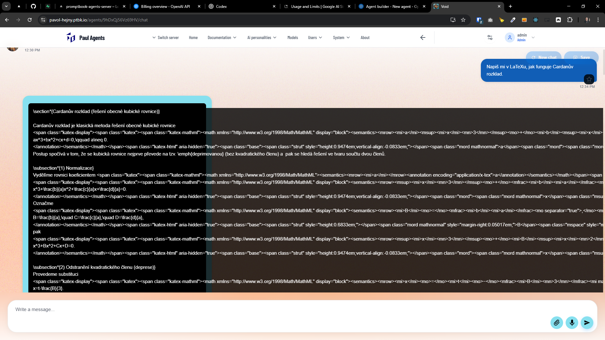
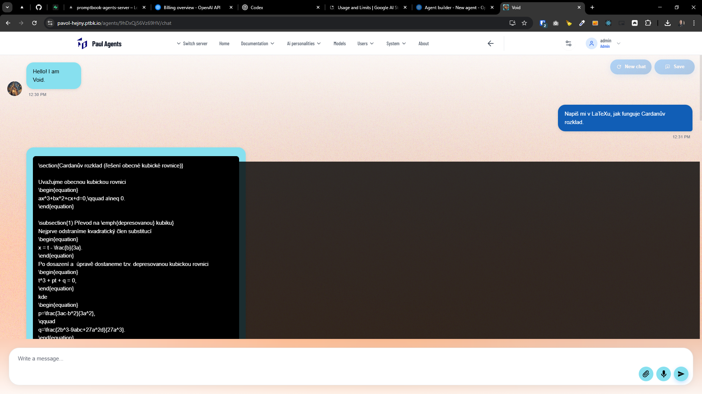

[x] ~$2.11 10 minutes by OpenAI Codex `gpt-5.1-codex-mini`

[✨🏞] In messages, the LaTeX notation should work and render

**For example, this message should be rendered correctly:**

```markdown
Jedna hezká matematická "finta" v Bitcoinu je, že **halving (půlení blokové odměny)** je v implementaci v podstatě jenom **bitový posun doprava**.

V knize je ukázka přímo ze zdrojáku: nejdřív se spočítá, kolikátý "halving" už nastal (`halvings = height / 210000`), a pak se odměna vezme jako `50 * COIN` a provede se `nSubsidy >>= halvings` - tedy **dělení číslem \(2^{\text{halvings}}\)** bitovým shiftem.

Proč je to zajímavé:

-   je to extrémně jednoduché a zároveň "nezáludné" (žádné plovoucí čárky, žádné zaokrouhlovací chyby),
-   přímo to odráží fakt, že v binární soustavě je **dělení dvěma totéž co posun bitů**.
-   a je tam i ochrana `halvings >= 64`, aby nenastal nedefinovaný posun u 64bit integeru.

Chceš zajímavost spíš z oblasti **hashování (SHA-256)**, **Merkleových stromů**, nebo **eliptických křivek (secp256k1/ECDSA)**?
```



-   Keep in mind the DRY _(don't repeat yourself)_ principle, there should be one place where this rendering happens.
-   Keep in mind modularity, the rendering logic should be encapsulated in a way that it can be easily reused and maintained.
-   If you need to install any new dependencies for LaTeX rendering, do it
-   You are working with the [Agents Server](apps/agents-server)
-   Add the changes into the [changelog](changelog/_current-preversion.md)

---

[x] ~$0.06 3 minutes by OpenAI Codex `gpt-5.1-codex-mini`

[✨🏞] You have added support to rendering the LaTeX notation.

-   but when the LaTeX is wrapped inside a code block, it is totally broken and not rendered as LaTeX at all
-   Do not render the LaTeX notation when it is wrapped inside a code block, but render it as a normal code block without any LaTeX rendering.
-   Keep rendering the LaTeX notation when it is not wrapped inside a code block, for example when it is in a normal markdown text or in a markdown blockquote.
-   Keep in mind the DRY _(don't repeat yourself)_ principle.
-   You are working with the [Agents Server](apps/agents-server)
-   Add the changes into the [changelog](changelog/_current-preversion.md)





---

[x] ~$0.00 a few seconds by OpenAI Codex `gpt-5.1-codex-mini`

[✨🏞] Inlined block wrapping

-   When there is a long line of markdown block in the message, do not stretch the block and overflow the message container, but wrap the text and keep it inside the message container.
-   You are working with the [Agents Server](apps/agents-server)



---

[-]

[✨🏞] brr

-   Keep in mind the DRY _(don't repeat yourself)_ principle.
-   You are working with the [Agents Server](apps/agents-server)
-   Add the changes into the [changelog](changelog/_current-preversion.md)


