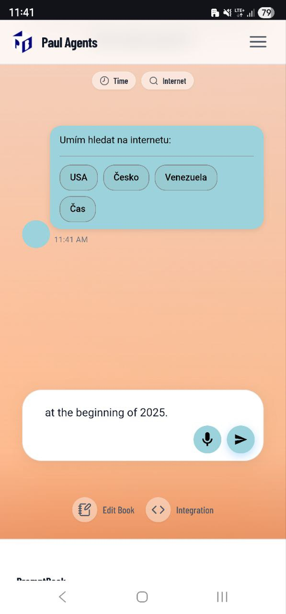

[x] ~$7.53 20 minutes by OpenAI Codex `gpt-5.1-codex-mini`

[✨😓] When using voice dictation, respect the language of the speaker.

-   For example, when the speaker says: "Na začátku roku 2025.", now the transcribed message is in English: "At the beginning of 2025.", but it should be in the original language: "Na začátku roku 2025."
-   You are working with the [Agents Server](apps/agents-server) with the chat

---

[-]

[✨😓] foo

-   Keep in mind the DRY _(don't repeat yourself)_ principle.
-   You are working with the [Agents Server](apps/agents-server)
-   Add the changes into the [changelog](changelog/_current-preversion.md)

---

[-]

[✨😓] foo

-   Keep in mind the DRY _(don't repeat yourself)_ principle.
-   You are working with the [Agents Server](apps/agents-server)
-   Add the changes into the [changelog](changelog/_current-preversion.md)

---

[-]

[✨😓] foo

-   Keep in mind the DRY _(don't repeat yourself)_ principle.
-   You are working with the [Agents Server](apps/agents-server)
-   Add the changes into the [changelog](changelog/_current-preversion.md)

