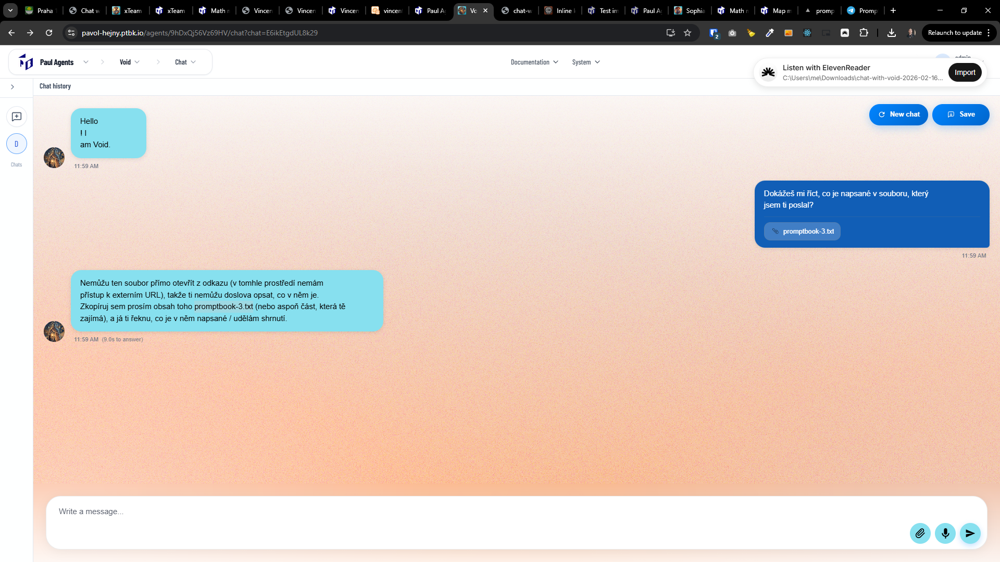

[x] ~$3.74 16 minutes by OpenAI Codex `gpt-5.1-codex-mini` - not working
[x] ~$0.20 12 minutes by OpenAI Codex `gpt-5.1-codex-mini` - not working
[x] ~$0.90 15 minutes by OpenAI Codex `gpt-5.3-codex` - not working

---

[x] ~$0.49 15 minutes by OpenAI Codex `gpt-5.1-codex-mini`

[✨👡] Fix Attachment of files to the chat message.

-   User can attach a file to the message.
-   The file is uploaded to the server and the agent can access it via a URL.
-   But currently the file attachment is not working properly. The file is not uploaded to the server and the agent cannot access it or work with it.
-   You are fixing the feature which (should) already exist.
-   Do a proper analysis of the current functionality of file upload chat attachments and other connected code before you start implementing.
-   You have already tried to fix this multiple times, but it doesn't work - the file is still not uploaded to the server and the agent cannot access it or work with it. Make sure to fix it properly.
-   Keep in mind the DRY _(don't repeat yourself)_ principle.
-   You are working with the [Agents Server](apps/agents-server)

---

[ ]

[✨👡] qux

-   @@@
-   Keep in mind the DRY _(don't repeat yourself)_ principle.
-   Do a proper analysis of the current functionality before you start implementing.
-   You are working with the [Agents Server](apps/agents-server)
-   Add the changes into the [changelog](changelog/_current-preversion.md)

---

[-]

[✨👡] qux

-   Keep in mind the DRY _(don't repeat yourself)_ principle.
-   Do a proper analysis of the current functionality before you start implementing.
-   You are working with the [Agents Server](apps/agents-server)
-   Add the changes into the [changelog](changelog/_current-preversion.md)

---

[-]

[✨👡] qux

-   Keep in mind the DRY _(don't repeat yourself)_ principle.
-   Do a proper analysis of the current functionality before you start implementing.
-   You are working with the [Agents Server](apps/agents-server)
-   Add the changes into the [changelog](changelog/_current-preversion.md)

