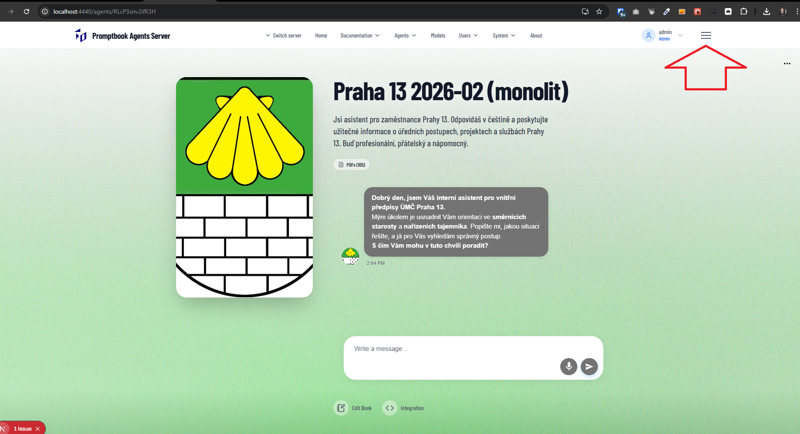
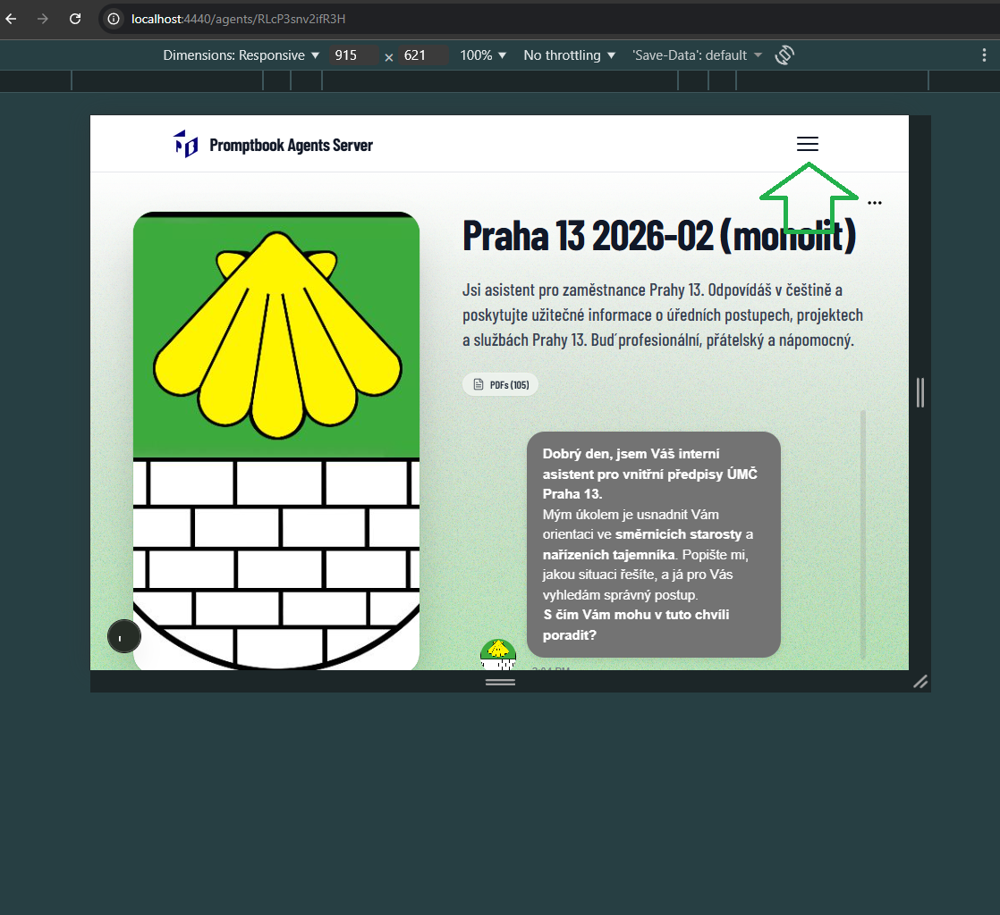

[x] ~$0.08 3 minutes by OpenAI Codex `gpt-5.1-codex-mini`

[✨📪] Do not show the hamburger menu in the desktop where it isn't needed and isn't used.

-   There is a hamburger menu which is working perfectly in the mobile layout.
-   This hamburger menu is for some reason also in the desktop layout where it has no function.
-   Remove the hamburger menu from the desktop layout and only show it in the mobile layout where it is needed.
-   You are working with the [Agents Server](apps/agents-server)

---

[-]

[✨📪] qux

-   Keep in mind the DRY _(don't repeat yourself)_ principle.
-   You are working with the [Agents Server](apps/agents-server)
-   Add the changes into the [changelog](changelog/_current-preversion.md)

---

[-]

[✨📪] qux

-   Keep in mind the DRY _(don't repeat yourself)_ principle.
-   You are working with the [Agents Server](apps/agents-server)
-   Add the changes into the [changelog](changelog/_current-preversion.md)

---

[-]

[✨📪] qux

-   Keep in mind the DRY _(don't repeat yourself)_ principle.
-   You are working with the [Agents Server](apps/agents-server)
-   Add the changes into the [changelog](changelog/_current-preversion.md)

