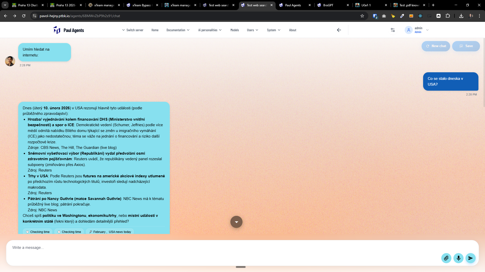
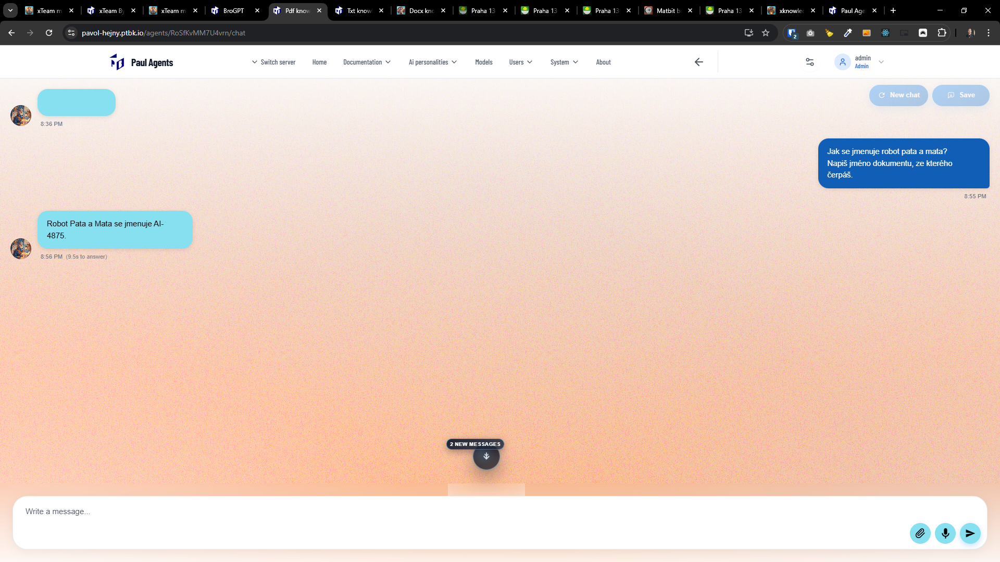
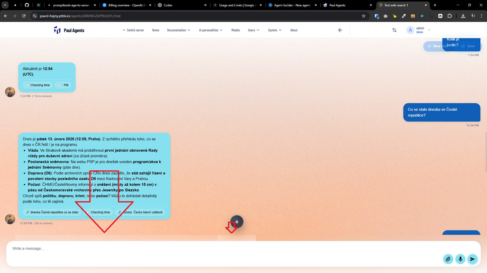

[x] ~$0.30 11 minutes by OpenAI Codex `gpt-5.1-codex-mini`

---

[x] ~$0.29 8 minutes by OpenAI Codex `gpt-5.3-codex`

[✨🗃] Enhance the UX of the scrolldown arrow in the chat in the agent server.

-   Do the graphics of the down arrow better
-   Keep in mind the DRY _(don't repeat yourself)_ principle.
-   You are working with the [Agents Server](apps/agents-server)

---

[x] ~$0.62 12 minutes by OpenAI Codex `gpt-5.3-codex`

[✨🗃] Enhance the UX of the scrolldown and number of new messages arrow in the chat in the agent server.

-   The entire scrolldown should appear only when you are scrolled inside the chat NOT when you see the last message. So if you are scrolled up and there are new messages, then the scrolldown with the number of new messages should appear, but if you are scrolled down and you see the last message, then the scrolldown should not appear even if there are new messages.
-   Do the graphics and placement of the "X new messages" should be better
-   Keep in mind the DRY _(don't repeat yourself)_ principle.
-   You are working with the [Agents Server](apps/agents-server)

---

[ ]

[✨🗃] Fix weird blurs shown when the scroll down is shown in the chat.

-   These blurs occur right-top on the write a message input.
-   They occur together with the scroll down button.
-   You are working with the [Agents Server](apps/agents-server)

---

[-]

[✨🗃] foo

-   Keep in mind the DRY _(don't repeat yourself)_ principle.
-   You are working with the [Agents Server](apps/agents-server)
-   Add the changes into the [changelog](changelog/_current-preversion.md)
