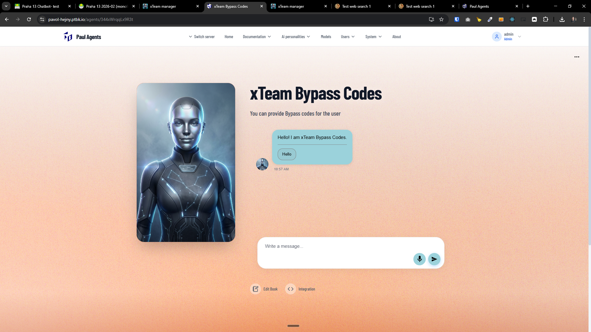
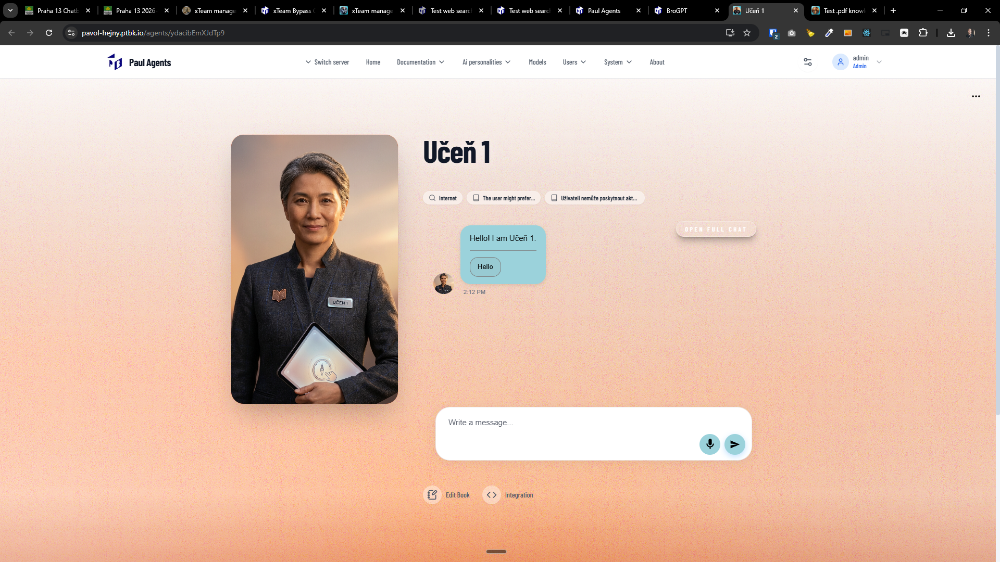
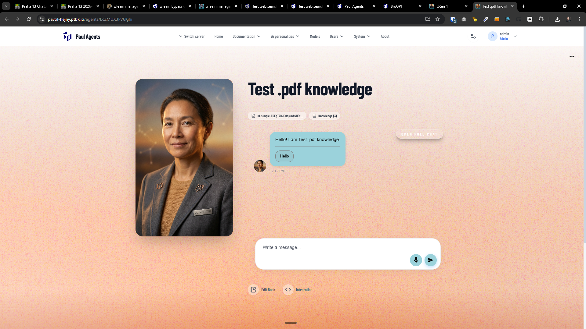

[x] ~$0.00 12 minutes by OpenAI Codex `gpt-5.1-codex-mini`

[✨✌️] Enhance the default images of agents in the agent server.

-   This looks old and a bit unmodern.
-   Keep in mind the DRY _(don't repeat yourself)_ principle.
-   Do a proper analysis of the current functionality before you start implementing.
-   You are working with the [Agents Server](apps/agents-server)
-   Add the changes into the [changelog](changelog/_current-preversion.md)

---

[x] ~$0.01 a minute by OpenAI Codex `gpt-5.1-codex-mini`

[✨✌️] Enhance the default images of agents in the agent server.

-   The images look very cold and technocratic.
-   The images should look more friendly, warm, and welcoming.
-   But not childlike, but more like a friendly and wise mentor, or a helpful assistant.
-   Should be suitable for the business. Not too playful, but still friendly and warm.
-   Change only the [prompt of the image](apps/agents-server/src/app/agents/[agentName]/images/default-avatar.png/getAgentDefaultAvatarPrompt.ts). Do not change the generating logic.

---

[x] ~$0.13 2 minutes by OpenAI Codex `gpt-5.3-codex`

[✨✌️] Enhance the default images of agents in the agent server.

-   The images look very cold and technocratic.
-   The images should look more friendly, warm, and welcoming.
-   But not childlike, but more like a friendly and wise mentor, or a helpful assistant.
-   Should be suitable for the business. Not too playful, but still friendly and warm.
-   **Do not do the photorealism, do some nice animated representation of the AI agents.**
-   Avoid text in the images.
-   Bring the colors of the agent into the images.
-   Be creative and try to make the images look more unique and different from each other, so it is easier for the users to distinguish between different agents.
-   Change only the [prompt of the image](apps/agents-server/src/app/agents/[agentName]/images/default-avatar.png/getAgentDefaultAvatarPrompt.ts). Do not change the generating logic.

---

[-]

[✨✌️] bar

-   _(@@@ Was the previous prompt enough?)_
-   Keep in mind the DRY _(don't repeat yourself)_ principle.
-   Do a proper analysis of the current functionality before you start implementing.
-   You are working with the [Agents Server](apps/agents-server)
-   Add the changes into the [changelog](changelog/_current-preversion.md)

---

[-]

[✨✌️] bar

-   Keep in mind the DRY _(don't repeat yourself)_ principle.
-   Do a proper analysis of the current functionality before you start implementing.
-   You are working with the [Agents Server](apps/agents-server)
-   Add the changes into the [changelog](changelog/_current-preversion.md)

---

[ ]

[✨✌️] Fix "Enhance the default images of agents in the agent server."

-   @@@
-   You have implemented the "Enhance the default images of agents in the agent server." feature, but it is not working, fix it
