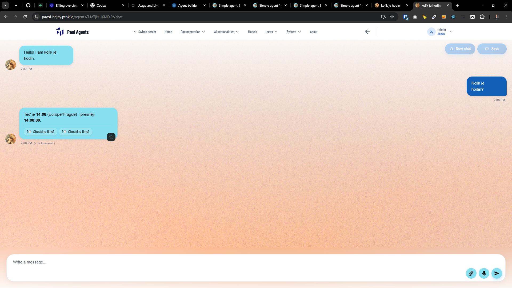

[ ] !!

[✨⏏️] Remove the "[" and "]" from the tool-calling chips

-   Remove it from all tool calling chips like `USE TIME`, `USE SEARCH ENGINE`, `TEAM`,...
-   You are working with the [Agents Server](apps/agents-server)

---

[-]

[✨⏏️] baz

-   Keep in mind the DRY _(don't repeat yourself)_ principle.
-   You are working with the [Agents Server](apps/agents-server)
-   Add the changes into the [changelog](changelog/_current-preversion.md)

---

[-]

[✨⏏️] baz

-   Keep in mind the DRY _(don't repeat yourself)_ principle.
-   You are working with the [Agents Server](apps/agents-server)
-   Add the changes into the [changelog](changelog/_current-preversion.md)

---

[-]

[✨⏏️] baz

-   Keep in mind the DRY _(don't repeat yourself)_ principle.
-   You are working with the [Agents Server](apps/agents-server)
-   Add the changes into the [changelog](changelog/_current-preversion.md)
