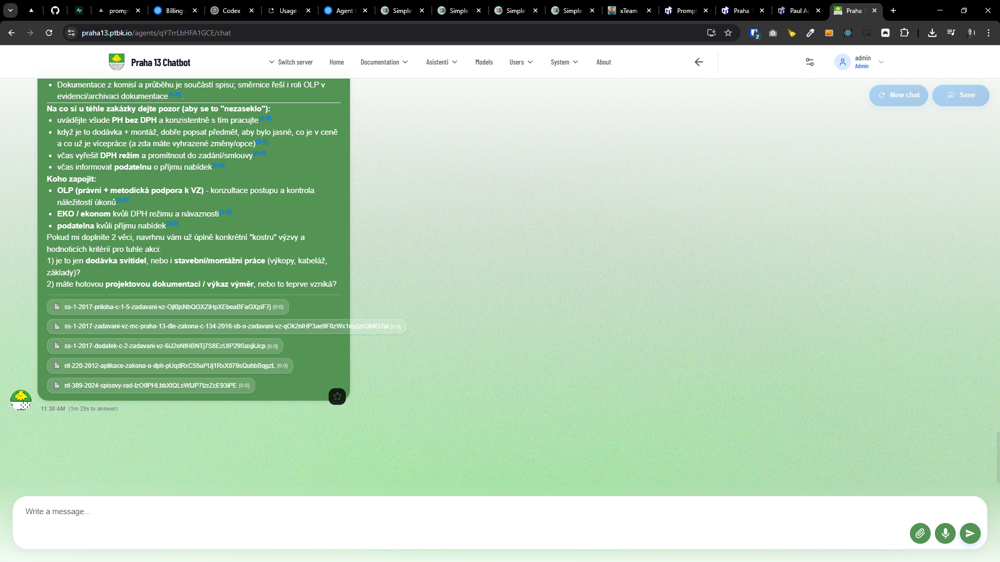
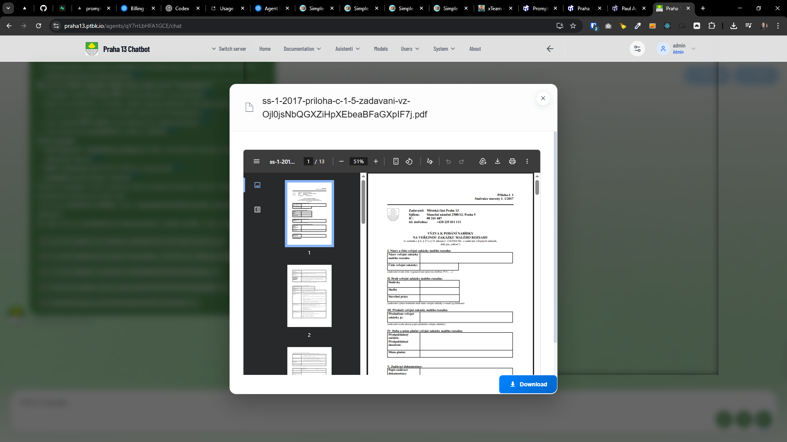

[x] ~$0.14 8 minutes by OpenAI Codex `gpt-5.1-codex-mini`

[✨🧹] Simplify the Knowledge Chips

-   When files are uploaded into the Promptbook CDN, they look like this `KNOWLEDGE https://ptbk.io/k/nt-290-2018-odpisovani-dlouhodobeho-majetku-OMOZI4p7bTQFpLtpfP6jMnTzVHvURF.pdf`
-   When the agent uses these files as a source, they show them in a chip like this "nt-290-2018-odpisovani-dlouhodobeho-majetku-OMOZI4p7bTQFpLtpfP6jMnTzVHvURF"
-   Simplify the name of the knowledge chips to show only the first 20 characters of the file name, and then add "..." at the end if the file name is longer than 20 characters.
-   Also crop the last part that is definitelly id "OMOZI4p7bTQFpLtpfP6jMnTzVHvURF" and is not useful for the user to see.
-   Create an utility function `isHumanOrID(text: string): 'HUMAN' | 'ID' | 'UNKNOWN'` that will have some heuristic that can determine if the string is human or ID.
-   Keep in mind the DRY _(don't repeat yourself)_ principle.
-   Do a proper analysis of the current functionality before you start implementing.
-   You are working with the [Agents Server](apps/agents-server)
-   Add the changes into the [changelog](changelog/_current-preversion.md)

---

[-]

[✨🧹] baz

-   Keep in mind the DRY _(don't repeat yourself)_ principle.
-   Do a proper analysis of the current functionality before you start implementing.
-   You are working with the [Agents Server](apps/agents-server)
-   Add the changes into the [changelog](changelog/_current-preversion.md)

---

[-]

[✨🧹] baz

-   Keep in mind the DRY _(don't repeat yourself)_ principle.
-   Do a proper analysis of the current functionality before you start implementing.
-   You are working with the [Agents Server](apps/agents-server)
-   Add the changes into the [changelog](changelog/_current-preversion.md)

---

[-]

[✨🧹] baz

-   Keep in mind the DRY _(don't repeat yourself)_ principle.
-   Do a proper analysis of the current functionality before you start implementing.
-   You are working with the [Agents Server](apps/agents-server)
-   Add the changes into the [changelog](changelog/_current-preversion.md)
