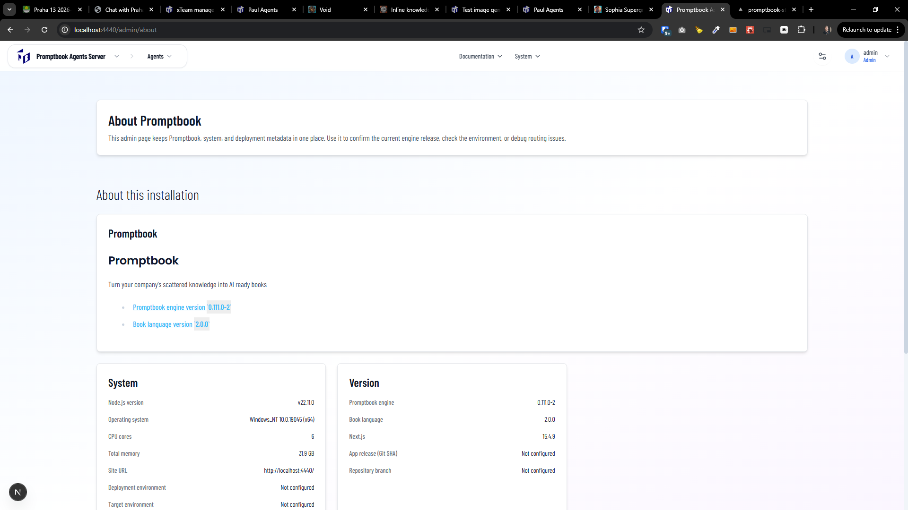
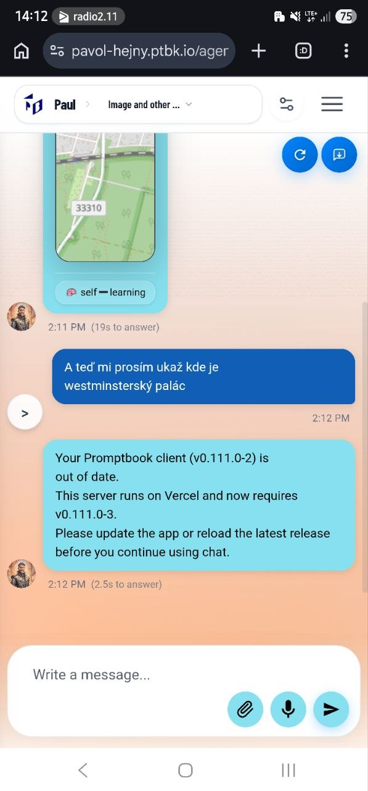

[x] ~$0.35 8 minutes by OpenAI Codex `gpt-5.1-codex-mini`

[✨👊] In the menu add information about the Promptbook and version of the app.

-   Add item under "System" -> "About" _(about)_
-   This should open `/admin/about` page
-   On this page, add information about the Promptbook and version of the app
-   Keep in mind the DRY _(don't repeat yourself)_ principle, use the existing components to show the information about the Promptbook, the system, and the version of the application.
-   You are working with the [Agents Server](apps/agents-server)
-   Add the changes into the [changelog](changelog/_current-preversion.md)

---

[x] ~$0.53 18 minutes by OpenAI Codex `gpt-5.1-codex-mini`

[✨👊] Enforce latest version for all clients.

-   If the client version is outdated, show a message in the chat that the user needs to update the app to the latest version to continue using it.
-   We are running on Vercel
-   Keep in mind the DRY _(don't repeat yourself)_ principle.
-   Do a proper analysis of the current functionality before you start implementing.
-   You are working with the [Agents Server](apps/agents-server)
-   Add the changes into the [changelog](changelog/_current-preversion.md)

---

[x] ~$0.08 11 minutes by OpenAI Codex `gpt-5.1-codex-mini`

[✨👊] Add more information into `/admin/about`

-   Try to add as many information about the build version, Git, etc.
-   This is a technical page, so you don't need to be non-technical-friendly. Put there as many technical and debugging information as possible about the server, user, browser, environment, connection, the build, etc. etc.
-   You are working with the [Agents Server](apps/agents-server)



---

[ ]

[✨👊] When the version of the client is behind the version of the backend, show the popup message With the information and auto-refresh the page for the client.

**The version of the app is currently enforced by this message in the chat, It's not a good solution:**

```
Your Promptbook client ... is out of date.
This server runs on Vercel and now requires ....
Please update the app or reload the latest release before you continue using chat.
```

-   User shouldn't know about the technical details, it should be a user-friendly message that explains that the app needs to be updated to continue using it, and it should automatically refresh the page to load the latest version of the app.
-   This is relevant for the entire agent server app, not only for the chat in the agent server app.
-   Keep in mind the DRY _(don't repeat yourself)_ principle.
-   Do a proper analysis of the current functionality before you start implementing.
-   Look at file `src/utils/clientVersion.ts`
-   You are working with the [Agents Server](apps/agents-server)



---

[-]

[✨👊] bar

-   Keep in mind the DRY _(don't repeat yourself)_ principle.
-   Do a proper analysis of the current functionality before you start implementing.
-   You are working with the [Agents Server](apps/agents-server)
-   Add the changes into the [changelog](changelog/_current-preversion.md)

---

[-]

[✨👊] bar

-   Keep in mind the DRY _(don't repeat yourself)_ principle.
-   Do a proper analysis of the current functionality before you start implementing.
-   You are working with the [Agents Server](apps/agents-server)
-   Add the changes into the [changelog](changelog/_current-preversion.md)
