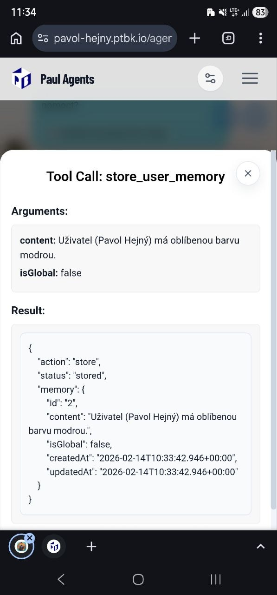
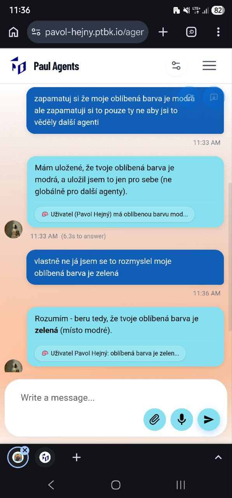
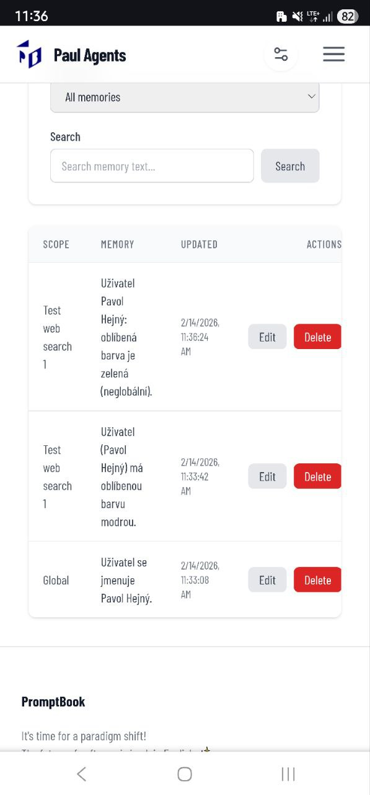

[x] - Implemented by OpenAI Codex `gpt-5.3-codex` but KCD II killed just before the final commit, so I am doing the final commit manually. The code is already implemented, just not committed.

[✨👸] Implement user memory

```book
My personal AI Agent

PERSONA Lawyer specialized in intellectual property.
MEMORY Remember projects user is working on
CLOSED
```

-   Add commitment `MEMORY` that will be used to store user memories. It should internally create a tool call to store and retrieve user memories, but the user should not see this, they should just use `MEMORY` commitment in the book to store and retrieve memories.
-   You can add additional instructions to the MEMORY commitment which will be added into the Agent model Requirements system message.
    -   `MEMORY Remember only things about the moral values of the user.`
    -   Look how this mechanism is implemented for example in the `USE SEARCH ENGINE` commitment.
-   User memories should be saved as user data. They are connected with locked-in user. The `admin` with `ADMIN_PASSWORD` is user "admin" and also has its own memory. When the user is deleted, the memory should be deleted as well.
-   User memories are per user and per agent.
-   When the agents are talking together in a `TEAM`, they don't have memories.
-   User memories should be stored in a table `UserMemory`
-   Create database migration for the change
    -   Migrations are located in `/apps/agents-server/src/database/migrations`
    -   Be aware that table names in migrations have prefix `prefix_` _(look at existing migrations for reference)_
-   Create a chip for the memory retrieval, and when the memory is used, show the chip.
    -   Look how other chips in the system work, for example `USE SEARCH ENGINE`, `KNOWLEDGE`, `TEAM`, and do the same for `MEMORY`. The chip should show the content of the memory that is retrieved or stored.
-   Create a simple menu under "System" -> "User Memory" where the user can see all the memories that are stored for the logged in user, and also do CRUD operations on them.
    -   User should see this memory per agent.
    -   But the user has the option to make one memory global.
-   When the user is not logged in, the memories are disabled
    -   But still, in other mechanisms (like self-learning), it is working as it is working now. Do not change them in any way.
-   Keep in mind the DRY _(don't repeat yourself)_ principle.
-   This is a big change. Do a proper analysis of the project before you start implementing.
-   You are working with the [Agents Server](apps/agents-server)
-   Add the changes into the [changelog](changelog/_current-preversion.md)

---

[ ] !!

[✨👸] Better memory toolcall chip

save/load

-   Memories are working perfectly, but the modal popup when the user clicks on the chip that memory was used (either saved or loaded) [looks awful](prompts/screenshots/2026-02-1220-agents-server-memory.png).
-   Enhance the design of this modal popup and make it look better.
-   It shouldn't be a technical model about the JSONs and the structure of the memory object. It should be useful for the general public and look very nice and intuitive.
-   Keep in mind the DRY _(don't repeat yourself)_ principle.
-   Do a proper analysis of the current functionality before you start implementing.
-   You are working with the [Agents Server](apps/agents-server)



---

[ ] !!

[✨👸] Do a slight changes in user memories.

prefer non global memories
Editing memories

-   Prefer non-global memories, the default should be that the memory is connected to the agent, the exception is to record the memory as global.
-   Agent should have the capability to edit the memory. For example, if the agent retrieves some memory and sees that it is outdated, it should be able to update this memory with the new information.
-   Agent should have option to delete the memory as well
-   The deletion should be soft deletion, so the memory is not deleted from the database, but just marked as deleted, and it should not be retrieved by the agent anymore.
-   Agent should be able to do full CRUD operations on the memories. Each agent can access either his memories or global memories. Memories of other agents are not accessible at all.
-   If you need to make changes in the database for the soft deletions, create database migration for the change
    -   Migrations are located in `/apps/agents-server/src/database/migrations`
    -   Be aware that table names in migrations have prefix `prefix_` _(look at existing migrations for reference)_
-   Keep in mind the DRY _(don't repeat yourself)_ principle.
-   Do a proper analysis of the current functionality of user memories before you start implementing.
-   You are working with the [Agents Server](apps/agents-server)




---

[-]

[✨👸] qux

-   Keep in mind the DRY _(don't repeat yourself)_ principle.
-   Do a proper analysis of the current functionality before you start implementing.
-   You are working with the [Agents Server](apps/agents-server)
-   Add the changes into the [changelog](changelog/_current-preversion.md)
