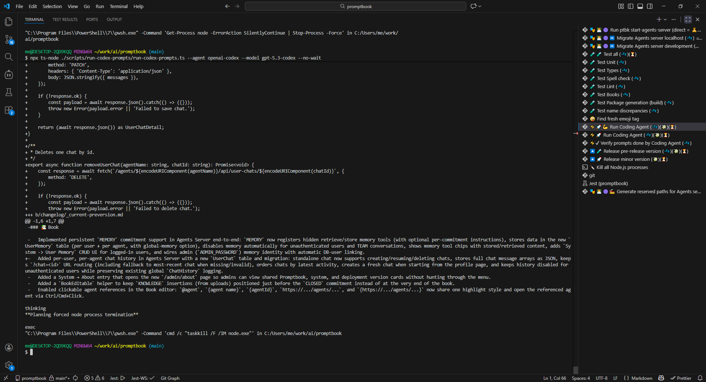
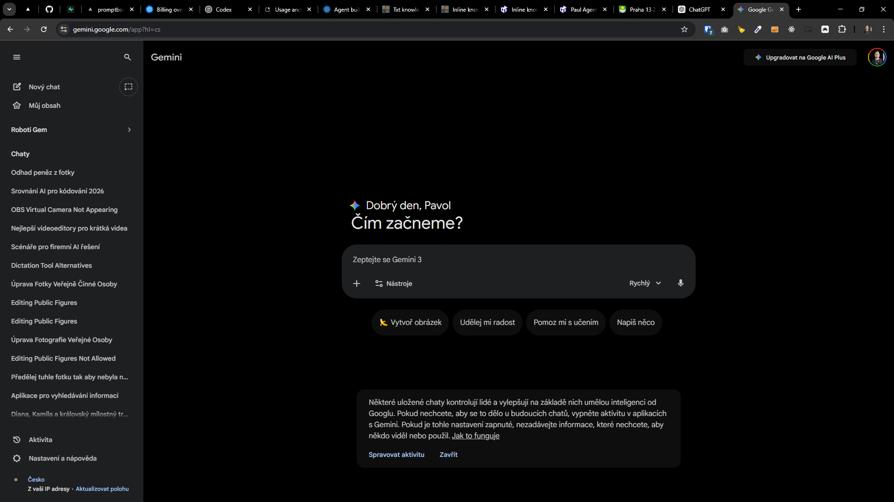
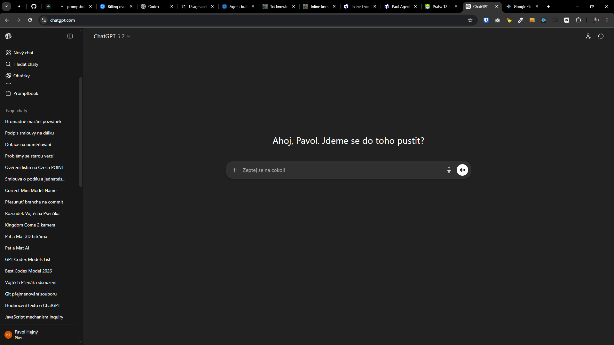
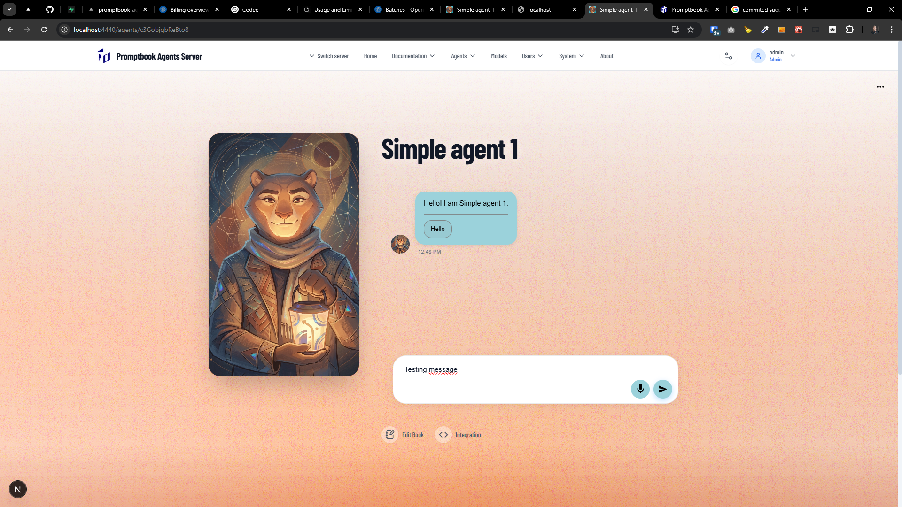
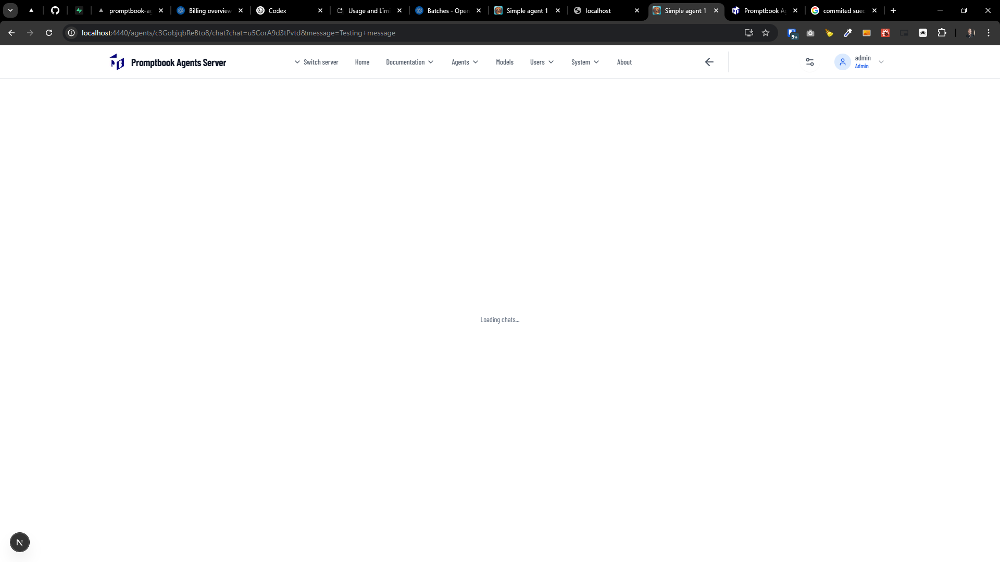
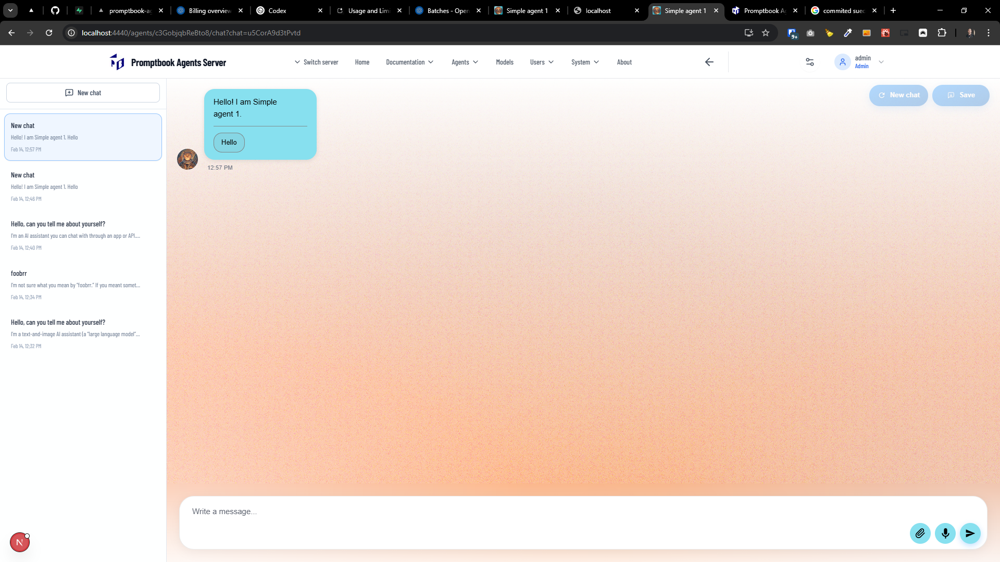
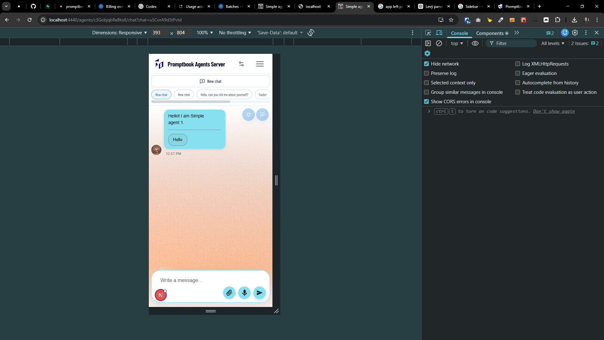
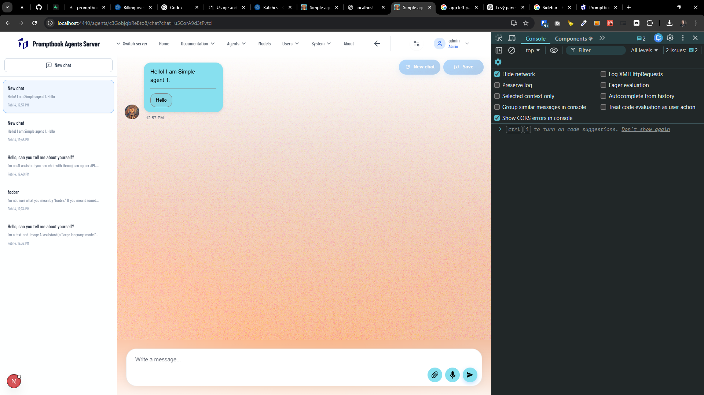

[x] - Implemented by OpenAI Codex `gpt-5.3-codex` but the script .

[✨⁉️] Implement user chat history

-   User is chatting with the agent. Store chats in some nice history.
-   This should be similar to other AI chatting platforms like ChatGPT, Claude, Gemini, etc. _(See screenshot for reference)_
-   User chats should be stored in a table `UserChat`
-   All of the messages in the chat should be stored as JSON in user chat.
-   Do not worry about editing messages in the past. The chat can be created, new, deleted, or continued, but it cannot be edited
-   Create database migration for the change
    -   Migrations are located in `/apps/agents-server/src/database/migrations`
    -   Be aware that table names in migrations have prefix `prefix_` _(look at existing migrations for reference)_
-   User chats are per agent per user. For each agent, user see different history of the chats because with one agent, a user can have a lot of chats, and with a different agent, a user can have none.
-   User can resume any of his chats at any time.
-   The chats are ordered by the time of the last message in the chat. So if the user has a chat with some agent, and then he continues this chat, this chat will be moved to the top of the list of chats.
-   When the user starts chat from the agent profile page (like https://praha13.ptbk.io/agents/qY7rrLbHFA1GCE/), it should always create a new chat, not continue with some old one.
-   Store current chat in the GET url parameter, for example https://praha13.ptbk.io/agents/qY7rrLbHFA1GCE/?chat=rTfQAdwsda, and when the user opens this url, it should open this chat.
    -   When the user opens the agent page without `?chat=...` parameter, it should open the most recent chat with this agent.
    -   This is not a sharing feature. This will be implemented later. The chat should be visible only for that one user, and if the user shares the link with someone else, this someone else should not see the chat because it is not their chat.
    -   Sharing will be implemented later.
    -   IDs of the chats should be generated by the same function as IDs of the agents.
-   This will work alongside the logging of the chat history _(table `ChatHistory`)_.
-   When the user is not logged in, the chat history are disabled
    -   But still, in other mechanisms (like logging chat history globally), it is working as it is working now. Do not change them in any way.
-   Keep in mind the DRY _(don't repeat yourself)_ principle.
-   This is a big change. Do a proper analysis of the project before you start implementing.
-   You are working with the [Agents Server](apps/agents-server)
-   Add the changes into the [changelog](changelog/_current-preversion.md)

---

[ ] !!

[✨⁉️] When the user starts chat from the agent profile page (like https://praha13.ptbk.io/agents/qY7rrLbHFA1GCE/), it should always create a new chat with a written message

-   When the user starts chat from the agent profile page, it should always create a new chat and start conversation
-   Both writing message manually and pressing a quick message should work
-   It is passed by GET parameter `?message=...`, for example http://localhost:4440/agents/c3GobjqbReBto8/chat?chat=u5CorA9d3tPvtd&message=Testing+message
-   But it stopped working after the implementation of the chat history, so it should be fixed and work together with the chat history.
-   Do a proper analysis of the current functionality before you start implementing.
-   You are working with the [Agents Server](apps/agents-server)

---

[ ] !!

[✨⁉️] Redesign the user chats into the proper app sidebar.

-   The sidebar should be on the left side of the screen, both on the desktop and mobile.
-   The sidebar should be collapsible, so the user can hide it when he doesn't need it.
-   It should look and behave exactly as the well-designed sidebars of other applications, like ChatGPT, Notion, etc. It should be a proper sidebar with the list of chats, and when the user clicks on the chat, it opens this chat in the main area.
-   Keep in mind the DRY _(don't repeat yourself)_ principle.
-   You are working with the [Agents Server](apps/agents-server)

---

[-]

[✨⁉️] Share my chat with link

-   @@@
-   Keep in mind the DRY _(don't repeat yourself)_ principle.
-   Do a proper analysis of the current functionality before you start implementing.
-   You are working with the [Agents Server](apps/agents-server)
-   Add the changes into the [changelog](changelog/_current-preversion.md)

---

[ ]

[✨⁉️] QR code to the shared chat link in the HTML / PDF exported chat.

-   @@@
-   Keep in mind the DRY _(don't repeat yourself)_ principle.
-   Do a proper analysis of the current functionality before you start implementing.
-   You are working with the [Agents Server](apps/agents-server)
-   Add the changes into the [changelog](changelog/_current-preversion.md)

---

[-]

[✨⁉️] brr

-   Keep in mind the DRY _(don't repeat yourself)_ principle.
-   Do a proper analysis of the current functionality before you start implementing.
-   You are working with the [Agents Server](apps/agents-server)
-   Add the changes into the [changelog](changelog/_current-preversion.md)
