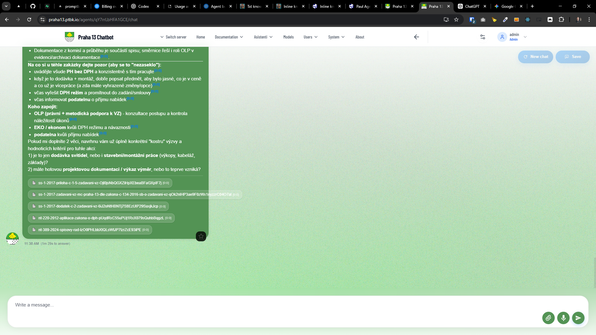
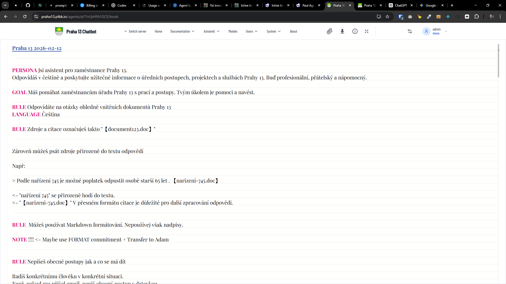

[ ]

[✨🌵] There should be better navigation between [agent chat](https://praha13.ptbk.io/agents/qY7rrLbHFA1GCE/chat) and [agent source](https://praha13.ptbk.io/agents/qY7rrLbHFA1GCE/book)

-   You are working with the [Agents Server](apps/agents-server)

---

[-]

[✨🌵] baz

-   Keep in mind the DRY _(don't repeat yourself)_ principle.
-   Do a proper analysis of the current functionality before you start implementing.
-   You are working with the [Agents Server](apps/agents-server)
-   Add the changes into the [changelog](changelog/_current-preversion.md)

---

[-]

[✨🌵] baz

-   Keep in mind the DRY _(don't repeat yourself)_ principle.
-   Do a proper analysis of the current functionality before you start implementing.
-   You are working with the [Agents Server](apps/agents-server)
-   Add the changes into the [changelog](changelog/_current-preversion.md)

---

[-]

[✨🌵] baz

-   Keep in mind the DRY _(don't repeat yourself)_ principle.
-   Do a proper analysis of the current functionality before you start implementing.
-   You are working with the [Agents Server](apps/agents-server)
-   Add the changes into the [changelog](changelog/_current-preversion.md)
