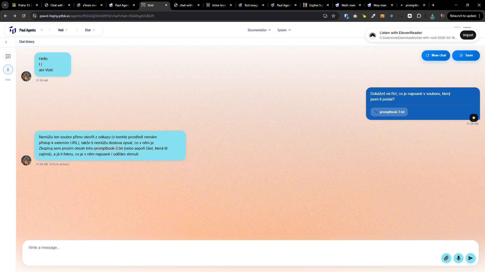
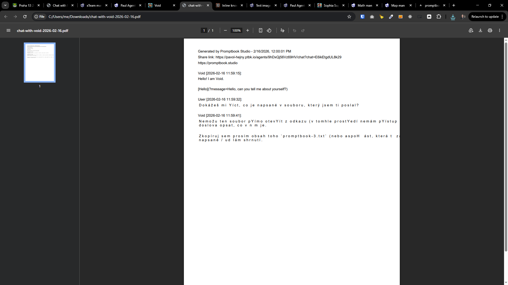

[x] ~$0.15 7 minutes by OpenAI Codex `gpt-5.1-codex-mini`

[✨🗺] Enhanced HTML download of the chat.

-   Exported HTML version of the chat looks awful.
-   The design of the exported HTML should be much better, with proper formatting, colors, and images. It should look like a nice chat export that you can share with someone or keep for your records.
-   It should look as similar as the chat in the application.
-   Keep in mind the DRY _(don't repeat yourself)_ principle.
-   Do a proper analysis of the current functionality before you start implementing.
-   You are working with the [Agents Server](apps/agents-server)
-   Add the changes into the [changelog](changelog/_current-preversion.md)

---

[x] ~$0.35 10 minutes by OpenAI Codex `gpt-5.1-codex-mini`

[✨🗺] Fix PDF download of the chat.

-   The PDF download of the chat is currently broken and doesn't work at all.
-   Exported PDF is just broken
-   Keep in mind the DRY _(don't repeat yourself)_ principle.
-   Do a proper analysis of the current functionality before you start implementing.
-   You are working with the [Agents Server](apps/agents-server)
-   Add the changes into the [changelog](changelog/_current-preversion.md)

---

[ ]

[✨🗺] The PDF which is exported from the chat should be richer and more visually appealing.

-   Currently, the PDF looks like bare text minimum. It should look more like a nicely exported chat, with proper formatting, colors, and images. It should look as similar as the chat in the application.
-   Keep in mind the DRY _(don't repeat yourself)_ principle.
-   Do a proper analysis of the current functionality of exporting chats before you start implementing.
-   You are working with the [Agents Server](apps/agents-server)

---

[-]

[✨🗺] qux

-   Keep in mind the DRY _(don't repeat yourself)_ principle.
-   Do a proper analysis of the current functionality before you start implementing.
-   You are working with the [Agents Server](apps/agents-server)
-   Add the changes into the [changelog](changelog/_current-preversion.md)
