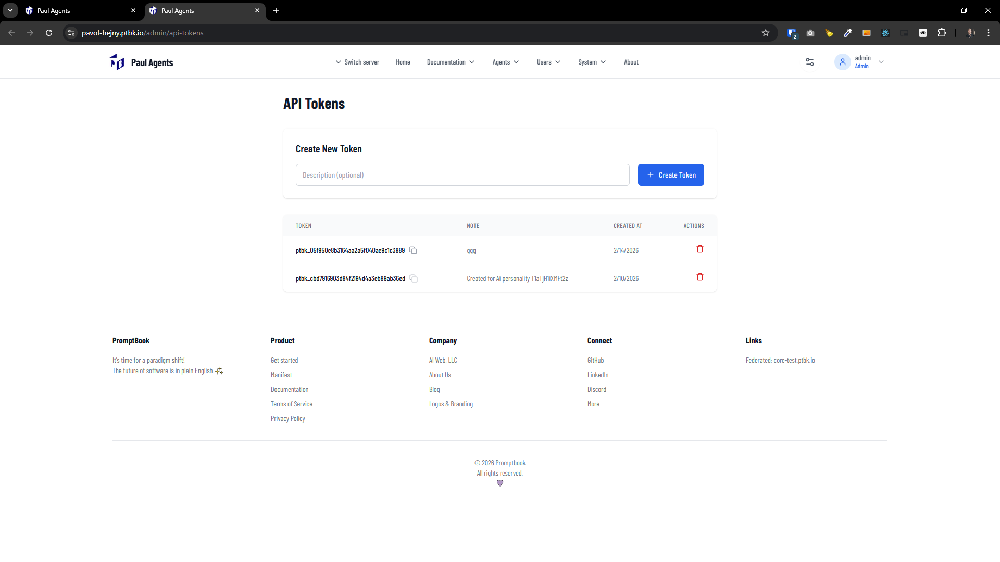

[x] ~$0.25 8 minutes by OpenAI Codex `gpt-5.1-codex-mini`

[✨☺️] Allow to toggle password visibility and token visibility alongside the input fields.

-   Keep in mind the DRY _(don't repeat yourself)_ principle, create a reusable component for the password and token input fields with visibility toggle.
-   You are working with the [Agents Server](apps/agents-server)

---

[ ]

[✨☺️] Show the tokens in `SecretInput` on page `/admin/api-tokens`

-   By default, it should be hidden. When the user clicks on the "eye" icon, it should show the token. When the user clicks on the "eye" icon again, it should hide the token.
-   Use coponent <SecretInput/>
-   Keep in mind the DRY _(don't repeat yourself)_ principle.
-   You are working with the [Agents Server](apps/agents-server)

---

[-]

[✨☺️] baz

-   Keep in mind the DRY _(don't repeat yourself)_ principle.
-   Do a proper analysis of the current functionality before you start implementing.
-   You are working with the [Agents Server](apps/agents-server)
-   Add the changes into the [changelog](changelog/_current-preversion.md)

---

[-]

[✨☺️] baz

-   Keep in mind the DRY _(don't repeat yourself)_ principle.
-   Do a proper analysis of the current functionality before you start implementing.
-   You are working with the [Agents Server](apps/agents-server)
-   Add the changes into the [changelog](changelog/_current-preversion.md)
