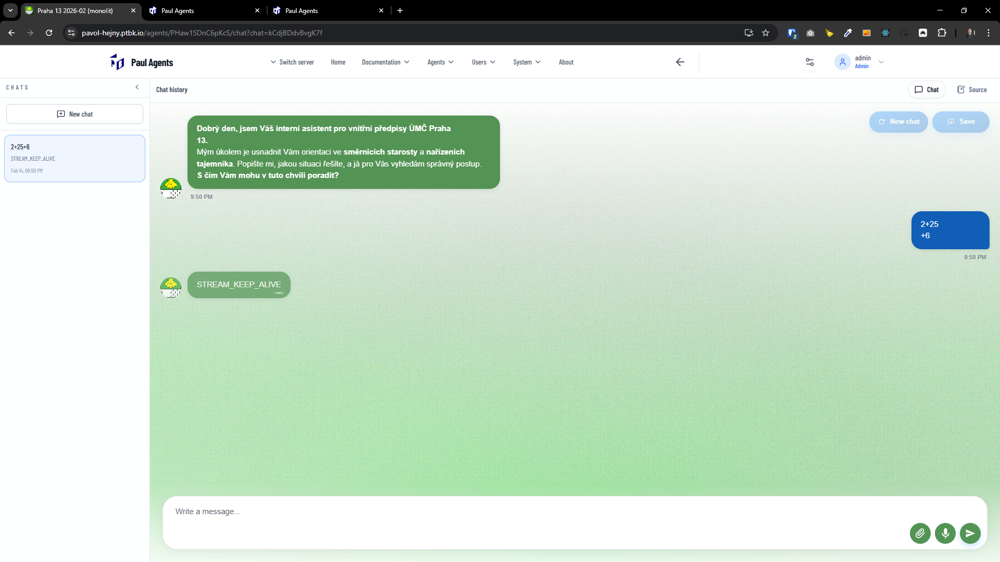

[x] ~$0.38 14 minutes by OpenAI Codex `gpt-5.1-codex-mini`

[✨📒] When the user asks the chat on the phone and puts the app on the background, the app fails with a connection error.

-   Try to keep the connection alive and make it work even when the app is on the background. It is really important for the user experience on mobile, because users often switch between apps and put the app on the background, and it shouldn't break the chat experience.
-   Chat can reply in some time, like 2 minutes, and during this time the user can put the app on the background, and when he opens it again, the chat should still work and show the response when it comes, instead of showing a connection error.
-   Keep in mind the DRY _(don't repeat yourself)_ principle.
-   Do a proper analysis of the current functionality of chat connection and chat streaming before you start implementing.
-   You are working with the [Agents Server](apps/agents-server)
-   Add the changes into the [changelog](changelog/_current-preversion.md)

---

[ ]

[✨📒] `STREAM_KEEP_ALIVE`

-   @@@
-   Keep in mind the DRY _(don't repeat yourself)_ principle.
-   Do a proper analysis of the current functionality before you start implementing.
-   You are working with the [Agents Server](apps/agents-server)
-   Add the changes into the [changelog](changelog/_current-preversion.md)

---

[-]

[✨📒] brr

-   Keep in mind the DRY _(don't repeat yourself)_ principle.
-   Do a proper analysis of the current functionality before you start implementing.
-   You are working with the [Agents Server](apps/agents-server)
-   Add the changes into the [changelog](changelog/_current-preversion.md)

---

[-]

[✨📒] brr

-   Keep in mind the DRY _(don't repeat yourself)_ principle.
-   Do a proper analysis of the current functionality before you start implementing.
-   You are working with the [Agents Server](apps/agents-server)
-   Add the changes into the [changelog](changelog/_current-preversion.md)
