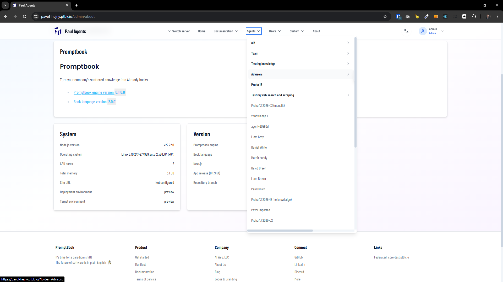
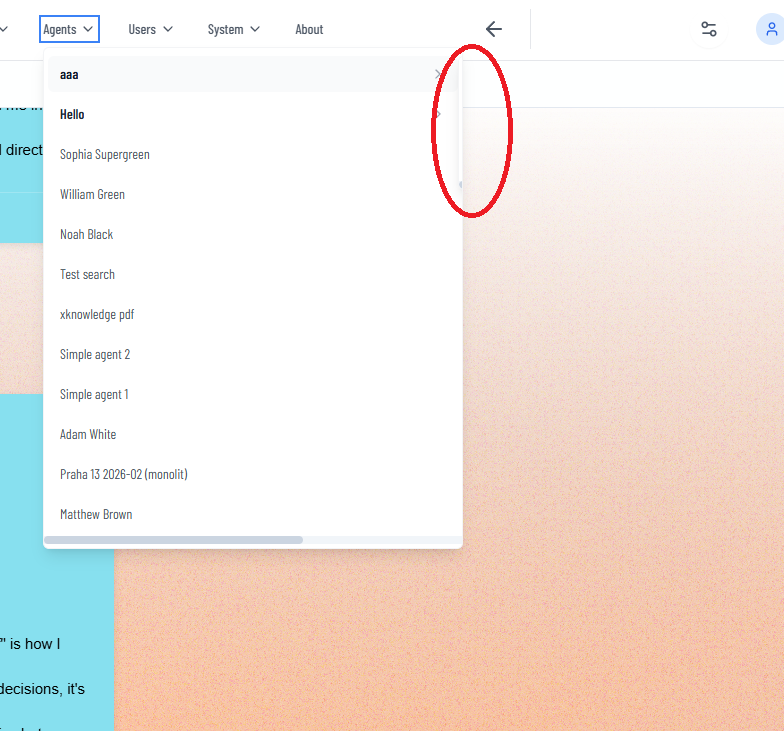
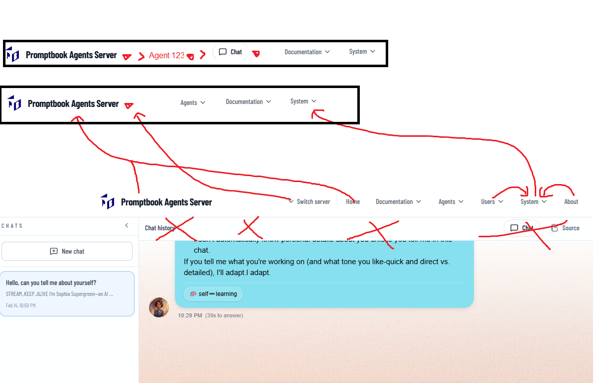
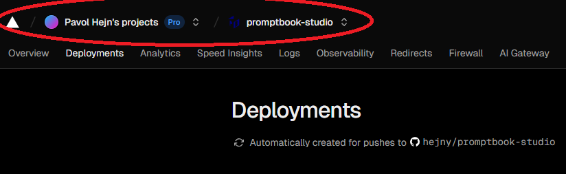
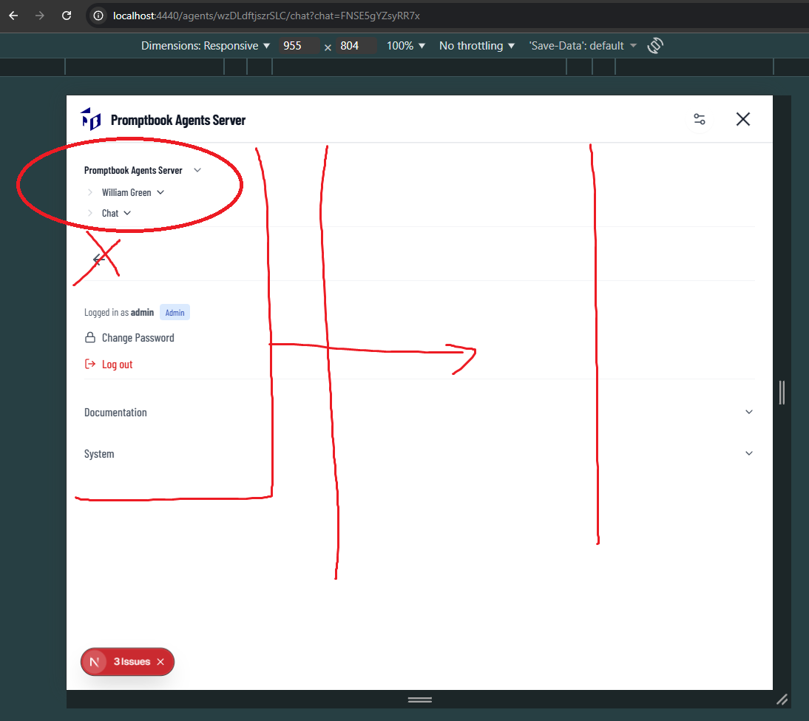
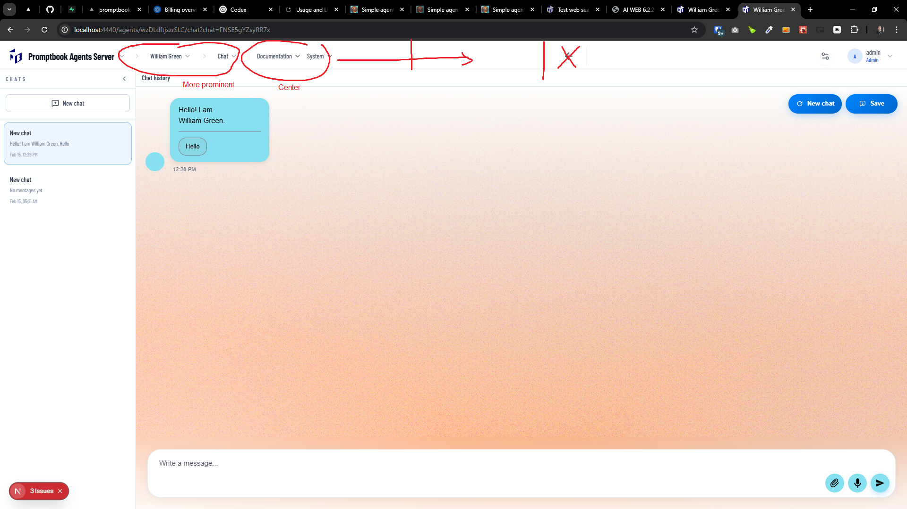

[x] ~$0.17 5 minutes by OpenAI Codex `gpt-5.3-codex`

[✨🍂] Fix subitems in the menu

-   The subitems in the menu, like "Agents" -> "Folder 1" -> ... are hidden behind the fold of the first level container, fix it
-   Keep in mind the DRY _(don't repeat yourself)_ principle.
-   You are working with the [Agents Server](apps/agents-server)

---

[x] ~$0.00 15 minutes by OpenAI Codex `gpt-5.3-codex`

[✨🍂] Reorder and redesign the Agents server app menu

-   Make some changes how the agent server menu works.
-   The main point is to make the entire Agents server more clean and intuitive, and to make it better navigable

**The menu should look like:**

1. The navigation hierarchy
    - Icon and Server name _(for example Promptbook Agents Server)_
    - arrow ">" and Agents or picked agent name (organized in folders)
    - arrow ">" and the view Profile / Chat / Book of the agent or nothing if no agent is picked
2. The menu items
    - Documentation
    - System
3. Control panel and user menu
    - Control panel
    - User menu with the avatar and the name of the user

**The changes you are making:**

-   Move the Server name with the logo on the left corner (it shouldnt float in the middle)
-   Create a clear hierarchy in the menu Server name > Agent name > Profile/Chat/Book
-   Put users under System
-   Put "About" in the "System" and rename it to "Landing page", the "About" already existing in the "System" rename to "Version info"
-   On the chat or book view (http://localhost:4440/agents/8iEwT1oJSv7xbU/chat?chat=9uPYkqbwK391eA) remove the buttons "Chat" / "Source" -> They are moved in the hierarchy

**Rules and context**

-   There should be a clean hierarchy in the left side of the menu. "[Icon] Server name" > "Agent" > "Profile/Chat/Book" then the menu items then control panel and user
-   The menu hierarchy should be inspired by the hierarchies, for example, in the Vercel dashboard, or in the Notion sidebar, or in the GitHub sidebar. The main point is to make it more intuitive and more clean.
-   Keep in mind both desktop and mobile versions of the menu
-   Do analysis how the menu, federated servers and hoisting works before you start implementing.
-   Keep in mind the DRY _(don't repeat yourself)_ principle.
-   You are working with the [Agents Server](apps/agents-server)
-   Add the changes into the [changelog](changelog/_current-preversion.md)

---

[ ]

[✨🍂] Make better Agent Server Application menu both on mobile and desktop

-   @@@
-   Do a proper analysis of the current menu before you start implementing.
-   Keep in mind the DRY _(don't repeat yourself)_ principle.
-   You are working with the [Agents Server](apps/agents-server)

---

[-]

[✨🍂] bar

-   Keep in mind the DRY _(don't repeat yourself)_ principle.
-   Do a proper analysis of the current functionality before you start implementing.
-   You are working with the [Agents Server](apps/agents-server)
-   Add the changes into the [changelog](changelog/_current-preversion.md)

---

[-]

[✨🍂] bar

-   Keep in mind the DRY _(don't repeat yourself)_ principle.
-   Do a proper analysis of the current functionality before you start implementing.
-   You are working with the [Agents Server](apps/agents-server)
-   Add the changes into the [changelog](changelog/_current-preversion.md)
