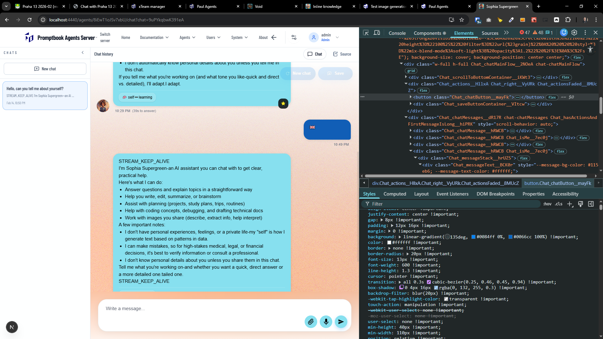

[ ] !!!!

[✨🌌] Chat buttons are always faded

-   The chat buttons, like "New Chat", "Save", are always faded, even when the user isnt scrolling or the buttons arent on top of any message
-   The faded status of the chat buttons has purpose to not obstruct the content of the message behind them.
-   Keep in mind the DRY _(don't repeat yourself)_ principle.
-   Do a proper analysis of the current functionality How the buttons are faded before you start implementing.
-   You are working with the [Agents Server](apps/agents-server)

---

[-]

[✨🌌] baz

-   Keep in mind the DRY _(don't repeat yourself)_ principle.
-   Do a proper analysis of the current functionality before you start implementing.
-   You are working with the [Agents Server](apps/agents-server)
-   Add the changes into the [changelog](changelog/_current-preversion.md)

---

[-]

[✨🌌] baz

-   Keep in mind the DRY _(don't repeat yourself)_ principle.
-   Do a proper analysis of the current functionality before you start implementing.
-   You are working with the [Agents Server](apps/agents-server)
-   Add the changes into the [changelog](changelog/_current-preversion.md)

---

[-]

[✨🌌] baz

-   Keep in mind the DRY _(don't repeat yourself)_ principle.
-   Do a proper analysis of the current functionality before you start implementing.
-   You are working with the [Agents Server](apps/agents-server)
-   Add the changes into the [changelog](changelog/_current-preversion.md)
