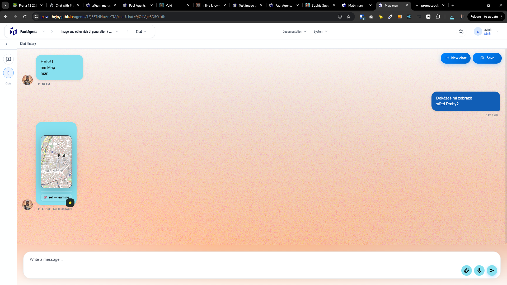
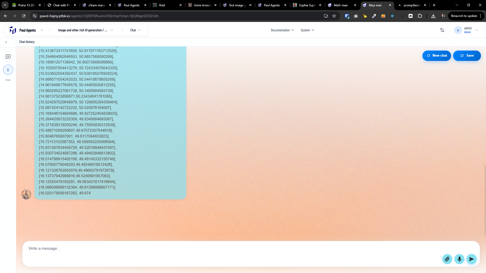

[x] ~$0.48 14 minutes by OpenAI Codex `gpt-5.1-codex-mini`

[✨📌] Allow to render the map inside a chat

When the agent sends a message with a map geojson feature, render the map with this feature inside the chat, so the users can see the map and the location of the feature on it:

**For example, the agent can send a message like this:**

```markdown
Sure! Here is the location of the nearest cafe:

\`\`\`geojson
{
"type": "FeatureCollection",
"features": [
{
"type": "Feature",
"geometry": {
"type": "Point",
"coordinates": [37.7749, -122.4194]
},
"properties": {
"name": "Nearest Cafe"
}
}
]
}
\`\`\`
```

-   Note \`\`\` are just here double escape characters, the actual message from the agent will contain `geojson ... ` without escaping.
-   Use leaflet for rendering the map, and make sure to render the feature on the map according to the geojson data.
-   This map should be inside a message box.
-   Message can contain the map freely in the content of the message. The message can contain any combination of text and features. For example, technically a chat message can contain the headings, formatting, tables, map, generated image, LaTeX,.. . Now we are implementing only map. I have sayd this as an example.
-   Keep in mind the DRY _(don't repeat yourself)_ principle.
-   Do a proper analysis of the current rendering of special message objects like image generation, quick buttons, LaTeX,... before you start implementing.
-   You are working with the [Agents Server](apps/agents-server)
-   Add the changes into the [changelog](changelog/_current-preversion.md)

---

[x] ~$0.21 10 minutes by OpenAI Codex `gpt-5.1-codex-mini`

[✨📌] When the GeoJSON is present in a message, it correctly renders a map, but it doesn't render features in this GeoJson, Fix it.

-   it eventually loads but it takes lot of time and it's confusing to see map without this features for a long time.
-   Keep in mind the DRY _(don't repeat yourself)_ principle.
-   Do a proper analysis of the current functionality before you start implementing.
    -   This functionality was implemented by [this prompt](prompts/2026-02-1400-agents-server-chat-map.md).
-   You are working with the [Agents Server](apps/agents-server)

---

[x] ~$0.15 13 minutes by OpenAI Codex `gpt-5.1-codex-mini`

[✨📌] You are rendering a map. Increase its width.

-   It should look great on desktop and on mobile.
-   Also add button to show the map on the bigger pop-up modal.
-   You are working with the [Agents Server](apps/agents-server)
-   This functionality was implemented by [this prompt](prompts/2026-02-1400-agents-server-chat-map.md).



---

[x] ~$0.20 6 minutes by OpenAI Codex `gpt-5.1-codex-mini`

[✨📌] When the agent is creating some rich feature like a map, image, table,... and the message isn't complete (It's in the process of the streaming.), only the source of this feature is shown, and it looks extremely ugly.

-   We definitely want to preserve the feature of streaming the text.
-   Do a proper analysis of the current functionality before you start implementing. This is relevant for any rich feature embedded in the chat message, like LaTeX, Map. Images, Tables,... ... Do it universally, not only for the map.
    -   The functionality of map rendering was implemented by [this prompt](prompts/2026-02-1400-agents-server-chat-map.md).
-   Keep in mind the DRY _(don't repeat yourself)_ principle.
-   You are working with the [Agents Server](apps/agents-server)



---

[-]

[✨📌] bar

-   Keep in mind the DRY _(don't repeat yourself)_ principle.
-   Do a proper analysis of the current functionality before you start implementing.
-   You are working with the [Agents Server](apps/agents-server)
-   Add the changes into the [changelog](changelog/_current-preversion.md)


