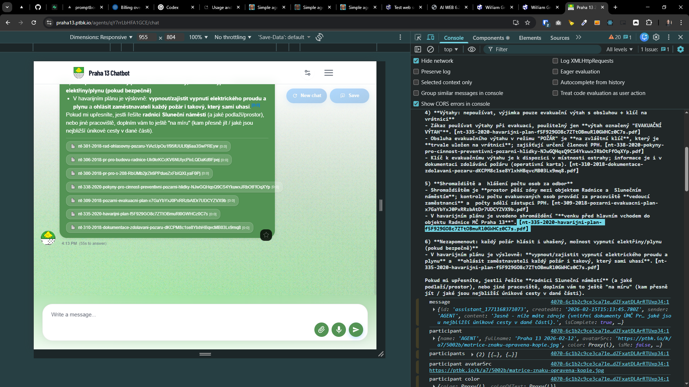

[x] ~$0.35 20 minutes by OpenAI Codex `gpt-5.1-codex-mini`

[✨🚂] Allow to citate, non-document, URL, or just raw text sources.

**This is already working:**

```markdown
Message from the agent... 【document-123-f5F929GO8c7ZTtOBmuRl0GWHCz0C7s.pdf】
```

<- This will show a nice source chip, and if when the user clicks on this chip, it will show a pop-up modal with the document.

**This should work:**

```markdown
Message from the agent... 【https://example.com/documents/qY7rrLbHFA1GCE/chatdocument-123-f5F929GO8c7ZTtOBmuRl0GWHCz0C7s.pdf】
```

_or_

```markdown
Message from the agent... 【Just some information, Roses are red, and secret code is 123. 】
```

-   If the `【...】` is document from the `KNOWLEDGE`, it should show the source chip with the title of the document, and in the pop-up modal, it should show the content of the document in iframe with the document viewer _(This is already working, just don't break it. )_
-   If the `【...】` is valid URL, it should show the source chip with the title of the URL and in the pop-up modal, it should show the content of the URL inside an iframe.
-   If the `【...】` is just some text, it should show the source chip with the first 30 characters of the text, and in the pop-up modal, it should show the full text as markdown content.
-   Keep in mind the DRY _(don't repeat yourself)_ principle.
-   Do a proper analysis of the current source citation before you start implementing.
-   You are working with the [Agents Server](apps/agents-server)
-   Add the changes into the [changelog](changelog/_current-preversion.md)




---

[-] _<- Note: Done in the prompt above_

[✨🚂] non-file non-url source

-   Keep in mind the DRY _(don't repeat yourself)_ principle.
-   Do a proper analysis of the current functionality before you start implementing.
-   You are working with the [Agents Server](apps/agents-server)
-   Add the changes into the [changelog](changelog/_current-preversion.md)


---

[-]

[✨🚂] baz

-   Keep in mind the DRY _(don't repeat yourself)_ principle.
-   Do a proper analysis of the current functionality before you start implementing.
-   You are working with the [Agents Server](apps/agents-server)
-   Add the changes into the [changelog](changelog/_current-preversion.md)

---

[-]

[✨🚂] baz

-   Keep in mind the DRY _(don't repeat yourself)_ principle.
-   Do a proper analysis of the current functionality before you start implementing.
-   You are working with the [Agents Server](apps/agents-server)
-   Add the changes into the [changelog](changelog/_current-preversion.md)

