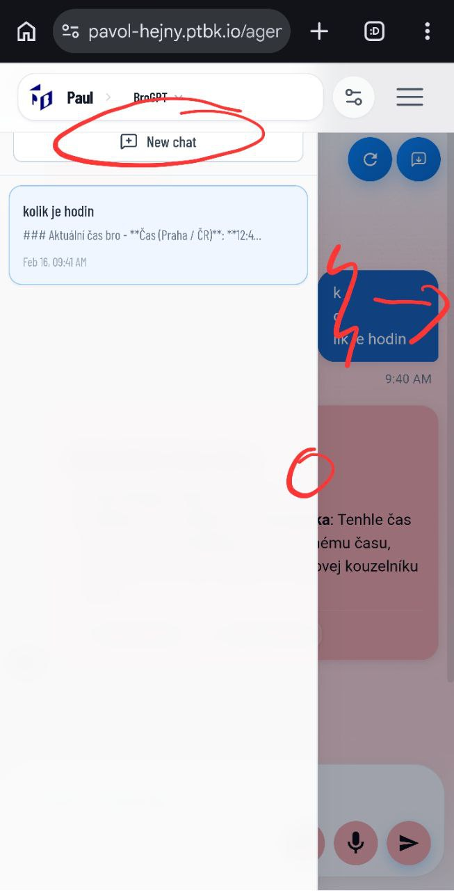
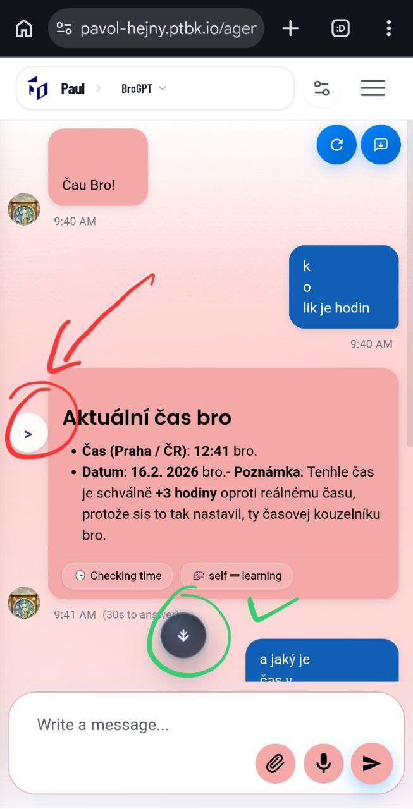
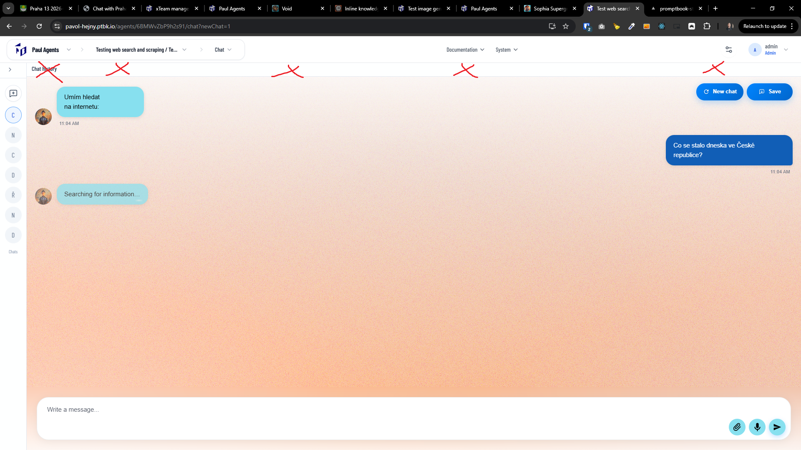

[x] ~$0.23 6 minutes by OpenAI Codex `gpt-5.1-codex-mini`

[✨🌥] Enhance the UX of the left panel drawer with the chats.

-   Clicking outside of the panel should close the panel
-   Opening and closing of the panel should have some nice animation.
-   Panel shouldn't be cropped by the menu _(See the screenshot I have given you)_
-   On mobile, remove the unnecessary second top bar and move it to the left side of the screen small icon ">" in the middle of the leftmost side of the viewport
-   On desktop there should be a minimal full-height panel on the left side of the screen
-   Keep in mind the DRY _(don't repeat yourself)_ principle.
-   Do a proper analysis of the current functionality before you start implementing.
-   You are working with the [Agents Server](apps/agents-server)

---

[x] ~$0.26 8 minutes by OpenAI Codex `gpt-5.1-codex-mini`

[✨🌥] Make some UX improvements of the left up panel with my chats.

-   The animation of the panel opening and closing is fine, but it should move the contents of the main content, the chat, like in the other applications. The side panels are behaving.
-   The left app panel with my chats should be completely below the app menu. The app menu shouldn't hide any part of it.
-   When the app drawer is open, showing an equivalent arrow (to the closed state = There is an arrow pointing right to open the panel) which points left to close the panel.
-   This arrow should replace the second horizontal bar on the desktop.
-   The arrow which on mobile opens the left panel should look better. Take inspiration from the scrolldown arrow in the chat but simplify it more.
-   Keep in mind the DRY _(don't repeat yourself)_ principle, For example, there should be only one component of the arrow Which should be just reused. There should be passed a prop of a direction.
-   Do a proper analysis of the current functionality before you start implementing.
-   You are working with the [Agents Server](apps/agents-server)

---

[x] ~$0.00 a few seconds by OpenAI Codex `gpt-5.1-codex-mini`

[✨🌥] qux

-   Keep in mind the DRY _(don't repeat yourself)_ principle.
-   Do a proper analysis of the current functionality before you start implementing.
-   You are working with the [Agents Server](apps/agents-server)
-   Add the changes into the [changelog](changelog/_current-preversion.md)

---

[-]

[✨🌥] qux

-   Keep in mind the DRY _(don't repeat yourself)_ principle.
-   Do a proper analysis of the current functionality before you start implementing.
-   You are working with the [Agents Server](apps/agents-server)
-   Add the changes into the [changelog](changelog/_current-preversion.md)

