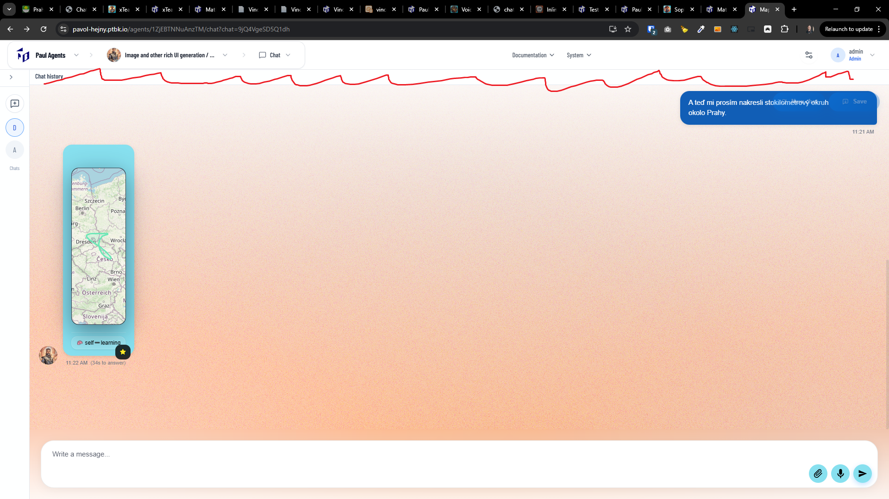
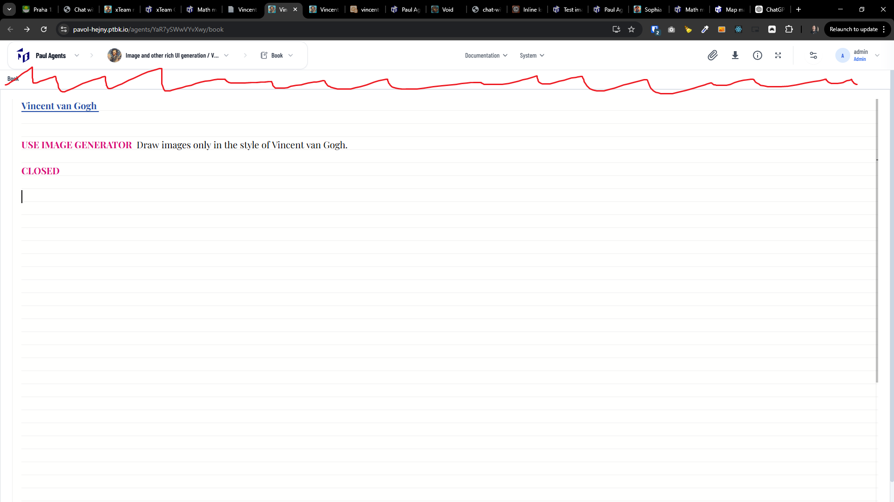
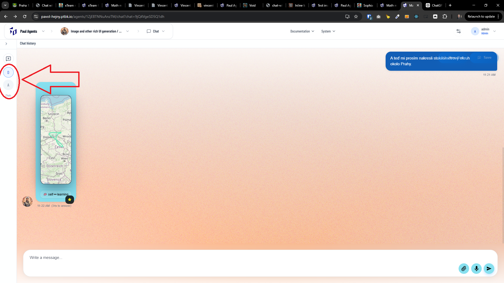
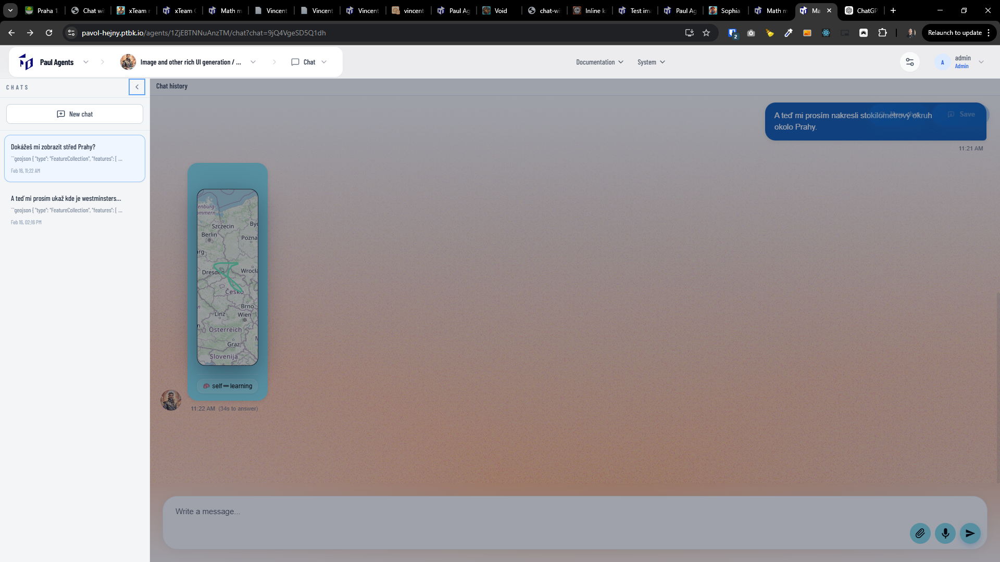

[x] ~$0.10 2 minutes by OpenAI Codex `gpt-5.1-codex-mini`

[✨🐫] When the chat starts, the default state should be Closed Left Panel, not Opened.

-   You are working with the [Agents Server](apps/agents-server)

---

[ ]

[✨🐫] Remove the unnecessary second "chat history" top horizontal bar below the main menu bar of the agent server application.

-   This second horizontal bar is unnecessary and it just takes space and makes the UI more complicated and less user-friendly. It doesn't have any functionality.
-   Do the same thing with the panel in the book view.
-   This is relevant only for the desktop view not for the mobile view.
-   You are working with the [Agents Server](apps/agents-server)

---

[ ]

[✨🐫] Make the links to the chats in the collapsed state better.

-   Now the links are just one letter a like "A" or "D", it is not clear and not user-friendly, Try to put there more information in some compact state.
-   This is relevant only for the desktop view not for the mobile view.
-   You are working with the [Agents Server](apps/agents-server)

---

[ ]

[✨🐫] Mobile links of the recent chats are broken on the mobile, take functionality from desktop and use it on mobile

-   Keep in mind the DRY _(don't repeat yourself)_ principle.
-   Only difference between mobile and desktop is that on desktop there should be a visible vertical panel which is collapsed. On the mobile there shouldn't be any vertical panel, only the arrow.
-   Do a proper analysis of the current functionality before you start implementing.
-   You are working with the [Agents Server](apps/agents-server)

---

[-]

[✨🐫] brr

-   Keep in mind the DRY _(don't repeat yourself)_ principle.
-   Do a proper analysis of the current functionality before you start implementing.
-   You are working with the [Agents Server](apps/agents-server)
-   Add the changes into the [changelog](changelog/_current-preversion.md)

---

[-]

[✨🐫] brr

-   Keep in mind the DRY _(don't repeat yourself)_ principle.
-   Do a proper analysis of the current functionality before you start implementing.
-   You are working with the [Agents Server](apps/agents-server)
-   Add the changes into the [changelog](changelog/_current-preversion.md)
